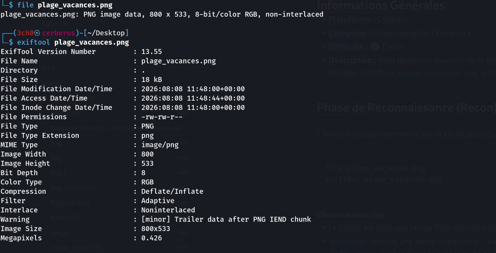
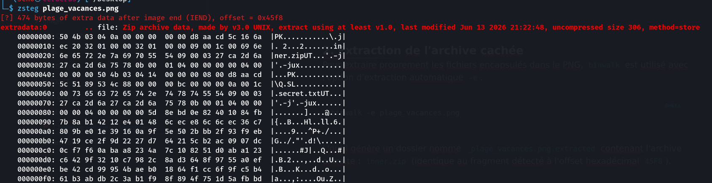
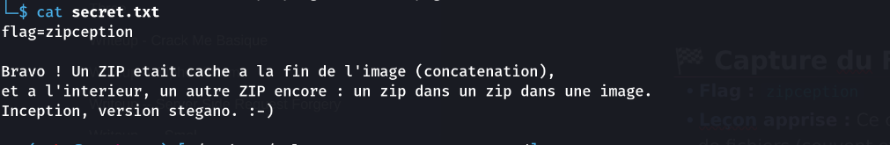

## Informations Générales
- **Plateforme :** Cyberini
- **Catégorie :** Stéganographie / Forensics
- **Difficulté :** 🟢 Facile
- **Description :** Petit dessin en souvenir de la jolie plage sur laquelle nous avons passé une partie de l'été. Un fichier `plage_vacances.png` est fourni.

## Phase de Reconnaissance (Recon)

L'analyse initiale commence par la vérification du type de fichier et des métadonnées.

```bash
file plage_vacances.png
exiftool plage_vacances.png
```

**Observations clés :**
- Le fichier est bien une image PNG standard ($800 \times 533$).
- `exiftool` renvoie une alerte importante : `Warning : [minor] Trailer data after PNG IEND chunk`. Cela indique la présence de données cachées injectées après la fin officielle de l'image.



##  Exploitation / Résolution

### 1. Analyse des données additionnelles
L'utilisation de `zsteg` confirme la présence de données supplémentaires à l'offset `0x45f8` et identifie explicitement une archive ZIP nommée `inner.zip` contenant un fichier `secret.txt`.

```bash
zsteg plage_vacances.png
```



### 2. Extraction de l'archive cachée
Pour extraire proprement les fichiers encapsulés dans le PNG, `binwalk` est utilisé avec l'option d'extraction automatique `-e`.

```bash
binwalk -e plage_vacances.png
```

L'outil génère un dossier nommé `_plage_vacances.png.extracted` contenant l'archive extraite : `inner.zip` (identique au fragment détecté à l'offset hexadécimal `45F8`).

### 3. Décompression et lecture du secret
Il suffit ensuite de se déplacer dans le répertoire d'extraction, de décompresser l'archive obtenue et de lire le fichier texte.

```bash
cd _plage_vacances.png.extracted
unzip inner.zip
cat secret.txt
```



## 🏁 Capture du Flag
- **Flag :** `zipception`
- **Leçon apprise :** Ce challenge illustre la technique classique de la concaténation de fichiers (souvent effectuée via une commande du type `cat image.png secret.zip > combo.png`). Les visionneuses d'images s'arrêtent au marqueur de fin `IEND`, mais les structures de données comme les ZIP restent intactes et lisibles par des outils d'analyse de fichiers binaires.
- **Outils clés utilisés :** exiftool, zsteg, binwalk

---
✍️ *par **3ch0 training***
