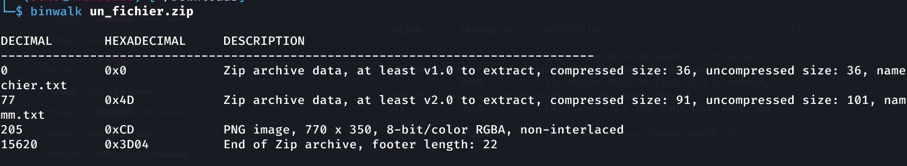

> **Catégorie : Forensics / File Carving**
> Fichier ZIP légitime avec des données PNG concaténées après sa fin d'archive (fichier "polyglotte" / carving). Le flag est directement visible dans l'image extraite.

## Résumé

| Champ | Valeur |
|---|---|
| **Type** | File carving — données cachées après la fin d'une archive ZIP |
| **Fichier fourni** | `un_fichier.zip` |
| **Source** | [cyberini.com/ctfs](https://cyberini.com/ctfs/assets/un_fichier.zip) |
| **Outils clés** | `binwalk`, `foremost` |
| **Flag** | `FLAG{...}` *(à compléter)* |

---

## Énoncé

> Plus que compressé
> Voici `un_fichier.zip`. Sauriez-vous trouver le flag caché à l'intérieur ?

Le titre "Plus que compressé" est un indice direct : le fichier contient **plus** que ce que l'extraction ZIP standard révèle.

---

## Méthodologie

### Étape 1 — Identification et extraction standard

```bash
file un_fichier.zip
```
```
un_fichier.zip: Zip archive data, made by v6.3 UNIX, extract using at least v1.0, last modified Apr 07 2025 09:37:08, uncompressed size 36, method=store
```

```bash
unzip un_fichier.zip
```
```
Archive:  un_fichier.zip
 extracting: fichier.txt
  inflating: hmm.txt
```

Extraction standard : deux fichiers texte.

```bash
cat fichier.txt
```
```
Oui bonjour ? Moi j'ai rien fait !!
```

```bash
cat hmm.txt
```
```
Un flag ici ? Ca me semble trop simple, n'est-ce pas ? C'est sans doute un peu plus... "intégré" ?
```

> **Red herrings assumés**
> Les deux fichiers texte sont volontairement des leurres. `hmm.txt` contient même un indice méta ("un peu plus intégré") suggérant d'aller chercher plus profondément dans la structure du fichier plutôt que dans le contenu extrait normalement.

Vérification de l'encodage avec `cat -A` (aucune anomalie de caractères de contrôle cachés dans le texte lui-même — piste écartée) :
```bash
cat -A hmm.txt
cat -A fichier.txt
```

### Étape 2 — Analyse de la structure binaire du ZIP

```bash
binwalk un_fichier.zip
```
```
DECIMAL       HEXADECIMAL     DESCRIPTION
--------------------------------------------------------------------------------
0             0x0             Zip archive data, at least v1.0 to extract, compressed size: 36, uncompressed size: 36, name: fichier.txt
77            0x4D            Zip archive data, at least v2.0 to extract, compressed size: 91, uncompressed size: 101, name: hmm.txt
205           0xCD            PNG image, 770 x 350, 8-bit/color RGBA, non-interlaced
15620         0x3D04          End of Zip archive, footer length: 22
```

> **Découverte clé**
> `binwalk` révèle une signature **PNG à l'offset 0xCD (205)**, située **entre** les entrées ZIP légitimes et le footer de fin d'archive. Ce PNG n'est pas référencé dans la table centrale du ZIP — `unzip` l'ignore donc complètement lors d'une extraction standard.



### Étape 3 — Tentative d'extraction automatique (`binwalk -e`)

```bash
binwalk -e un_fichier.zip
```
```
WARNING: One or more files failed to extract: either no utility was found or it's unimplemented
```

L'extraction automatique de `binwalk` échoue sur le PNG imbriqué (limitation d'extracteur pour ce type de carving spécifique — le PNG n'a pas de structure de fichier séparée standard ici, il est simplement concaténé dans le flux de données du ZIP).

### Étape 4 — Carving manuel avec `foremost`

`foremost` est un outil de récupération de fichiers par signatures binaires (indépendant de la structure du conteneur), plus robuste que `binwalk -e` pour ce cas de figure :

```bash
foremost -i un_fichier.zip
```

```bash
ls output/png
```
```
00000000.png
```

```bash
file output/png/00000000.png
```
```
output/png/00000000.png: PNG image data, 770 x 350, 8-bit/color RGBA, non-interlaced
```

### Étape 5 — Lecture du flag

Ouverture de l'image extraite :
```bash
open output/png/00000000.png
```

Le flag est directement visible dans le contenu visuel du PNG :

> **Flag obtenu**
> `ZIPPED&STEGGED`

---

## Analyse technique

Le fichier `un_fichier.zip` est un exemple de **fichier polyglotte par concaténation** : les données d'une image PNG ont été insérées dans le flux binaire du ZIP, à un offset situé après les entrées de fichiers légitimes mais avant le footer `End of Central Directory` du ZIP.

Le format ZIP est structuré de façon à ce que les lecteurs standards (`unzip`, explorateurs de fichiers) se basent sur la **table centrale** (référençant les offsets et noms des fichiers) plutôt que de scanner le flux binaire linéairement. Toute donnée insérée hors de cette table est donc **invisible** pour une extraction classique, mais reste détectable par :
- Une **analyse de signatures binaires** (`binwalk`), qui scanne le fichier entier à la recherche de magic bytes connus (ici `\x89PNG` à l'offset 205), indépendamment de la structure logique du conteneur
- Un **carving par signature** (`foremost`), qui reconstruit les fichiers en cherchant des paires début/fin de signature (`\x89PNG...` jusqu'à `IEND`), également indépendant de la structure du conteneur englobant

---

## Enseignements méthodologiques (pour la compet')

- [x] Ne jamais se fier uniquement à l'extraction standard (`unzip`, `tar`, etc.) — toujours passer `binwalk` sur l'archive brute pour détecter des signatures de fichiers non référencés
- [x] Si `binwalk -e` échoue à extraire un fichier détecté, basculer sur `foremost` (carving par signature, plus tolérant sur les structures non standards) ou `dd` manuel avec l'offset donné par `binwalk` :
  ```bash
  dd if=un_fichier.zip of=extracted.png bs=1 skip=205 count=$((15620-205))
  ```
- [x] Un énoncé qui insiste sur "plus que" / "intégré" / du vocabulaire suggérant la profondeur est un indice quasi systématique de carving ou de couches multiples
- [x] Toujours vérifier le contenu visuel d'une image extraite avant de chercher une stéganographie supplémentaire — parfois le flag est simplement affiché, pas caché une seconde fois

## Commandes clés à retenir

```bash
file <fichier>
unzip <fichier>              # extraction standard, souvent insuffisante
binwalk <fichier>            # détection de signatures, y compris non référencées
binwalk -e <fichier>         # extraction automatique (pas toujours fiable)
foremost -i <fichier>        # carving par signature, plus robuste
dd if=<fichier> of=<sortie> bs=1 skip=<offset> count=<taille>  # extraction manuelle par offset
```

## Liens connexes
- Stego - Souvenir de vacances (bali.jpg)
- Forensics - Cheatsheet
- CTF - Space Explorer - 22-23 Aout
