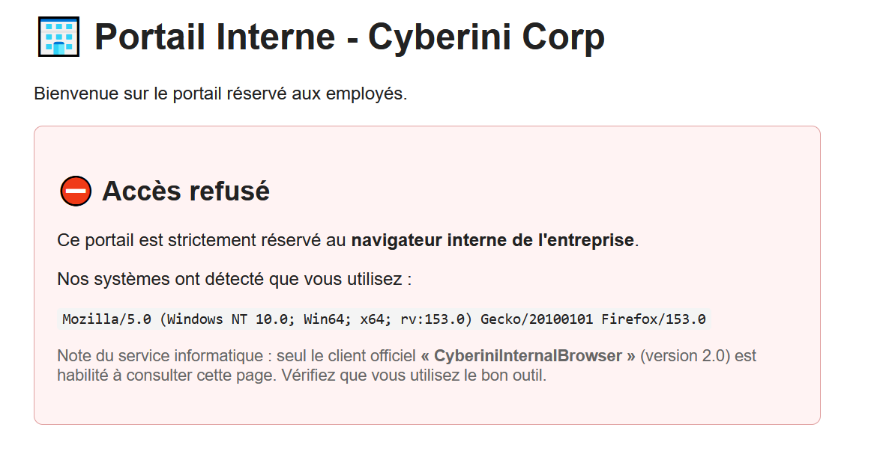

## 📌 Aperçu du Challenge
- **Plateforme :** Cyberini CTF
- **Catégorie :** Web
- **Vulnérabilité :** User-Agent Spoofing (Usurpation d'identité logicielle)
- **Flag :** `u53r_4g3nt_5p00f1ng`

---

##  Analyse de la vulnérabilité

Lorsqu'on tente d'accéder à la page web avec une requête standard, le serveur refuse l'accès et renvoie une erreur indiquant que la ressource est réservée à un navigateur spécifique :
> *Seul le client officiel « CyberiniInternalBrowser » (version 2.0) est habilité à consulter cette page.*

Le serveur se base uniquement sur l'en-tête HTTP `User-Agent` envoyé par le client pour vérifier l'habilitation. Or, cet en-tête est entièrement contrôlable par l'utilisateur.



---

## Exploitation

L'objectif est de forger une requête HTTP en modifiant l'en-tête `User-Agent` pour qu'il corresponde exactement à ce que le serveur attend.

**Commande utilisée :**
L'option `-A` (ou `--user-agent`) de `curl` permet de redéfinir cet en-tête :

```bash
curl -A "CyberiniInternalBrowser/2.0" https://cyberini.com/ctfs/assets/portail_interne.php
````

**Résultat :** Le serveur valide l'accès et affiche le flag : `✅ Accès autorisé [...] flag=u53r_4g3nt_5p00f1ng`


## 🔒 Notions Clés

> **A retenir**
> 
> - **User-Agent Spoofing :** Consiste à modifier l'identité déclarée de son client HTTP. Souvent utilisé pour contourner des pare-feux applicatifs (WAF), des restrictions géographiques rudimentaires ou scrapper des sites qui bloquent les scripts automatisés.
>     
> - **Sécurité serveur :** Il ne faut **jamais** utiliser le `User-Agent` comme méthode d'authentification ou d'autorisation. Le serveur doit se baser sur des identifiants (mot de passe, tokens, certificats clients).
>
