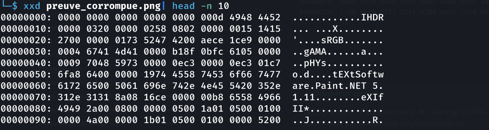
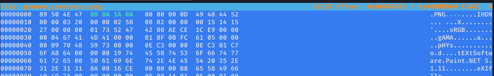

> **Catégorie : Forensics / Réparation de fichier**
> Signature PNG (magic bytes) corrompue en début de fichier, remplacée par des octets nuls. Réparation manuelle en hexadécimal pour restaurer un fichier valide.

## Résumé

| Champ | Valeur |
|---|---|
| **Type** | Réparation de fichier — corruption de header/magic bytes |
| **Fichier fourni** | `preuve_corrompue.png` |
| **Source** | [cyberini.com/ctfs](https://cyberini.com/ctfs/assets/preuve_corrompue.png) |
| **Outil de réparation** | `hexeditor` |
| **Flag** | `SIMPSON` |

---

## Énoncé

> Cette pièce à conviction numérique nous est parvenue endommagée : impossible de l'ouvrir. Pourtant, nos experts sont convaincus que le fichier est presque intact.

L'énoncé indique explicitement que le fichier est "presque intact" — signal clair qu'il ne s'agit pas d'une vraie corruption de données mais d'une altération volontaire et limitée, typiquement au niveau de l'en-tête.

---

## Méthodologie

### Étape 1 — Identification du type de fichier

```bash
file preuve_corrompue.png
```
```
preuve_corrompue.png: data
```

> **Signal d'alerte**
> `file` renvoie `data` (type générique indéterminé) au lieu de `PNG image data` malgré l'extension `.png`. Cela confirme que la **signature interne** du fichier ne correspond à aucun format connu — la première piste à explorer est une corruption de l'en-tête plutôt qu'un problème de contenu.

### Étape 2 — Inspection hexadécimale de l'en-tête

```bash
xxd preuve_corrompue.png | head -n 10
```
```
00000000: 0000 0000 0000 0000 0000 000d 4948 4452  ............IHDR
00000010: 0000 0320 0000 0258 0802 0000 0015 1415  ... ...X........
00000020: 2700 0000 0173 5247 4200 aece 1ce9 0000  '....sRGB.......
...
```



> **Diagnostic confirmé**
> Les 8 premiers octets sont tous à `00`, alors qu'un PNG valide doit impérativement commencer par la signature magique standard :
> ```
> 89 50 4E 47 0D 0A 1A 0A
> ```
> Immédiatement après ces 8 octets corrompus, on retrouve `00 00 00 0D 49 48 44 52` — c'est-à-dire la structure PNG légitime : longueur du chunk (`0D` = 13 octets) suivie du type de chunk `IHDR` (première section obligatoire d'un PNG, contenant les dimensions de l'image). Cela confirme que **seule la signature magique initiale a été altérée**, le reste du fichier étant structurellement intact — cohérent avec l'indice de l'énoncé ("presque intact").

### Étape 3 — Réparation avec `hexeditor`

Installation de l'outil (non présent par défaut sur Kali) :
```bash
sudo apt install ncurses-hexedit
```

Édition manuelle des 8 premiers octets pour restaurer la signature PNG standard :
```bash
hexeditor preuve_corrompue.png
```

Remplacement de :
```
00 00 00 00 00 00 00 00
```
par :
```
89 50 4E 47 0D 0A 1A 0A
```



### Étape 4 — Vérification de la réparation

```bash
file preuve_corrompue.png
```
```
preuve_corrompue.png: PNG image data, 800 x 600, 8-bit/color RGB, non-interlaced
```

> **Fichier réparé**
> `file` reconnaît maintenant correctement le PNG (800x600, RGB 8-bit), confirmant que la seule altération portait bien sur les 8 premiers octets.

### Étape 5 — Ouverture et lecture du flag

```bash
open preuve_corrompue.png
```

Le flag est visible directement dans le contenu visuel de l'image une fois celle-ci correctement décodée.


> **Flag obtenu**
> `SIMPSON`

---

## Analyse technique

Chaque format de fichier binaire commence généralement par une séquence d'octets fixe et unique appelée **signature magique** (ou "magic bytes" / "magic number"), qui permet aux logiciels et outils système (comme la commande `file`) d'identifier le type réel d'un fichier indépendamment de son extension. Pour PNG, cette signature est standardisée par la spécification du format :

```
89 50 4E 47 0D 0A 1A 0A
```

Cette séquence précise n'est pas arbitraire : le premier octet `0x89` est choisi pour être hors de la plage ASCII imprimable (évite une confusion avec un fichier texte), `50 4E 47` correspond aux caractères ASCII `PNG`, et `0D 0A` (retour chariot + saut de ligne) permet de détecter une corruption liée à une conversion de fin de ligne (CRLF ↔ LF), problème historique de transfert de fichiers entre systèmes Windows/Unix.

Une corruption limitée aux premiers octets (remplacés ici par des zéros) est une technique pédagogique courante en forensics CTF : elle simule un scénario réaliste (en-tête endommagé lors d'un transfert, tentative de suppression partielle, ou altération volontaire pour dissimuler un fichier) tout en restant résoluble simplement, puisque la signature attendue est **connue et standardisée** — il suffit de la restaurer octet par octet.

---

## Enseignements méthodologiques (pour la compet')

- [x] `file` retournant `data` sur un fichier avec une extension connue est un signal quasi systématique de corruption/altération de signature — premier réflexe : inspecter les octets de tête avec `xxd`/`hexdump`
- [x] Comparer les octets observés à la signature magique standard du format attendu (déductible de l'extension du fichier, même si celle-ci peut aussi être trompeuse dans d'autres challenges)
- [x] Si seuls quelques octets de tête sont corrompus mais que le reste de la structure (chunks PNG, tables ZIP, etc.) semble cohérent, une réparation manuelle ciblée suffit — pas besoin d'outils de reconstruction complexes
- [x] Se constituer une **cheatsheet des magic bytes** les plus courants (PNG, JPEG, ZIP, PDF, ELF, GIF...) pour éviter de dépendre d'une recherche en ligne pendant la compétition, où l'accès réseau peut être limité ou source de perte de temps

## Magic bytes courants à retenir

| Format | Signature (hex) |
|---|---|
| PNG | `89 50 4E 47 0D 0A 1A 0A` |
| JPEG | `FF D8 FF` |
| ZIP | `50 4B 03 04` |
| PDF | `25 50 44 46` (`%PDF`) |
| GIF | `47 49 46 38` (`GIF8`) |
| ELF | `7F 45 4C 46` |

## Commandes clés à retenir

```bash
file <fichier>              # identification rapide, "data" = signature suspecte
xxd <fichier> | head -n 10  # inspection hexadécimale de l'en-tête
sudo apt install ncurses-hexedit
hexeditor <fichier>         # édition binaire interactive pour réparation manuelle
```
