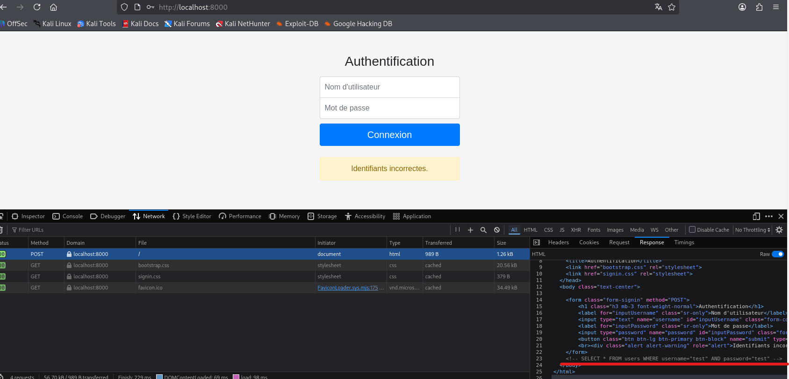

### Informations sur le Challenge

- **Plateforme :** Hackropole (FCSC 2021)
    
- **Catégorie :** Web / PHP
    
- **Difficulté :** Facile
    
###  Étape 1 : Reconnaissance et inspection des réponses

En arrivant sur l'application, nous faisons face à un formulaire d'authentification classique. Une tentative de connexion avec des identifiants au hasard renvoie simplement un message générique visuel : `Identifiants incorrectes.`

Cependant, en inspectant la réponse HTTP brute via l'onglet **Network** des outils de développement de Firefox (ou via Burp Suite), on découvre un commentaire de debug crucial laissé par le développeur dans le corps HTML :

Cette information nous indique deux choses capitales :

1. Les paramètres sont encapsulés dans des **guillemets doubles (`"`)** et non des quotes simples (`'`).
    
2. La structure exacte de la requête SQL.
    


```
<!-- SELECT * FROM users WHERE username="test" AND password="test" -->
```

### Étape 2 : Analyse du comportement de l'injection

En testant une injection SQL classique pour bypasser l'authentification dans le champ _Nom d'utilisateur_ :

```text
" OR 1=1 --
```

Le serveur n'affiche rien de particulier sur l'interface graphique, mais l'analyse de la réponse brute (Network) révèle un message d'erreur spécifique du SGBD/Application :

> **"Erreur : trop de lignes sont retournées par la requête SQL."**

**Compréhension du mécanisme :** La condition `1=1` étant toujours vraie, la requête renvoie toutes les lignes de la table `users`. L'application PHP lève alors une exception de sécurité car elle s'attend à recevoir la ligne d'**un seul et unique utilisateur** pour valider la session.


### Étape 3 : Exploitation (Contournement de la limite)

Pour contourner cette restriction, le payload injecté doit forcer le SGBD à ne retourner qu'une seule ligne. En accord complet avec le titre du challenge (_"Push it to the limit"_), nous utilisons la clause SQL **`LIMIT 1`**.

#### Option A (Via la clause LIMIT) :

En injectant le payload suivant dans le champ **Nom d'utilisateur** :

```
" OR 1=1 LIMIT 1 --
```

La requête interprétée devient :

```sql
SELECT * FROM users WHERE username="" OR 1=1 LIMIT 1 -- " AND password="..."
```

Le SGBD évalue la condition à _Vrai_, mais restreint le résultat au premier utilisateur trouvé (généralement l'administrateur).

#### Option B (Ciblage direct) :

Puisque nous connaissons l'existence du compte `admin`, nous pouvons également cibler uniquement sa ligne pour éviter le surplus de résultats :

```sql
admin" --
```


### 🏁 Résultat & Flag

L'authentification est contournée avec succès et l'application nous délivre le flag :

```
FCSC{5012fb37d7886deaa5c4e209cf683286}
```
