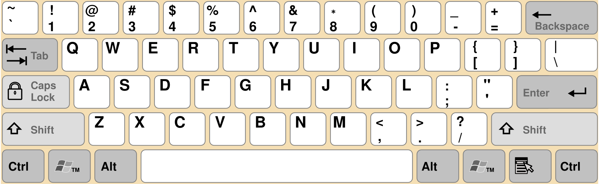

Description 

**I am so very sorry.... I made a lot of typos :(

I should rot in hell 😭

?AEAGJ8NJF,\0[d5JcE-

Le challenge crypto conssite a decoder le message pour trouver le flag sachant que c'est qwerty qui est utilisé comme clavier 

En analysant la séquence du decalage avec le clavier Qwerty , on remarque un decalade de 5 par derrière . 

Le flag décodé est :
