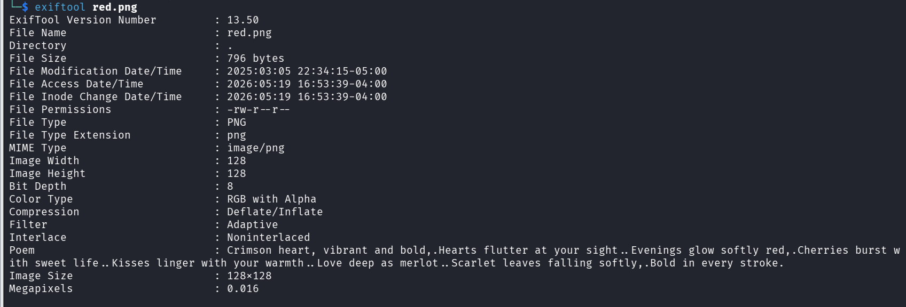
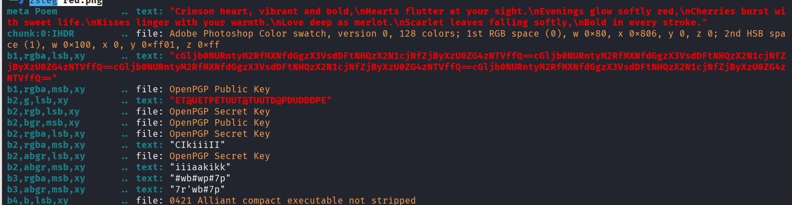

Description

RED, RED, RED, RED

```
file red.png 
```

Résultat

```
red.png: PNG image data, 128 x 128, 8-bit/color RGBA, non-interlaced
```

```
exiftool red.png
```

On a juste un poème 
```
Crimson heart, vibrant and bold,.Hearts flutter at your sight..Evenings glow softly red,.Cherries burst with sweet life..Kisses linger with your warmth..Love deep as merlot..Scarlet leaves falling softly,.Bold in every stroke.
```

```
zsteg red.png
```

On a cette ligne intéressante 
```
b1,rgba,lsb,xy      .. text: "cGljb0NURntyM2RfMXNfdGgzX3VsdDFtNHQzX2N1cjNfZjByXzU0ZG4zNTVffQ==cGljb0NURntyM2RfMXNfdGgzX3VsdDFtNHQzX2N1cjNfZjByXzU0ZG4zNTVffQ==cGljb0NURntyM2RfMXNfdGgzX3VsdDFtNHQzX2N1cjNfZjByXzU0ZG4zNTVffQ==cGljb0NURntyM2RfMXNfdGgzX3VsdDFtNHQzX2N1cjNfZjByXzU0ZG4zNTVffQ=="
```

Décodage 

```
echo "cGljb0NURntyM2RfMXNfdGgzX3VsdDFtNHQzX2N1cjNfZjByXzU0ZG4zNTVffQ==" | base64 -d
```

Flag 
```
picoCTF{r3d_1s_th3_ult1m4t3_cur3_f0r_54dn355_}
```

## Métadonnées

- **Catégorie :** Steganography Forensics
    
- **Outils :** file exiftool zsteg base64
    
- **Flag :** `picoCTF{r3d_1s_th3_ult1m4t3_cur3_f0r_54dn355_}`
    

## 💬 Description du challenge

> _RED, RED, RED, RED_

##  Étape 1 : Analyse initiale de l'image

On vérifie le type de fichier et ses métadonnées pour chercher un premier indice.

```bash
file red.png
```

### Résultat :

```
red.png: PNG image data, 128 x 128, 8-bit/color RGBA, non-interlaced
```

On inspecte ensuite les métadonnées avec `exiftool` :

```
exiftool red.png
```

### Résultat :



L'outil extrait un poème, mais aucun flag n'y figure directement en clair :

> _Crimson heart, vibrant and bold... Hearts flutter at your sight... Evenings glow softly red... Cherries burst with sweet life... Kisses linger with your warmth... Love deep as merlot... Scarlet leaves falling softly... Bold in every stroke._

## 🕵️ Étape 2 : Analyse des canaux LSB (`zsteg`)

Le fichier étant un PNG (format sans perte idéal pour la dissimulation par pixel), on utilise l'outil **`zsteg`** pour scanner les bits de poids faible (LSB) des canaux de couleur RGB/A.

```bash
zsteg red.png
```

### Résultat :



L'outil détecte immédiatement une charge utile textuelle suspecte cachée dans le premier bit (`b1`) du canal combiné `rgba`, ordonnée par pixels `xy` :

```text
b1,rgba,lsb,xy      .. text: "cGljb0NURntyM2RfMXNfdGgzX3VsdDFtNHQzX2N1cjNfZjByXzU0ZG4zNTVffQ==cGljb0NURntyM2RfMXNfdGgzX3VsdDFtNHQzX2N1cjNfZjByXzU0ZG4zNTVffQ==..."
```

La chaîne se répète en boucle et est encodée en **Base64**. On isole un seul bloc :

`cGljb0NURntyM2RfMXNfdGgzX3VsdDFtNHQzX2N1cjNfZjByXzU0ZG4zNTVffQ==`

## 🔓 Étape 3 : Décodage du Flag

On décode la chaîne extraite depuis le terminal Linux pour obtenir la version en clair.

```bash
echo "cGljb0NURntyM2RfMXNfdGgzX3VsdDFtNHQzX2N1cjNfZjByXzU0ZG4zNTVffQ==" | base64 -d
```

### Résultat :

```text
picoCTF{r3d_1s_th3_ult1m4t3_cur3_f0r_54dn355_}
```

## 🏁 Étape 4 : Capture du Flag

**Flag :**

`picoCTF{r3d_1s_th3_ult1m4t3_cur3_f0r_54dn355_}`

## Mémo de Stéganographie : La méthode LSB (Least Significant Bit)

La stéganographie **LSB** consiste à modifier le bit le moins important (le dernier bit de l'octet) d'un composant de couleur d'un pixel (Rouge, Vert, Bleu ou Alpha).

- **Pourquoi c'est invisible ?** Si la valeur de rouge d'un pixel passe de `255` (binaire `11111111`) à `254` (binaire `11111110`), la modification de couleur est mathématiquement infime ($1/255$). L'œil humain est strictement incapable de voir la différence sur l'écran.
    
- **Outils clés selon le format :**
    
    - Pour les images **PNG** et **BMP** (sans perte) $\rightarrow$ Privilégier **`zsteg`**.
        
    - Pour les images **JPEG** (avec perte, où le LSB classique ne fonctionne pas car la compression détruit les bits modifiés) $\rightarrow$ Privilégier **`steghide`** ou **`stegoveritas`**
