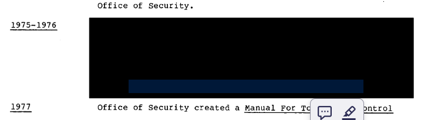
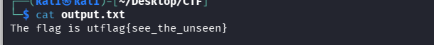

## 📝 Description du Challenge

> **Description :** I recieved this document from ⬛⬛⬛⬛⬛⬛ at ⬛⬛⬛⬛, but it looks like the flag was redacted by ⬛⬛⬛⬛⬛⬛⬛⬛. There's probably no way to get it back, right?
> 
> **Fichier :** `redacted.pdf`
> 
> **Auteur :** balex

Le challenge nous présente un document PDF contenant des informations censurées par de gros blocs noirs. L'objectif est de retrouver le texte dissimulé sous ces masques graphiques.

## 🔍 1. Analyse du Problème & Concept de Censure (Redaction)

Face à un document censuré visuellement, deux scénarios sont possibles :

1. **La bonne censure :** Le texte original a été effacé du fichier et remplacé par une image ou un bloc noir aplati. Les données n'existent plus.
    
2. **La mauvaise censure (Mauvaise Redaction) :** Le créateur du document a simplement dessiné des formes géométriques noires (couche vectorielle supérieure) _par-dessus_ le texte existant (couche textuelle inférieure). Le texte brut est donc toujours présent dans la structure interne du fichier.
    

En ouvrant le PDF et en tentant une sélection globale (`CTRL+A`), on remarque que des zones invisibles sous les rectangles noirs sont sélectionnables. Le texte est donc toujours là.

## 2. Exploitation & Extraction du Texte

Pour extraire ce texte caché sans être gêné par la couche graphique noire, deux méthodes simples mais redoutables fonctionnent.

### Méthode A : Le Copier-Coller Brut (La plus rapide)

En effectuant un `CTRL+A` suivi d'un `CTRL+C` dans le lecteur PDF, puis en collant le contenu dans un éditeur de texte brut (comme un bloc-notes), les éléments graphiques et vectoriels sautent. Seul le texte brut réapparaît, révélant le flag.



### Méthode B : L'utilitaire `pdftotext` (En ligne de commande)

Pour automatiser proprement l'extraction de tout le flux textuel du document, nous utilisons l'outil Linux `pdftotext`.

```bash
# Extraction du flux textuel vers un fichier de sortie
sudo pdftotext redacted.pdf output.txt

# Lecture du résultat
cat output.txt
```



Le terminal nous renvoie le contenu épuré de ses masques graphiques.

## 🏁 3. Capture du Flag

L'extraction textuelle nous donne directement la phrase complète qui était masquée :

```
The flag is utflag{see_the_unseen}
```

**Flag récupéré :**

```
utflag{see_the_unseen}
```

**_3ch0 training_**
