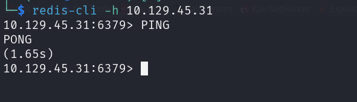
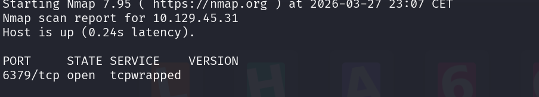
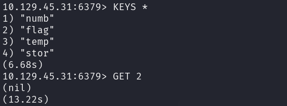

### Description 
Redeemer is a very easy Linux machine which explores the enumeration and exploitation of a Redis database server while showcasing the redis-cli command line utility and basic commands to interact with the Redis service.

But  est d'apprendre à exploiter redis en utilisant l'outil redis-cli 

## 1. Qu'est-ce que Redis ?

**Redis** (Remote Dictionary Server) est ce qu'on appelle une base de données **NoSQL** de type **clé-valeur**.

- **En mémoire :** Contrairement à MySQL ou PostgreSQL qui stockent les données sur le disque dur, Redis stocke tout dans la **RAM**. C'est pour ça qu'il est extrêmement rapide (utilisé pour les scores de jeux vidéo, les sessions utilisateur ou le cache).
    
- **Structure Clé-Valeur :** Imagine un immense dictionnaire. Tu as une "Clé" (ex: `user:101`) et une "Valeur" associée (ex: `{"nom": "Loukman", "score": 500}`).
    
- **Le danger (CTF) :** Par défaut, les anciennes versions de Redis n'ont **pas de mot de passe**. Si un administrateur expose le port Redis sur Internet sans configuration de sécurité, n'importe qui peut se connecter et lire toutes les données.
    

## 2. L'outil de connexion : `redis-cli`

C'est l'outil officiel en ligne de commande pour interagir avec un serveur Redis.

- **Installation :** Si tu ne l'as pas, il s'installe avec `sudo apt install redis-tools`.
    
- **La syntaxe de base :**
    
    ```bash
    redis-cli -h <IP_CIBLE> -p <PORT>
    ```
    
    - `-h` : Host (l'IP de la machine HTB).
        
    - `-p` : Port (par défaut **6379**).
        
  Par défaut, Redis utilise le port 6379 

## 3. Les commandes essentielles pour l'exploitation

Test de connectivité 
```
PING
```



Liste rles clés : 
```
KEYS *
```
  
  Set Key-Value Paire

```text
SET key value
```

Obtenez la paire de valeur clé

```text
GET key
```

Liste Push

```text
LPUSH mylist value
RPUSH mylist value
```

Liste Obtenir

```text
LRANGE mylist 0 -1
```

Définir Ajouter

```text
SADD myset value
```

Définir les membres

```text
SMEMBERS myset
```

Ensemble de hachage

```text
HSET myhash field value
```

Hash Get

```text
HGET myhash field
```

## Résolution 

#### Tâche 1 - Enumération

Nous allons enumérer les ports ouverts ainsi que les services et la version de service qui tourne sur ces ports 

Commande : 
```
nmap -Pn -sV -p- 10.129.45.31
```

On a qu'un seul port ouvert qui est le port 6379 qui correspond a celui de Redis

Nous allons utiliser l'outil **redis-cli** pour nous connecter et interagir avec le serveur 

#### Tâche 2 - Se connecter a Redis 

Commande : 
```
redis-cli -h 10.129.45.31 -p 6379

```

- Recuperer les infos : 
Pour cela on utilise la commande INFO 
```
# Server
redis_version:5.0.7
redis_git_sha1:00000000
redis_git_dirty:0
redis_build_id:66bd629f924ac924
redis_mode:standalone
os:Linux 5.4.0-77-generic x86_64
arch_bits:64
multiplexing_api:epoll
atomicvar_api:atomic-builtin
gcc_version:9.3.0
process_id:750
run_id:3aebc76213b6227b0ed8c616235eee327115140f
tcp_port:6379
uptime_in_seconds:1091
uptime_in_days:0
hz:10
configured_hz:10
lru_clock:13041608
executable:/usr/bin/redis-server
config_file:/etc/redis/redis.conf

# Clients
connected_clients:1
client_recent_max_input_buffer:2
client_recent_max_output_buffer:0
blocked_clients:0

# Memory
used_memory:859624
used_memory_human:839.48K
used_memory_rss:5996544
used_memory_rss_human:5.72M
used_memory_peak:859624
used_memory_peak_human:839.48K
used_memory_peak_perc:100.12%
used_memory_overhead:847166
used_memory_startup:797248
used_memory_dataset:12458
used_memory_dataset_perc:19.97%
allocator_allocated:1557880
allocator_active:1892352
allocator_resident:9101312
total_system_memory:2084024320
total_system_memory_human:1.94G
used_memory_lua:41984
used_memory_lua_human:41.00K
used_memory_scripts:0
used_memory_scripts_human:0B
number_of_cached_scripts:0
maxmemory:0
maxmemory_human:0B
maxmemory_policy:noeviction
allocator_frag_ratio:1.21
allocator_frag_bytes:334472
allocator_rss_ratio:4.81
allocator_rss_bytes:7208960
rss_overhead_ratio:0.66
rss_overhead_bytes:-3104768
mem_fragmentation_ratio:7.33
mem_fragmentation_bytes:5178920
mem_not_counted_for_evict:0
mem_replication_backlog:0
mem_clients_slaves:0
mem_clients_normal:49694
mem_aof_buffer:0
mem_allocator:jemalloc-5.2.1
active_defrag_running:0
lazyfree_pending_objects:0

# Persistence
loading:0
rdb_changes_since_last_save:0
rdb_bgsave_in_progress:0
rdb_last_save_time:1774649098
rdb_last_bgsave_status:ok
rdb_last_bgsave_time_sec:0
rdb_current_bgsave_time_sec:-1
rdb_last_cow_size:421888
aof_enabled:0
aof_rewrite_in_progress:0
aof_rewrite_scheduled:0
aof_last_rewrite_time_sec:-1
aof_current_rewrite_time_sec:-1
aof_last_bgrewrite_status:ok
aof_last_write_status:ok
aof_last_cow_size:0

# Stats
total_connections_received:5
total_commands_processed:10
instantaneous_ops_per_sec:0
total_net_input_bytes:384
total_net_output_bytes:11667
instantaneous_input_kbps:0.00
instantaneous_output_kbps:0.00
rejected_connections:0
sync_full:0
sync_partial_ok:0
sync_partial_err:0
expired_keys:0
expired_stale_perc:0.00
expired_time_cap_reached_count:0
evicted_keys:0
keyspace_hits:1
keyspace_misses:1
pubsub_channels:0
pubsub_patterns:0
latest_fork_usec:290
migrate_cached_sockets:0
slave_expires_tracked_keys:0
active_defrag_hits:0
active_defrag_misses:0
active_defrag_key_hits:0
active_defrag_key_misses:0

# Replication
role:master
connected_slaves:0
master_replid:977757dfc1b2c87a42078b00d44dbdc4d4d1d267
master_replid2:0000000000000000000000000000000000000000
master_repl_offset:0
second_repl_offset:-1
repl_backlog_active:0
repl_backlog_size:1048576
repl_backlog_first_byte_offset:0
repl_backlog_histlen:0

# CPU
used_cpu_sys:0.868008
used_cpu_user:0.690607
used_cpu_sys_children:0.001276
used_cpu_user_children:0.000000

# Cluster
cluster_enabled:0

# Keyspace
db0:keys=4,expires=0,avg_ttl=0
(5.32s)
10.129.45.31:6379> 

```

On peu ainsi voir les configs qui ont été faite sur le serveur Redis. Et aussi on peu voir l aversion de redis qui est le **5.0.7**

- Lister les clés : 
Pour ce faire nous allons utiliser la commande suivante : 
```
KEYS *
```
+

On a une clé nommée flag, donc nous allons recupérer le contenu de cette lé en utilisamt la commande suivante : 
```
GET flag
```

### Flag     :

```
03e1d2b376c37ab3f5319922053953eb
```
