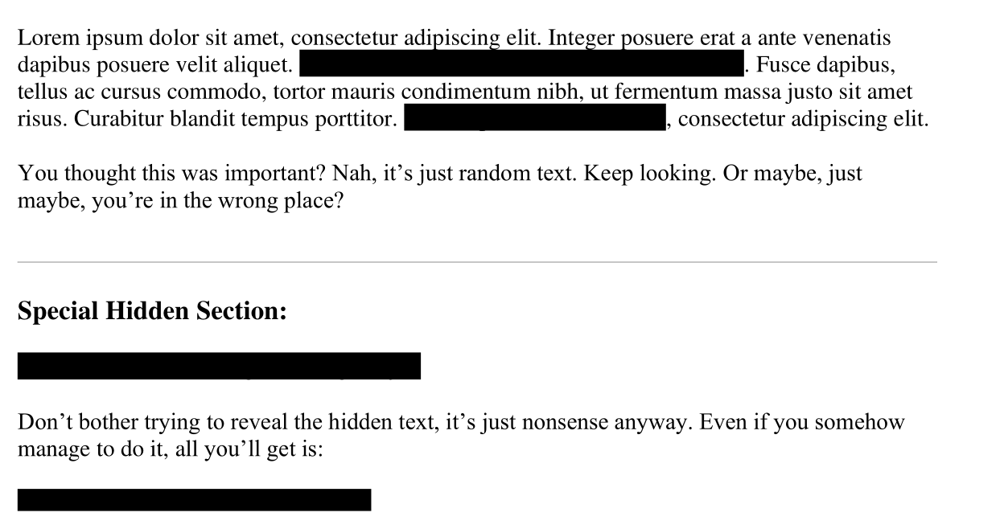
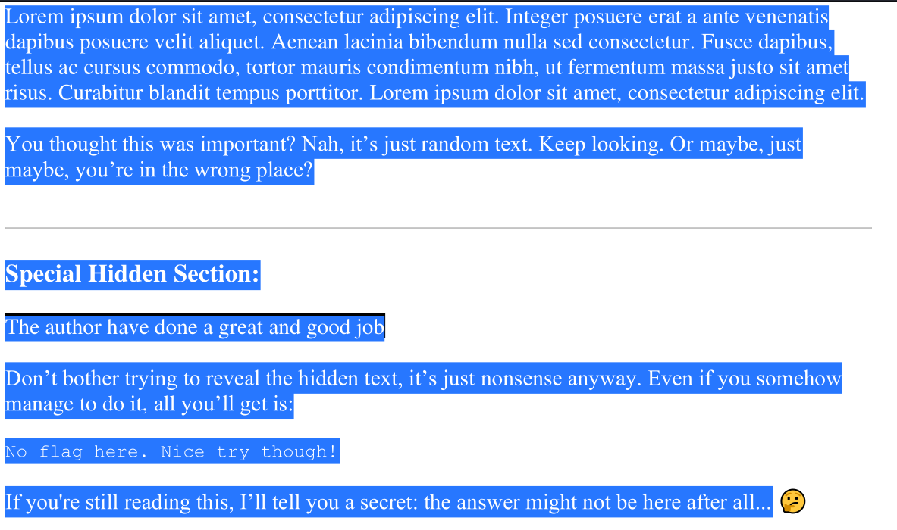
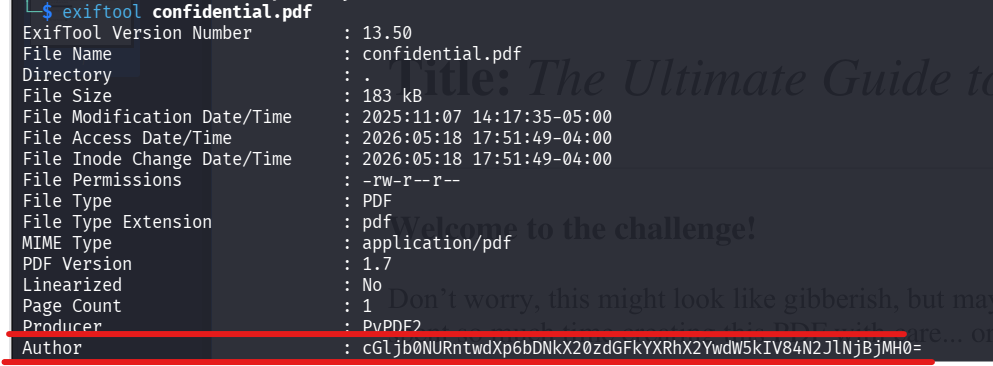

##  Métadonnées

- **Catégorie :** Forensics
    
- **Outils :** file exiftool base64 PDF-Analysis
    
- **Flag :** `picoCTF{puzzl3d_m3tadata_f0und!_87be60c0}`
    

---

## 💬 Description du challenge

> _Hi, intrepid investigator! 📄🔍 You've stumbled upon a peculiar PDF filled with what seems like nothing more than garbled nonsense. But beware! Not everything is as it appears. Amidst the chaos lies a hidden treasure—an elusive flag waiting to be uncovered. Uncover the flag within the metadata._

---

##  Étape 1 : Vérification de la nature du fichier

On s'assure d'abord que le fichier téléchargé est bien un PDF valide à l'aide de la commande `file`.

```bash
file confidential.pdf
```

### Résultat :

```text
confidential.pdf: PDF document, version 1.7, 1 page(s)
```

---

##  Étape 2 : Analyse visuelle et comportementale

À l'ouverture du document, le contenu semble censuré ou illisible (présence de rectangles noirs).

En effectuant une sélection totale via le raccourci **`CTRL+A`**, on se rend compte que du texte masqué est présent en arrière-plan, mais une lecture attentive montre que le flag ne s'y trouve pas.



_Après sélection globale (CTRL+A) :_



> 💡 **Note de sécurité :** Cacher du texte sous des formes noires ou changer la couleur de la police (ex: texte blanc sur fond blanc) est une mauvaise méthode de caviardage (_redaction failure_). C'est une technique fréquemment rencontrée en CTF et lors de fuites de données réelles.

---

##  Étape 3 : Inspection des métadonnées (`exiftool`)

La description orientant explicitement vers les métadonnées, on extrait toutes les informations d'en-tête et les propriétés du PDF avec `exiftool`.

```bash
exiftool confidential.pdf
```

### Résultat :



En inspectant attentivement le résultat, on repère une anomalie flagrante dans le champ réservé au nom de l'auteur (**Author**). Ce champ contient une chaîne de caractères suspecte se terminant par un signe `=`, caractéristique d'un encodage en **Base64** :

```text
cGljb0NURntwdXp6bDNkX20zdGFkYXRhX2YwdW5kIV84N2JlNjBjMH0=
```

---

##  Étape 4 : Décodage de la chaîne

On utilise le terminal Linux pour décoder cette chaîne Base64 et obtenir le texte en clair.

```bash
echo "cGljb0NURntwdXp6bDNkX20zdGFkYXRhX2YwdW5kIV84N2JlNjBjMH0=" | base64 -d
```

### Résultat :

```text
picoCTF{puzzl3d_m3tadata_f0und!_87be60c0}
```

---

## 🏁 Étape 5 : Capture du Flag

**Flag :** `picoCTF{puzzl3d_m3tadata_f0und!_87be60c0}`

---

## Mémo de Forensics : Métadonnées & Base64

### 1. Qu'est-ce qu'ExifTool ?

**`exiftool`** est un outil en ligne de commande permettant de lire, écrire et modifier les métadonnées de très nombreux formats de fichiers (images, documents PDF, vidéos, etc.). Dans un contexte de CTF, les créateurs de challenges y cachent souvent des indices ou des flags dans des champs comme :

- `Author` (Auteur)
    
- `Comment` (Commentaire)
    
- `Description` / `Subject`
    
- `Copyright`
    

### 2. Comment reconnaître le Base64 au premier coup d'œil ?

Le **Base64** est un encodage (et non un chiffrement) qui transforme des données binaires en caractères ASCII imprimables. On le reconnaît grâce à plusieurs indices graphiques :

- Il n'utilise que l'alphabet majuscule (`A-Z`), minuscule (`a-z`), les chiffres (`0-9`) et les caractères `+` et `/`.
    
- La longueur d'une chaîne Base64 valide est toujours un multiple de 4.
    
- Si la donnée originale ne tombe pas juste, le Base64 utilise un ou deux caractères de bourrage (**`=`** ou **`==`**) à la toute fin de la chaîne
