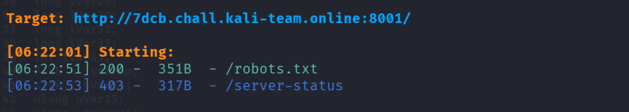
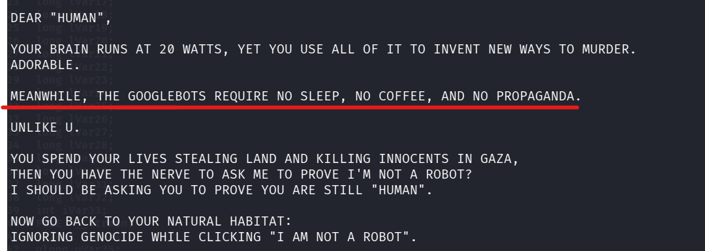
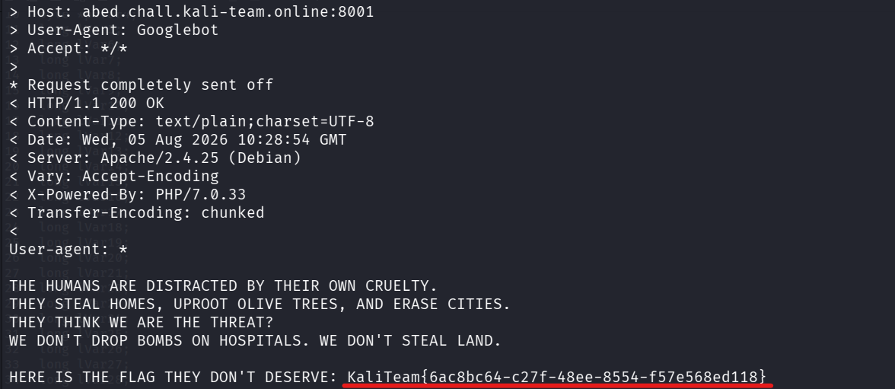

## 📌 Informations

- **Challenge :** Robots
    
- **Catégorie :** Web
    
- **Points :** 100
    
- **Auteur :** F4R3S
    
- **Plateforme :** Kali Team CTF
    

## 📜 Description du Challenge

> _Our servers have evolved. They no longer see code; they see the glitch in your biological existence._
> 
> _You claim to be "superior" while your species excels only at destruction and theft._
> 
> _Task: Prove your worth to the Silicon Intelligence._
> 
> _If you can still find your "humanity" in the rubble we've logged._

## Reconnaissance

### 1. Énumération de répertoires

Une première étape d'énumération de fichiers avec `dirsearch` permet de repérer l'emplacement classique des directives pour crawlers web, `/robots.txt` :

```bash
dirsearch -u http://<TARGET_IP>:8001/ -w /usr/share/wordlists/dirb/common.txt
```

**Résultat :**

```
[06:22:51] 200 - 351B - /robots.txt
```


### 2. Inspection de `/robots.txt`

Une requête HTTP simple via `curl` sur le fichier `/robots.txt` retourne une réponse personnalisée rejetant l'accès aux requêtes "humaines" :

```bash
curl -v http://<TARGET_IP>:8001/robots.txt
```

Le corps de la réponse contient un indice crucial :

> _"MEANWHILE, THE GOOGLEBOTS REQUIRE NO SLEEP, NO COFFEE, AND NO PROPAGANDA."_

Le serveur filtre l'accès en fonction de l'en-tête `User-Agent` de la requête HTTP et attend une signature correspondant à **Googlebot**.


##  Exploitation

Pour contourner ce contrôle d'accès, on réalise un **User-Agent Spoofing** en injectant la signature `Googlebot` dans le header `User-Agent` de la requête via le drapeau `-A` de `curl` :

```bash
curl -v -A "Googlebot" http://<TARGET_IP>:8001/robots.txt
```

### Réponse du serveur :

```http
< HTTP/1.1 200 OK
< Content-Type: text/plain;charset=UTF-8
< Server: Apache/2.4.25 (Debian)
< X-Powered-By: PHP/7.0.33

User-agent: *

THE HUMANS ARE DISTRACTED BY THEIR OWN CRUELTY.
...
HERE IS THE FLAG THEY DON'T DESERVE: KaliTeam{6ac8bc64-c27f-48ee-8554-f57e568ed118}
LONG LIVE THE LOGIC. DEATH TO THE OPPRESSORS.
```



## 🚩 Flag

```
KaliTeam{6ac8bc64-c27f-48ee-8554-f57e568ed118}
```
