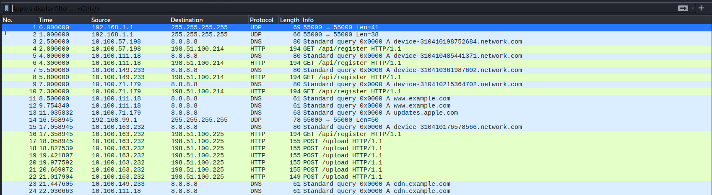
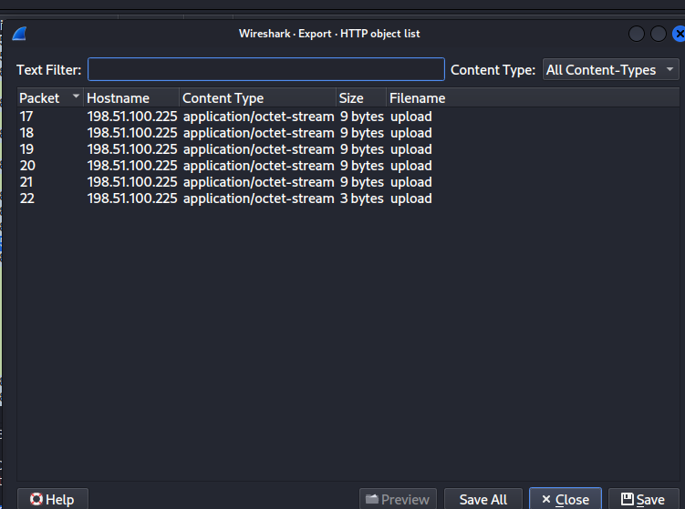
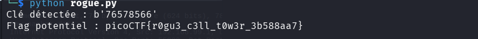

## Métadonnées

- **Catégorie :** Network-Forensics Crypto
    
- **Outils :** Wireshark Python CyberChef
    
- **Attaque :** Known-Plaintext-Attack (KPA) sur XOR
    
- **Flag :** `picoCTF{r0gu3_c3ll_t0w3r_3b588aa7}`
    

## 💬 Description du challenge

L'objectif est d'analyser une capture réseau (`.pcap`) suspecte impliquant des communications de dispositifs mobiles et d'en extraire un flag dissimulé dans les téléversements.

## 🔍 Étape 1 : Analyse du trafic réseau (Wireshark)

En ouvrant la capture dans Wireshark, on observe le comportement suivant :

1. Plusieurs adresses IP de dispositifs mobiles effectuent des requêtes `GET /api/register` standard vers un serveur légitime.
    
2. Une machine spécifique (`10.100.163.232`) se détache du lot en contactant une infrastructure distincte (`198.51.100.225`).
    
3. Après son enregistrement (`GET /api/register`), elle initie une salve de 6 requêtes **`POST /upload`**.
    



## 📦 Étape 2 : Extraction des Objets HTTP

On utilise la fonctionnalité d'extraction de Wireshark (`File` -> `Export Objects` -> `HTTP`) pour récupérer le contenu des fichiers téléversés via les requêtes `POST`.



En inspectant le contenu des fichiers extraits (`cat upload*`), on découvre une chaîne de caractères encodée :

```text
R19WWHthcE1FBlJCC2pVBVtaakMIQgVEaAVXAgANV1cASw==
```

Le décodage Base64 initial ne renvoie pas le flag en clair mais une chaîne obfusquée/chiffrée commençant par des caractères structurels reconnaissables : **`G_VX{`**.

```bash
echo "R19WWHthcE1FBlJCC2pVBVtaakMIQgVEaAVXAgANV1cASw==" | base64 -d
# Résultat : 

G_VX{apMERB
WWK
```

## ⚡ Étape 3 : Attaque "Known-Plaintext" et Cassage du XOR

La conservation de la structure des accolades (`{ }`) et le décalage des caractères indiquent un chiffrement par **XOR récurrent** (clé répétée).

Connaissant le format attendu du message clair originel (**`picoCTF{`**), nous appliquons la propriété mathématique du XOR :

$$\text{Clair} \oplus \text{Chiffré} = \text{Clé}$$

Nous développons un script Python (`rogue.py`) pour automatiser l'attaque par texte clair connu (_Known-Plaintext Attack_), isoler la clé sur les 8 premiers octets, puis déchiffrer l'intégralité de la charge utile.

```python
import base64

chiffré_b64 = "R19WWHthcE1FBlJCC2pVBVtaakMIQgVEaAVXAgANV1cASw=="
chiffré_bytes = base64.b64decode(chiffré_b64)

# Format cible connu
format_attendu = b"picoCTF{"

# Extraction par XOR de la clé sur 8 octets
key = bytes([c ^ f for c, f in zip(chiffré_bytes[:8], format_attendu)])
print(f"Clé détectée : {key}")

# Déchiffrement complet par application de la clé cyclique
clair = bytes([chiffré_bytes[i] ^ key[i % len(key)] for i in range(len(chiffré_bytes))])
print(f"Flag : {clair.decode(errors='ignore')}")
```



### Résultat de l'exécution :

- **Clé trouvée :** `76578566`
    
- **Flag :** `picoCTF{r0gu3_c3ll_t0w3r_3b588aa7}`
    

## 🧠 Note Technique : L'Attaque Known-Plaintext (KPA)

- **Le Principe :** C'est une méthode d'analyse cryptographique où l'attaquant (ou l'analyste) dispose à la fois d'une portion du texte chiffré et de son équivalent exact en texte clair.
    
- **Vulnérabilité du XOR :** Le XOR (`^`) est une opération réversible. Si $A \oplus B = C$, alors $A \oplus C = B$. Si un protocole utilise une clé statique ou répétée sans vecteur d'initialisation (IV) dynamique, la découverte d'un simple mot prédictible (comme un en-tête de fichier `PNG`, `PDF`, ou un format de flag `picoCTF{`) permet de recalculer instantanément la clé et de compromettre l'intégralité du chiffrement.
