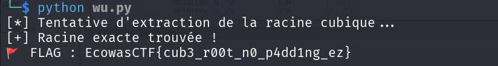

### Description

This should be fun, as I know what I'm doing with m3.

#### Données
```
"n":"0x77ce5ee900868d7fce486622dd689ad52a9d5092bd292662f05f321190a72f0f721c36511f061462e4c83fa3cea9b01440baad9ab3e93ad85f59a42b50232b76fe0f81afbf6bcdaddd43566269a5595b1345a6c75d7d483b3e659b243ad51bd26bd2fd9e5c75887501efd2cc803a47801ecb3897a0fd4c3c70566cf9ffc1482f6da7cf1a85e36f78727104b994de56e8147026d435afd7d9f8244f0e175c351bf85899f974fc01c5a97797f928f7bfee36277f8d5eea49b7c5517802d4274ecbe7d47797ff91571797452feab2465daf216d9d373d23781e320a4ed6703549f049251f42de97b7f636ae4efae36b0ba9589a3eed2e11b9ea4592ba784792e675"

"e": 3 

"c":"0x5190815ee3d8be07d0810aa5876b5e2052fd8b780410c599844144afb8e72f1f93a76b0a6c966d318bb4e0c31260b0e40042777ca3fa7504f8e32742076f6954f12c9d536fb7463f2ccdf887521d121ce32448914f2e5b6757f9f0fe1d3346425b588c3ab65"
```

##### Etape 1- Analyse

Ce challenge nous donne les paramètres d'un chiffrément RSA (le n, e et c) mais la vulnérabilité réside dans le  fait que e soit petit et quelque soit la taille  de n on a pas  besoin de le décomposer. Il suffit juste de calculer la racine e-ieme de n
#####  Exploitation

Script python 

### 1. Analyse du problème

On nous fournit les paramètres classiques d'un chiffrement **RSA** :

- **n** : Un module très grand (plus de 1024 bits).
    
- **e=3** : Un exposant public extrêmement petit.
    
- **c** : Le message chiffré (ciphertext).
    

**La vulnérabilité :** En RSA, le chiffrement est défini par$$ c≡m^e(modn)$$. Si le message m est court ou si e est très petit, il arrive que me soit inférieur à n. Dans ce cas, l'opération modulo n n'a aucun effet. L'équation devient simplement : **c=me**

Pour retrouver le message clair m, il suffit alors de calculer la **racine e-ième classique** (racine cubique ici) de c dans les nombres réels, sans se soucier du module n ou de la factorisation de p et q.

### 2. Exploitation

Puisque e=3 et que le message semble ne pas avoir "bouclé" autour du module n, nous allons extraire la racine cubique de c.

> **Note technique :** Les calculateurs standards de flottants perdent en précision sur de tels nombres. On utilise donc des fonctions de recherche binaire ou des bibliothèques spécifiques comme `gmpy2` pour obtenir une racine entière exacte.

---

### 3. Script d'exploitation (Python)

```python
import gmpy2
from Crypto.Util.number import long_to_bytes

# Données du challenge
n_hex = "0x77ce5ee900868d7fce486622dd689ad52a9d5092bd292662f05f321190a72f0f721c36511f061462e4c83fa3cea9b01440baad9ab3e93ad85f59a42b50232b76fe0f81afbf6bcdaddd43566269a5595b1345a6c75d7d483b3e659b243ad51bd26bd2fd9e5c75887501efd2cc803a47801ecb3897a0fd4c3c70566cf9ffc1482f6da7cf1a85e36f78727104b994de56e8147026d435afd7d9f8244f0e175c351bf85899f974fc01c5a97797f928f7bfee36277f8d5eea49b7c5517802d4274ecbe7d47797ff91571797452feab2465daf216d9d373d23781e320a4ed6703549f049251f42de97b7f636ae4efae36b0ba9589a3eed2e11b9ea4592ba784792e675"
c_hex = "0x5190815ee3d8be07d0810aa5876b5e2052fd8b780410c599844144afb8e72f1f93a76b0a6c966d318bb4e0c31260b0e40042777ca3fa7504f8e32742076f6954f12c9d536fb7463f2ccdf887521d121ce32448914f2e5b6757f9f0fe1d3346425b588c3ab65"
e = 3

# Conversion hex vers entier
c = int(c_hex, 16)
n = int(n_hex, 16)

print("[*] Tentative d'extraction de la racine cubique...")

# Calcul de la racine e-ieme
# gmpy2.iroot(x, n) retourne (root, boolean_exact)
m_root, exact = gmpy2.iroot(c, e)

if exact:
    print("[+] Racine exacte trouvée !")
    flag = long_to_bytes(m_root)
    print(f"🚩 FLAG : {flag.decode()}")
else:
    print("[-] La racine n'est pas exacte. Le message a peut-être dépassé n.")
    # Si non exact, on pourrait tester l'attaque de Hastad si on avait plusieurs ciphertexts
```



#### Flag
```
EcowasCTF{cub3_r00t_n0_p4dd1ng_ez}
```
