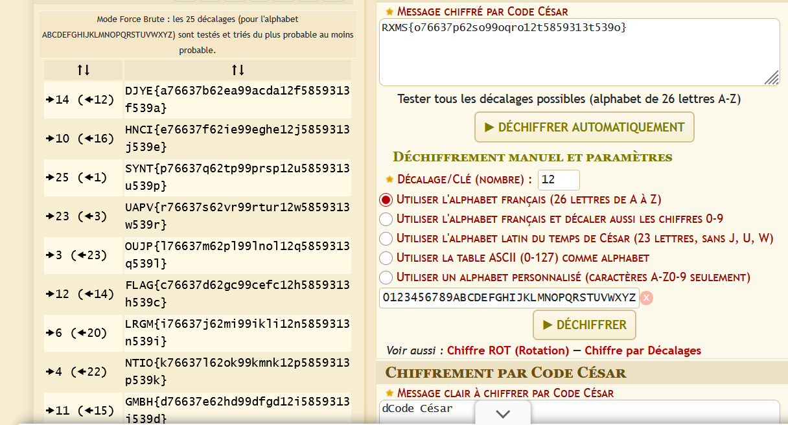

Message 
```
RXMS{o76637p62so99oqro12t5859313t539o}

```

Dans ce chall on a un message qu'on doit décodé. 
Pour déchiffrer ce message on voit déjà que c'est le chiffrement par substitution qui a été utilisé ( Comme Cesar. Rot13..). 
Et on sait aussi que le Format du flag est FLAG. 
Donc d'apres analyse on remarque un decalage de 12 
Ainsi nous allons utiliser dcode pour décoder



#### Flag :
```
FLAG{c76637d62gc99cefc12h5859313h539c}
```
