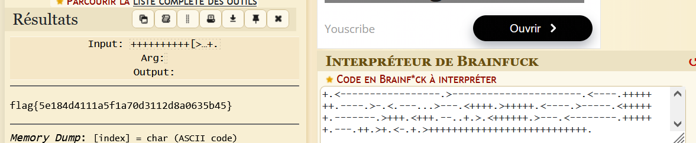

### Catégorie : Crypto 

### Description 
Decode it to retrieve the flag.

Contenu du message : 
```
++++++++++[>+>+++>+++++++>++++++++++<<<<-]>>>>++.++++++.-----------.++++++.++++++++++++++++++++.<-----------------.>----------------------.<----.+++++++.----.>-.<.---...>---.<++++.>+++++.<----.>-----.<++++++.-------.>+++.<+++.--..+.>.<++++++.>---.<--------.++++++.---.++.>+.<-.+.>+++++++++++++++++++++++++++.

```

### Etape 1- Analyse du message :
Le challenge nous fournit une suite de caractères composée uniquement de symboles mathématiques et de crochets : `+`, `-`, `<`, `>`, `[`, `]`, `.`.

### Etape 2- Énumération et Identification

Cette syntaxe est la signature unique du langage de programmation **Brainfuck**, l'un des langages ésotériques les plus connus.

Le fonctionnement repose sur un ruban de mémoire composé de cellules (initialisées à 0). Les commandes agissent ainsi :

- `+` / `-` : Incrémente ou décrémente la valeur de la cellule pointée.
    
- `>` / `<` : Déplace le pointeur vers la cellule de droite ou de gauche.
    
- `[` / `]` : Crée une boucle (répète les instructions tant que la cellule actuelle n'est pas à 0).
    
- `.` : Affiche le caractère ASCII correspondant à la valeur de la cellule.

### Etape 3- Exploitation

Pour décoder le message, nous pouvons utiliser les outils en ligne pour décoder ou encore l'outil en ligne de commande **bf** 

**Outil en ligne  :**

- ([dcode ](https://www.dcode.fr/langage-brainfuck))
- [Md5decrypt]([Md5decrypt](https://md5decrypt.net/en/Brainfuck-translator/))

#### Note: Brainfuck


### Flag : 

```
flag{5e184d4111a5f1a70d3112d8a0635b45}
```
