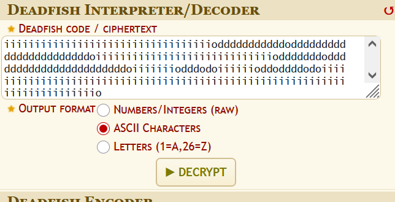
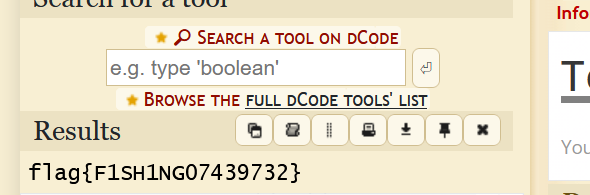
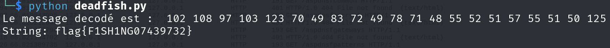

##### Tag : Crypto esolang 

**Message :**
```
iiisdsiiiiiiiiiiiiiiiiiiiiiiiiiiiiiiiiiiiiiioiiiiiiodddddddddddoiiiiiioiiiiiiiiiiiiiiiiiiiiodddddddddddddddddddddddddddddddddddddddddddddddddddddodddddddddddddddddddddoiiiiiiiiiiiiiiiiiiiiiiiiiiiiiiiiiiodddddddddddodddddddddddddddddddddddoiiiiiiiiiiiiiiiiiiiiiiiiiiiiiodddddddodddddddddddddddddddddddoiiiiiiiodddodoiiiiiioddoddddodoiiiiiiiiiiiiiiiiiiiiiiiiiiiiiiiiiiiiiiiiiiiiiiiiiiiiiiiiiiiiiiiiiiiiiiiiiiio
```

### Etape 1- Analyse du message 

L'analyse visuelle du message révèle une structure très spécifique composée uniquement de quatre caractères : `i`, `s`, `d`, et `o`. Cette syntaxe est caractéristique d'un **langage de programmation ésotérique (Esolang)**.

#### 1. Identification du langage

Ce jeu d'instructions correspond au langage **Deadfish**. C'est un langage minimaliste qui utilise un seul accumulateur (une valeur numérique en mémoire) et quatre commandes de base :

- **`i` (increment) :** Ajoute 1 à l'accumulateur.
    
- **`d` (decrement) :** Retire 1 à l'accumulateur.
    
- **`s` (square) :** Elève l'accumulateur au carré (x2).
    
- **`o` (output) :** Affiche le caractère correspondant à la valeur actuelle de l'accumulateur (généralement converti via la table **ASCII**).

#### Note :Esolang - Deadfish

#### Etape 2- Déchiffrement 

Pour déchiffrer Deadfish , nous allons utiliser les décodeurs en ligne comme 
- [dcode](https://www.dcode.fr/deadfish-language)





On a ainsi le flag 
#### Flag : 
```
flag{F1SH1NG07439732}
```

#### Script python pour décoder aussi 

```
def deadfish(code):
    acc = 0
    output = []
    for char in code:
        if char == 'i': acc += 1
        elif char == 'd': acc -= 1
        elif char == 's': acc *= acc
        elif char == 'o': output.append(str(acc))
        
        if acc == -1 or acc == 256:
            acc = 0
    decoded_text = "".join(chr(int(x)) for x in output)
    return f"{' '.join(output)}\nString: {decoded_text}"

message="iiisdsiiiiiiiiiiiiiiiiiiiiiiiiiiiiiiiiiiiiiioiiiiiiodddddddddddoiiiiiioiiiiiiiiiiiiiiiiiiiiodddddddddddddddddddddddddddddddddddddddddddddddddddddodddddddddddddddddddddoiiiiiiiiiiiiiiiiiiiiiiiiiiiiiiiiiiodddddddddddodddddddddddddddddddddddoiiiiiiiiiiiiiiiiiiiiiiiiiiiiiodddddddodddddddddddddddddddddddoiiiiiiiodddodoiiiiiioddoddddodoiiiiiiiiiiiiiiiiiiiiiiiiiiiiiiiiiiiiiiiiiiiiiiiiiiiiiiiiiiiiiiiiiiiiiiiiiiio"

print("Le message decodé est : ", deadfish(message))

```


