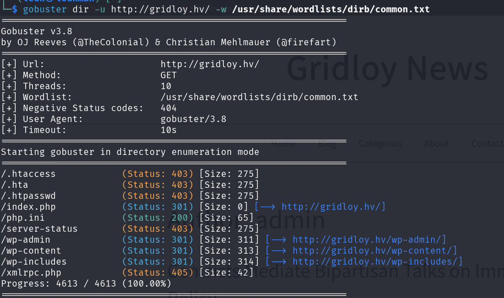

Description:

Recently, a mysterious writer using the pseudonym "Currol" has been publishing striking and influential news articles. The true identity of this writer remains a major mystery. Currol is particularly known for his in-depth analyses in the field of politics, making a name internationally. However, there is no information available about who is behind these writings.  
  
Your task is to uncover the real identity of Currol. In this process, your job will involve vulnerability research on the website where the writer's articles are published.

### Résolution

1- Enumération

- Scan des ports ouverts ainsi que les servies et versions encoure 

