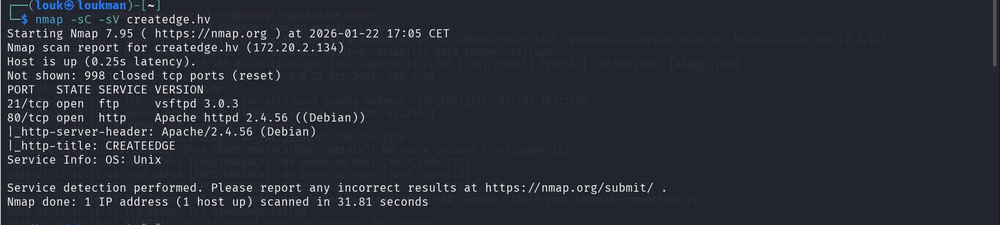
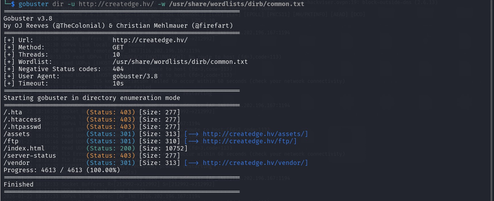

Description:
There is a striking competition between the software giants VertexWave International and Orbitronix Systems, as both continuously struggle for market dominance. Recently, VertexWave International has assigned you, a skilled hacker, a secret mission suitable for this critical task.  
  
Your mission is to access sensitive data related to the sales and marketing strategies of Orbitronix Systems. This information is of vital importance because Orbitronix Systems has established a partnership with the famous Create Edge Advertising Agency, known for its innovative and highly effective marketing campaigns, in order to surpass VertexWave.  
  
VertexWave International wants you to level the playing field and perhaps gain an advantage by collecting detailed information about Orbitronix Systems' sales and marketing maneuvers.  
  
Your target is to hack the Create Edge Advertising Agency, which has a deal with Orbitronix Systems.

Catégorie : Web 
Système : Linux 

Étape :
nmap -sC -sV createdge.hv 

 gobuster dir -u http://createdge.hv/ -w /usr/share/wordlists/dirb/common.txt

