Description:
According to our security analysts' reports, our critical systems have been subjected to scans from a suspicious IP address for some time. Your mission is to identify the owner of this IP address and the associated server, and to uncover what the attackers are doing. Good luck!

Catégorie : 
Système : Linux

Étape :

- Enumération  :

Commande : 
```
nmap -sC -sV --script vuln 172.20.1.62
```
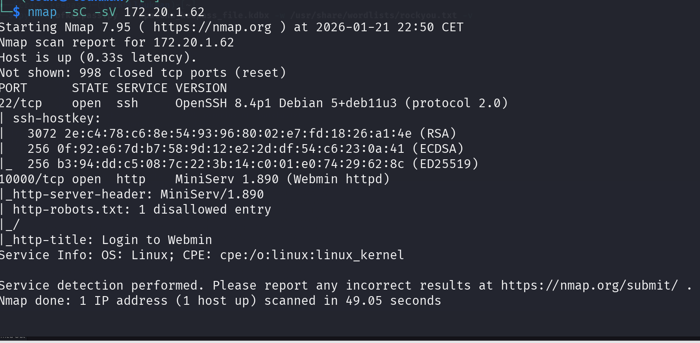

On a deux ports, le service SSH sur le port 22 et le service HTTP sur le port 10000

Accéder a la page web 
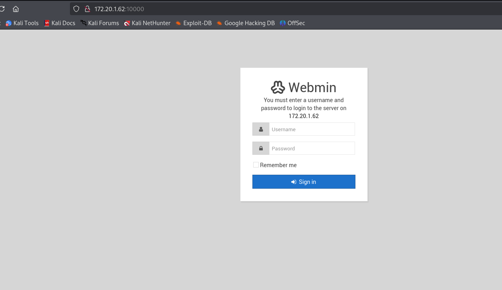

On constate que le CMS utilisé est le Webmin avec la version 1.860 

Recherche d'exploit public sur cette version : 

Commande : 
```
searchsploit webmin 
```

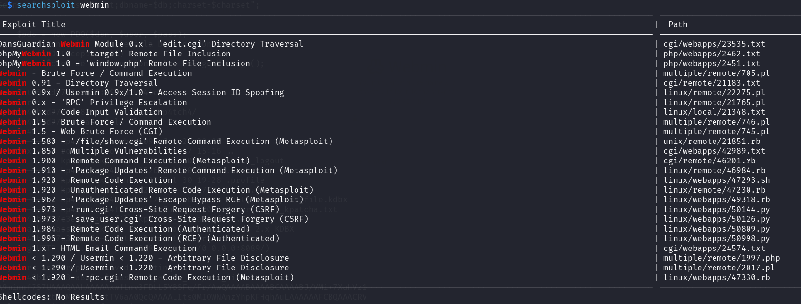

On peut voire que les versions inférieurs a 1.920 sont vulnérables a un RCE et on peut utiliser metasploit CVE-2019-15107

Etape : 
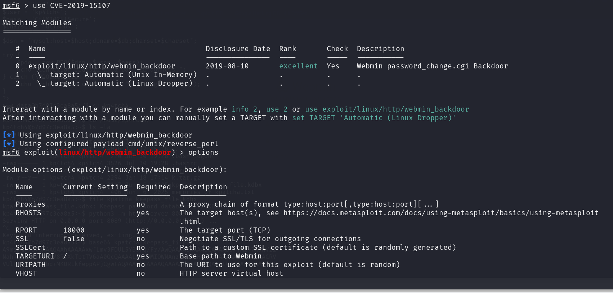

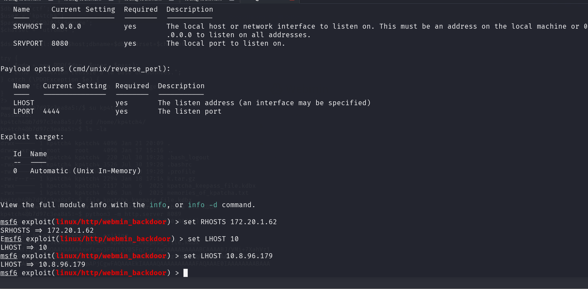

Boom on a obtenu est shell 
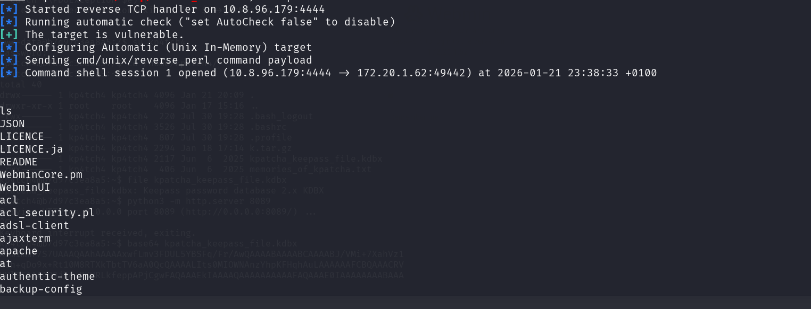

Cette exploit nous donne directement un acces root au systeme 

- **Tâche 1:** 
- **What is the email address and password for the attacker's GitHub account?**

Se dirriger dans le reperoire root 
```
cd /root 
```

ensuite 

```
ls -la 
```

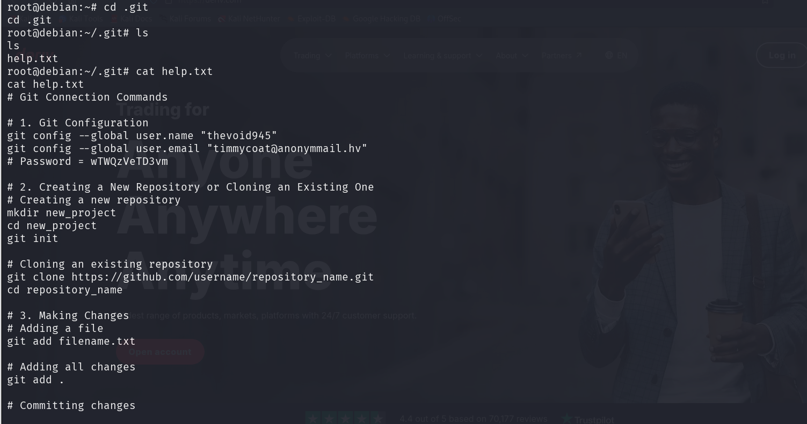

- **Tâche 2 :** 
What is the MD5 hash value of the malware used by the attacker?

Pour voire le hash MD5 il faut d'abord decompresser le fichier zip  **phishing_malware.zip**  
Etape : 
Mettre en place un serveur avec python 

Commande : 
```
python -m http.server 8080
```

Récupérer depuis notre machine kali 

```
wget http://172.20.1.62:8080/phishing_malware.zip
```

Craquer avec l'outil john 

```
zip2john phishing_malware.zip > phish.hash
```
craquer 
```
john --wordlist=/usr/share/wordlists/rockyou.txt phish.hash
```

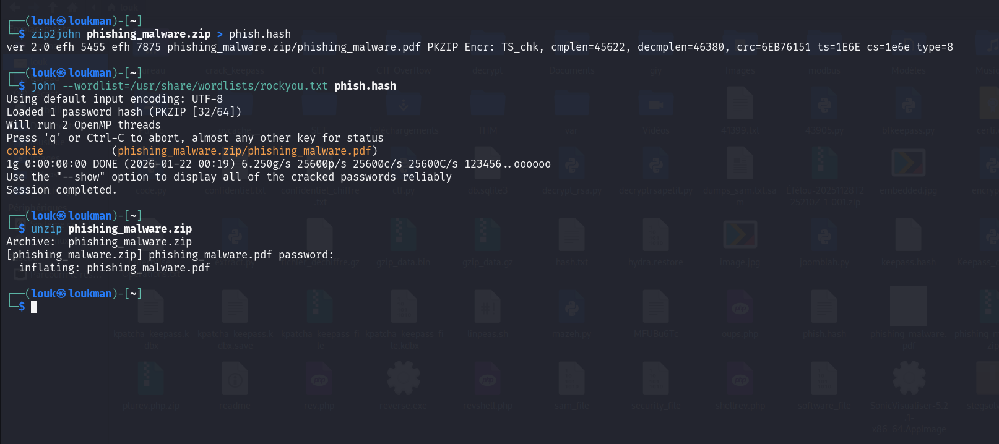

Boom on l'a craqué 

Récupérer le hash MD5
```
 md5sum phishing_malware.pdf 
b82f8ba530a975e9f2acefe675fbffce  phishing_malware.pdf

```

- **Tâche 3:**
What is the domain name that the attacker scanned with the SQL Injection scanning tool?

```
find / -name "sqlmap" 2>/dev/null
```
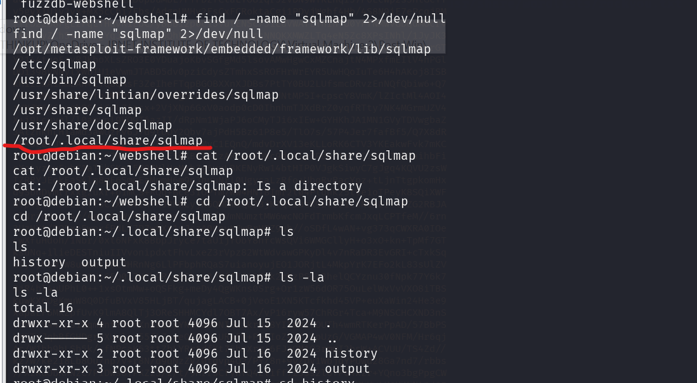
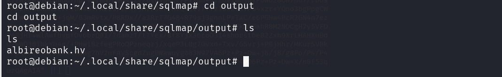

- **Tâche 4 :** 
What is the e-mail address of the victim in the “Stealer Log” data on the server?

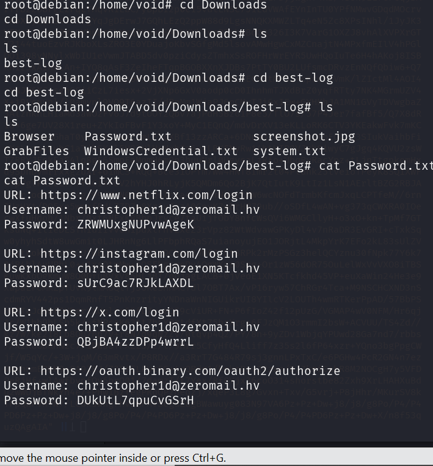

- **Tâche 5:**
Which IP address did the attacker scan for ports and services?

```
find / -name "nmap" 2>>/dev/null
```
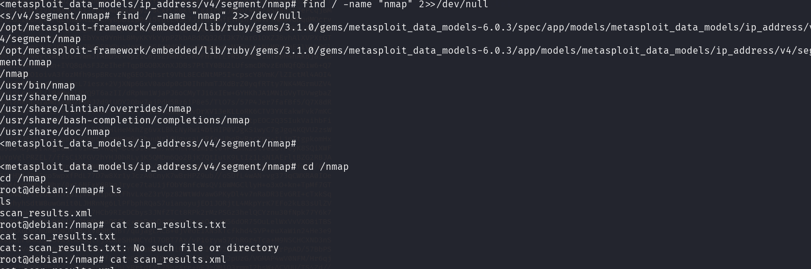
