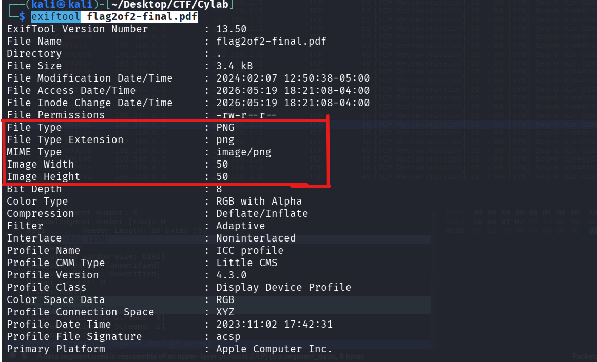
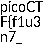
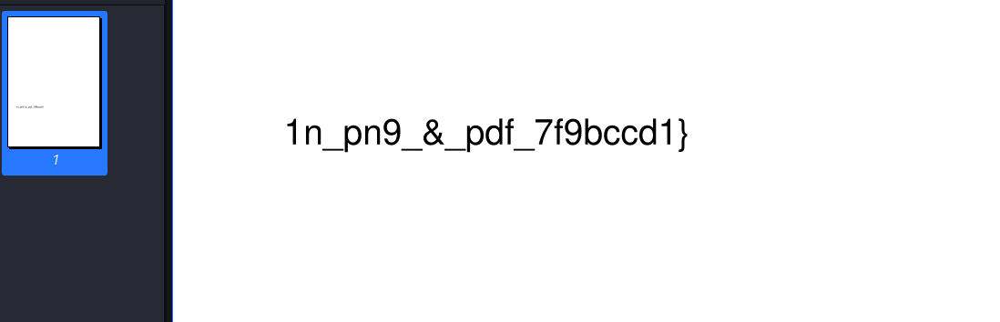

The Network Operations Center (NOC) of your local institution picked up a suspicious file, they're getting conflicting information on what type of file it is. They've brought you in as an external expert to examine the file. Can you extract all the information from this strange file?

Download the suspicious file [here](https://artifacts.picoctf.net/c_titan/9/flag2of2-final.pdf)

```
 file flag2of2-final.pdf 

```

```
flag2of2-final.pdf: PNG image data, 50 x 50, 8-bit/color RGBA, non-interlaced
```

```
exiftool flag2of2-final.pdf
```

Confirme aussi qu'il s'agit d'un png 

```
1n_pn9_&_pdf_7f9bccd1}
```

Parcontre lorsqu'on ouvre le pdf on a la second partie du flag 

Modifier l'extension 

```

```

premiere partie 

```
picoCTF{f1u3n7_
```

Flag 

```
picoCTF{f1u3n7_1n_pn9_&_pdf_7f9bccd1}
```

## Métadonnées

- **Catégorie :** Forensics Polyglot
    
- **Outils :** file exiftool PDF-Viewer Image-Viewer
    
- **Flag :** `picoCTF{f1u3n7_1n_pn9_&_pdf_7f9bccd1}`
    

##  Description du challenge

> _Le Network Operations Center (NOC) a intercepté un fichier suspect et obtient des informations contradictoires sur sa véritable nature. En tant qu'expert externe, vous devez examiner le fichier et en extraire toutes les informations cachées._

## Étape 1 : Analyse des contradictions du fichier

On commence par analyser le fichier fourni, initialement nommé `flag2of2-final.pdf`.

```bash
file flag2of2-final.pdf
```

### Résultat :

```
flag2of2-final.pdf: PNG image data, 50 x 50, 8-bit/color RGBA, non-interlaced
```

On pousse l'analyse avec `exiftool` :

```
exiftool flag2of2-final.pdf
```



> 📌 **Constat d'anomalie :** L'extension du fichier indique `.pdf`, mais les outils d'analyse statique (`file` et `exiftool`) confirment de manière unanime que l'en-tête (Magic Bytes) commence par la signature d'une image **PNG**.

##  Étape 2 : Extraction de la 1ère partie (Mode Image)

Puisque le fichier possède les structures d'un PNG, on modifie son extension pour forcer le système à l'ouvrir avec un visionneur d'images.

```
mv flag2of2-final.pdf flag2of2-final.png
```

À l'ouverture de l'image `flag2of2-final.png`, le visuel révèle la première moitié du flag :



```text
picoCTF{f1u3n7_
```

##  Étape 3 : Extraction de la 2nde partie (Mode PDF)

Un fichier "polyglotte" cache souvent du contenu dans les structures tolérées ou ignorées par le premier format. On tente d'ouvrir le fichier d'origine directement avec un lecteur PDF (`Evince`, `Adobe Reader`, ou directement dans le navigateur).



Le lecteur PDF ignore l'en-tête PNG et parvient à parser la structure PDF cachée plus loin dans le fichier, affichant la seconde partie du flag :

```text
1n_pn9_&_pdf_7f9bccd1}
```

## 🏁 Étape 4 : Assemblage du Flag

En combinant les deux parties extraites des deux modes de lecture, on obtient le flag complet.

**Flag :** `picoCTF{f1u3n7_1n_pn9_&_pdf_7f9bccd1}`

##  Mémo de Forensics : Les Fichiers Polyglottes

Un fichier **polyglotte** est un fichier qui est interprété comme valide par plusieurs applications distinctes exécutant des formats différents.

- **Comment c'est possible ?** Certains formats de fichiers (comme le **PDF** ou le **ZIP**) n'ont pas besoin de commencer strictement au tout premier octet (octet `0`) du fichier pour être lus. Ils cherchent leur signature (`%PDF-`) n'importe où dans les premiers kilo-octets.
    
- À l'inverse, le format **PNG** exige que ses Magic Bytes (`89 50 4E 47`) soient au tout début, mais il permet d'ignorer complètement les données situées après la fin officielle de l'image (marquée par le chunk `IEND`).
    
- **Technique d'attaquant :** Les malwares utilisent parfois cette technique pour dissimuler un script malveillant ou une archive ZIP à l'intérieur d'une image de profil ou d'un favicon inoffensif afin de tromper les pare-feux et les solutions de filtrage du SOC.
