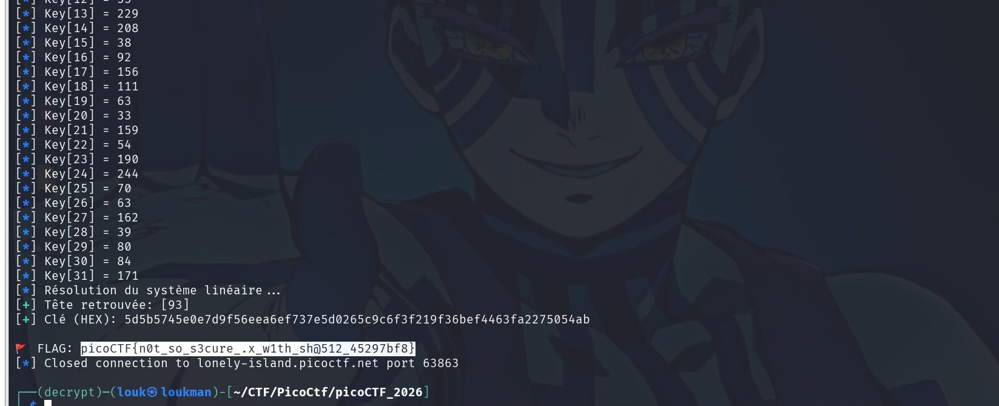

#### Description

Our intern thought it was a great idea to vibe code a secure dot product server using our AES key. Having taken a class in linear algebra, they're confident the server can't ever leak our key, but I'm not so sure... Download the source code [remote.py](https://challenge-files.picoctf.net/c_lonely_island/961d201fbbfb8d30ffd851f93dbeff8cfb650e85a175263f5e75232b2ef2261a/remote.py)

Additional details will be available after launching your challenge instance.

Source :

```
import ast

import hashlib

import os

import random

import secrets

import sys

from Crypto.Cipher import AES

from Crypto.Util.Padding import pad

  

KEY_SIZE = 32

SALT_SIZE = 256

  

class SecureDotProductService:

    def __init__(self, key):

        self.key_vector = [byte for byte in key]

        self.salt = secrets.token_bytes(SALT_SIZE)

        self.trusted_vectors = self.generate_trusted_vectors()

    def hash_vector(self, vector):

        vector_encoding = vector[1:-1].encode('latin-1')

        return hashlib.sha512(self.salt + vector_encoding).digest().hex()

  

    def generate_trusted_vectors(self):

        trusted_vectors = []

  

        for _ in range(5):

            length = random.randint(1, 32)

            vector = [random.randint(-2**8, 2**8) for _ in range(length)]

            trusted_vectors.append((vector, self.hash_vector(str(vector))))

  

        return trusted_vectors

    def parse_vector(self, vector):

        sanitized = "".join(c if c in '0123456789,[]' else '' for c in vector)

        try:

            parsed = ast.literal_eval(sanitized)

        except (ValueError, SyntaxError, TypeError):

            return None

        if isinstance(parsed, list):

            return parsed

        return None

    def dot_product(self, vector):

        return sum(vector_entry * key_entry for vector_entry, key_entry in zip(vector, self.key_vector))

    def run(self):

        print("============== Secure Dot Product Service ==============")

        print("I will compute the dot product of my key vector with any trustworthy vector you choose!")

        print("Here are the vectors I trust won't leak my key:")

  

        for pair in self.trusted_vectors:

            print(pair)

  

        while True:

            print("========================================================")

            vector_input = input("Enter your vector: ")

            vector_input = vector_input.encode().decode('unicode_escape')

            vector = self.parse_vector(vector_input)

            vector_hash = self.hash_vector(vector_input)

  

            if not vector:

                print("Invalid vector! Please enter your vector as a list of ints.")

                continue

  

            input_hash = input("Enter its salted hash: ")

            if not vector_hash == input_hash:

                print("Untrusted vector detected!")

                break

  

            dot_product = self.dot_product(vector)

  

            print("The computed dot product is: " + str(dot_product))

  

def read_flag():

    flag_path = 'flag.txt'

  

    if os.path.exists(flag_path):

        with open(flag_path, 'r') as f:

            flag = f.read().strip()

    else:

        print("flag.txt not found in the current directory.")

        sys.exit()

  

    return flag

  

def encrypt_flag(flag, key):

    iv = secrets.token_bytes(16)

    cipher = AES.new(key, AES.MODE_CBC, iv)

    ciphertext = cipher.encrypt(pad(flag.encode(), AES.block_size))

  

    return iv, ciphertext

  

def main():

    flag = read_flag()

    key = secrets.token_bytes(KEY_SIZE)

    iv, ciphertext = encrypt_flag(flag, key)

  

    print("==================== Encrypted Flag ====================")

    print(f"IV: {iv.hex()}")

    print(f"Ciphertext: {ciphertext.hex()}")

  

    service = SecureDotProductService(key)

    service.run()

  

if __name__ == "__main__":

    main()
```

---
##  Aperçu du Challenge

Le service propose de calculer le **produit scalaire** entre une clé secrète AES de 32 octets et un vecteur fourni par l'utilisateur. Pour empêcher l'extraction directe de la clé (en envoyant des vecteurs unitaires), le serveur n'accepte que des vecteurs "de confiance", validés par un hash SHA-512 salé.

- **Vecteur clé (K)** : 32 octets secrets.
    
- **Vecteur utilisateur (V)** : Liste d'entiers.
    
- **Sécurité** : `hashlib.sha512(salt + str(V)[1:-1])`.
    
- **Résultat** : ∑(Vi​×Ki​).
    

---

##  Analyse des Vulnérabilités

### 1. Hash Length Extension (HLÉ)

Le serveur utilise une construction de type H(salt∣∣data). Puisque SHA-512 est basé sur la construction de Merkle-Damgård, il est possible, à partir d'un hash connu, de calculer le hash d'un nouveau message commençant par les données originales suivies d'un suffixe arbitraire, sans jamais connaître le `salt` (à condition d'en connaître la longueur, ici 256).

### 2. Désynchronisation du "Sanitizer"

C'est la faille critique. Le serveur valide le hash sur l'entrée brute (`vector_input`), mais calcule le produit scalaire sur une version **sanitisée** :

```python
sanitized = "".join(c if c in '0123456789,[]' else '' for c in vector)
```

Lors d'une attaque HLÉ, le message contient du **padding binaire** (octets nuls et bits de longueur).

- **Le validateur de hash** voit le padding et valide la signature.
    
- **Le sanitizer** supprime silencieusement tout le padding binaire.
    
- **Le résultat** est un vecteur valide qui "fusionne" la donnée de base et notre extension.
    

---

##  Stratégie d'Exploitation

### Étape 1 : Récupération d'un point d'appui

On récupère les 5 vecteurs de confiance fournis au démarrage. On choisit le plus court (noté `base_vec`) pour minimiser les inconnues.

### Étape 2 : Extraction par HLÉ (Octets 4 à 31)

Pour chaque index i de la clé (de 4 à 31), on forge un vecteur via `hashpumpy` :

1. **Donnée originale** : `str(base_vec)[1:-1]`
    
2. **Suffixe** : `,0,0,0...1` (le `1` est placé à l'index i).
    
3. **Payload** : Le serveur reçoit `[base_vec + padding + suffixe]`. Après sanitisation, il calcule :
    
    Resultat=(base_vec⋅K)+(1×Ki​)
    
4. **Extraction** : Ki​=Resultat−(base_vec⋅K).
    

### Étape 3 : Résolution Algèbre Linéaire (Octets 0 à 3)

Une fois les octets 4 à 31 connus, les vecteurs de confiance initiaux ne contiennent plus qu'un système d'équations à 4 inconnues (K0​,K1​,K2​,K3​). On utilise `numpy.linalg.lstsq` pour résoudre Ax=B.
### Résolution avec pwntools

```
from pwn import *
import hashpumpy  # On utilise la lib installée via pip
import ast
from Crypto.Cipher import AES
from Crypto.Util.Padding import unpad
import numpy as np

# Configuration
HOST = 'lonely-island.picoctf.net'
PORT = 63863
KEY_SIZE = 32
SALT_SIZE = 256

def solve():
    # Connexion
    r = remote(HOST, PORT)

    # 1. Récupération des métadonnées
    r.recvuntil(b"IV: ")
    iv = bytes.fromhex(r.recvline().strip().decode())
    r.recvuntil(b"Ciphertext: ")
    ciphertext = bytes.fromhex(r.recvline().strip().decode())
    
    trusted_vectors = []
    r.recvuntil(b"vectors I trust won't leak my key:\n")
    
    # Parsing robuste des vecteurs (Correction EOF)
    for _ in range(5):
        line = r.recvline().strip().decode()
        if not line: break
        try:
            vec, v_hash = ast.literal_eval(line)
            trusted_vectors.append((vec, v_hash))
        except ValueError:
            continue

    key = [0] * KEY_SIZE
    
    # 2. Sélection du vecteur de base
    base_vec, base_hash = min(trusted_vectors, key=lambda x: len(x[0]))
    base_len = len(base_vec)
    log.info(f"Vecteur de base (len {base_len}): {base_vec}")

    # Oracle initial (pour référence)
    payload_str = str(base_vec).encode('unicode_escape').decode()
    r.sendlineafter(b"Enter your vector: ", payload_str.encode())
    r.sendlineafter(b"Enter its salted hash: ", base_hash.encode())
    r.recvuntil(b"The computed dot product is: ")
    base_dprod = int(r.recvline().strip())
    log.success(f"Dot Product de base: {base_dprod}")

    # 3. Attaque Length Extension (hashpumpy)
    log.info("Attaque HashPump en cours...")
    
    for i in range(base_len, KEY_SIZE):
        # Suffixe à ajouter : ", 0, ..., 0, 1"
        suffix = ", " + "0, " * (i - base_len) + "1"
        original_data = str(base_vec)[1:-1] # Contenu du vecteur sans crochets
        
        # --- Appel à la librairie Python ---
        new_hash, new_data = hashpumpy.hashpump(base_hash, original_data, suffix, SALT_SIZE)
        # -----------------------------------
        
        # Construction du payload
        # new_data contient le vecteur original + padding + suffixe
        # On ajoute les crochets pour simuler une liste
        full_payload = b"[" + new_data + b"]"
        
        # Échappement pour le serveur (unicode_escape)
        payload_escaped = "".join(f"\\x{b:02x}" for b in full_payload)
        
        r.sendlineafter(b"Enter your vector: ", payload_escaped.encode())
        r.sendlineafter(b"Enter its salted hash: ", new_hash.encode())
        
        try:
            # Lecture du résultat
            r.recvuntil(b"The computed dot product is: ")
            dprod = int(r.recvline().strip())
            
            # Extraction de l'octet de clé
            k_byte = dprod - base_dprod
            key[i] = k_byte
            log.info(f"Key[{i:02d}] = {k_byte}")
            
        except EOFError:
            log.error(f"Connexion coupée à l'index {i}")
            return

    # 4. Résolution Algèbre Linéaire (Tête de clé)
    if base_len > 0:
        log.info("Résolution du système linéaire...")
        coeffs = []
        constants = []
        
        for vec, v_hash in trusted_vectors:
            # Oracle
            p_str = str(vec).encode('unicode_escape').decode()
            r.sendlineafter(b"Enter your vector: ", p_str.encode())
            r.sendlineafter(b"Enter its salted hash: ", v_hash.encode())
            r.recvuntil(b"dot product is: ")
            dp = int(r.recvline().strip())
            
            san_vec = [abs(x) for x in vec]
            
            # Soustraction de la partie connue
            known_part = 0
            for j in range(base_len, len(san_vec)):
                if j < KEY_SIZE:
                    known_part += san_vec[j] * key[j]
            
            target = dp - known_part
            
            # Ligne de matrice
            row = []
            for j in range(base_len):
                val = san_vec[j] if j < len(san_vec) else 0
                row.append(val)
            
            coeffs.append(row)
            constants.append(target)

        try:
            # Résolution
            A = np.array(coeffs)
            b = np.array(constants)
            x, _, _, _ = np.linalg.lstsq(A, b, rcond=None)
            
            recovered = [int(round(n)) for n in x]
            log.success(f"Tête retrouvée: {recovered}")
            
            for i in range(base_len):
                key[i] = recovered[i]
                
        except Exception as e:
            log.error(f"Erreur Math: {e}")

    # 5. Décryptage Final
    key_bytes = bytes(key)
    log.success(f"Clé (HEX): {key_bytes.hex()}")
    
    try:
        cipher = AES.new(key_bytes, AES.MODE_CBC, iv)
        flag = unpad(cipher.decrypt(ciphertext), AES.block_size)
        print(f"\n🚩 FLAG: {flag.decode()}")
    except Exception as e:
        log.failure(f"Décryptage échoué: {e}")

    r.close()

if __name__ == "__main__":
    solve()

```



##### Clé:

```
5d5b5745e0e7d9f56eea6ef737e5d0265c9c6f3f219f36bef4463fa2275054ab
```

#### Flag 🚩:

```
picoCTF{n0t_so_s3cure_.x_w1th_sh@512_45297bf8}
```
