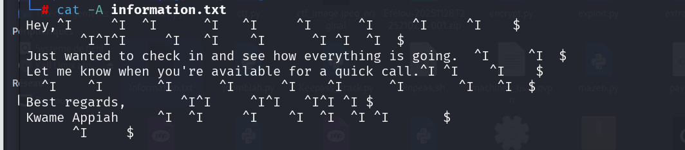
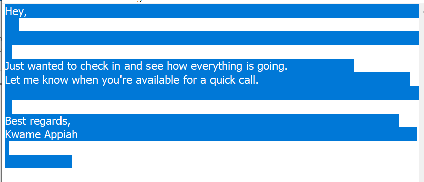
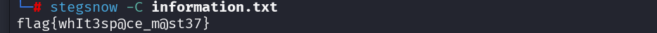

####  Catégorie : Stegano 

Description : 
We intercepted what looks like a normal message, but something feels.....off. The content seems harmless, yet there may be more than meets the eye. Not all secrets are visible - some hide in plain sight. Can you uncover what's hidden?

Le Message : 
```
Hey,	     	  	      	   	     	      	     	     	    
       			     	   	    	      	 	  	  
Just wanted to check in and see how everything is going.  	     	  
Let me know when you're available for a quick call.	 	    	    
  	    	       	      	      	    	      	       	   	  
Best regards,       		     		   		 	 
Kwame Appiah     	  	     	    	  	  	 	       
      	     

```

### Etape 1. Analyse de l'énoncé

Le challenge nous présente un message apparemment anodin de "Kwame Appiah". La description insiste sur le fait que "tout n'est pas visible" et que les secrets se cachent "en pleine vue" (_plain sight_). Cela suggère immédiatement que le flag n'est pas dans le texte lui-même, mais dans les caractères non-imprimables.

### Etape 2- Énumération et Identification
En ouvrant le fichier `information.txt` ou en analysant le message avec la commande `cat -A`, on remarque des traînées de tabulations (`^I`) et d'espaces à la fin de chaque ligne :

Commande : 
```
cat -A informations.txt
```





On remarque beaucoup d'espace et tabulation, il s'agit ainsi du SNOW ( Steganography Natural Whitespace
Cette technique est la signature caractéristique de l'algorithme **SNOW (Steganographic Nature of Whitespace)**. Contrairement à d'autres méthodes de stéganographie binaire simple, **SNOW utilise les espaces et les tabulations** pour encoder des données en les plaçant à la fin des lignes, là où elles ne modifient pas l'apparence visuelle du texte dans un éditeur classique.
Pour décoder le SNOW, on peu utiliser l'outil **SNOW, le stegsnow sous kali linux , l'outil snow , dcode**

#### Note: SNOW

Ainsi pour lire le message caché à l'intérieur du fichier texte nous allons utiliser l'outil stegsnow

Commande : 
```
stegsnow -C information.txt
```

- C qui signifie activer la compression 



On a ainsi le Flag 
### Flag 
```
flag{whIt3sp@ce_m@st37}
```
