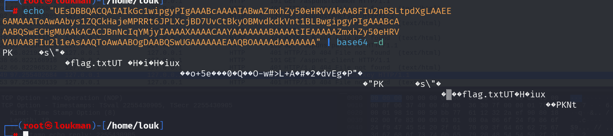
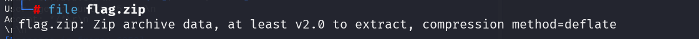
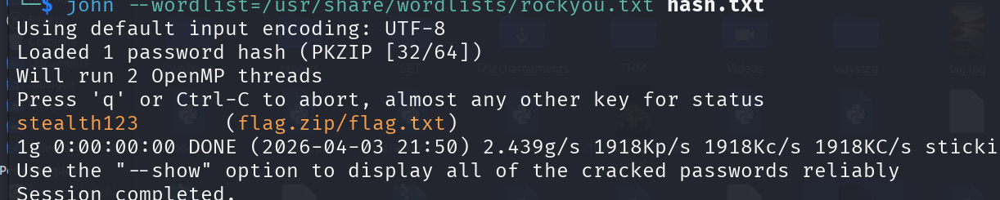
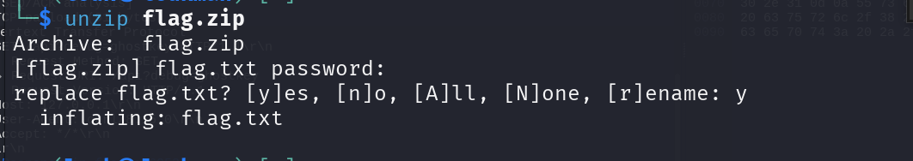

### Description

We intercepted another message… and this time, it feels intentional. At first glance, everything looks normal. But given past incidents, we suspect something is hidden beneath the surface. This may not be a simple extraction. Be prepared to dig deeper.

#### Catégorie : Stegano 

##### Message : 

```
Hi,	     	       	  	 	 	  		  	 
   	   	       	     	     	      	   	   	     	    
Attached are the meeting notes from last week.       		     	    
Please review and let me know if anything needs to be updated.       	     
 	      	     	    	       		     	    	       	      
Everything looks normal from my end. 	    	    	       	      	 
    	    	     	      			   	   	  	  
Regards,   	  	   	      	 	    	      	     	 
Kwame Appiah	  	      	 	      	 	    	   	     
    	       	  	      	   	 	       	   	       	     
     	     	 	 	       	     	    	       	  	      
   	 	       	     	   		 	       	   	       
     	 	  	   	 	       	     	    	   	       
   	       	  	     	       	 	  	 	       	      
       		    	      	   	       	    		      	    
      	    	     	     	    	   	     	    	       	      
  	      	   	     	    	       	  	      	    	    
       	  	      	       	  	      	    	    	  	  
      	 	      	      	   	   	  	 	      	      
   	   	     	    		  	     	    	    	 
    	  	    	      		    	    	   	 	     
  	    	    	       	  	      	   	  	    
	 	  	     	     	     	 	   	    	    
       	     	 	       	  	      	   	 	       	     
    	       	     	      	 	   	  	      	   	  
   	 	       	     	    	       	    	    	 
		    	    	      	  	      	     	       	     
    	       		   	   	    	     	    	     	      
    	     	  	   	 	       	       	 	     	 
       	  	      	 	     	    	   	     	    	   
 	   	   	      	    	      		    	     	    
   		     	  	  	   		  	   	   
     	    	       	   	       	     	     	  	      	  
 	     	    	     	       	  	     	   	      	      
	       	    	     	       	      	    	    	     
	    	      		      	      	   	   	     	 
       	      	 	     		  	      	    		  
      	  	 	       	     		   	  	 	     
   	       	     	 	  	     	    	      	   	   
    	      	      	     	    	   		     	   	   
	    	    	   	    	   		       	  	 
       	     	    	       	  	      	       	      	   	   
   	   	  	      	       	      	  	 	       	     
    	       	     	       	      	  	 	       	 	      
  	  		     	 	 	  	     	 	      
     	 	   	     	   	   	   	      	   	       
     	  	 	       	     	    	       	  	      	    
    	       	     	 	      	  	      	       	      
	       	      		    	   	       	     	 	    
     	    	      	   	   	      	 	  	       	       
     	  	      	     	  	   	      	   	 	       
       			       		  	      	   	 	       
     	    	       	  	      	       	      		    	    
    	       	  	      	   	 	       	     	    	       
     	 	      	  	      	   	 	       	     	    
   	 	 	       	     	    	       	  	      	   
 	       	     	    	       	  	      	   	 	       
   	       	     	 	 	       	     	    	       	  
      	   	 	       	   	  	       		    
	 	 	       	     	    	       	  	      	   
 	       	     	    	       	  	      	     	       	     
   	     	      	       		     	    	   	       	   
	  	       	     	   	  		   	  	   
      	      	  	      	     	  	      	   	   	   
   	 	       	     	  	      	       	      	   	     
  	      	   	 	       	   	 	   	  	  
 	 	       		   	       	     	 	     	      
   	 	     	       		 	       	 		 
       	     	    	       	     	    	       		   	     
   	      	    	    	       	    	      	  	      	   
 	       	   	       	     	     	      		  	       
      	  	      	  	 	       	     	    	       	     
       	      	  	 	       	 	      	  	  
	     	   	       	     	      	      			  
      	   	 	       	     	    	       	  	      	   
 	       	     	    	       	    		 	 	       
     	    	       	     	    	       		   	       	     
     	      		  	 	       	     	    	       	  
      	   	 	       	     		  	      	   	 
       	     	    	       	  	      	   	 	       	     
    	       	  	      	   

```
#### Etape 1- Analyse du message 
Lorsqu'on ouvre le fichier, on remarque qu'il y a des beacoup d'espace et de tabulations dans le texte, ce qui nous fait reflechir à la technique SNOW ( Steganography Natural Whistesapace) utilisé pour cacher les informations dans le un fichier texte 

#### Note: SNOW
#### Etape 2- Extraire les informations 

Pour lire les informations cachés dans le fichier texte , nous allons utiliser l'outil en ligne de commande **stegsnow** 

Commande : 
```
stegsnow -C information_II.txt
```

Boom on a une informations cachée encodée en base64
```
UEsDBBQACQAIAIkGc1wipgyPIgAAABcAAAAIABwAZmxhZy50eHRVVAkAA8FIu2nBSLtpdXgLAAEE
6AMAAAToAwAAbys1ZQCkHajeMPRRt6JPLXcjBD7UvCtBkyOBMvdkdkVnt1BLBwgipgyPIgAAABcA
AABQSwECHgMUAAkACACJBnNcIqYMjyIAAAAXAAAACAAYAAAAAAABAAAAtIEAAAAAZmxhZy50eHRV
VAUAA8FIu2l1eAsAAQToAwAABOgDAABQSwUGAAAAAAEAAQBOAAAAdAAAAAAA 
```

Décoder le base64 

```
echo "UEsDBBQACQAIAIkGc1wipgyPIgAAABcAAAAIABwAZmxhZy50eHRVVAkAA8FIu2nBSLtpdXgLAAEE
6AMAAAToAwAAbys1ZQCkHajeMPRRt6JPLXcjBD7UvCtBkyOBMvdkdkVnt1BLBwgipgyPIgAAABcA
AABQSwECHgMUAAkACACJBnNcIqYMjyIAAAAXAAAACAAYAAAAAAABAAAAtIEAAAAAZmxhZy50eHRV
VAUAA8FIu2l1eAsAAQToAwAABOgDAABQSwUGAAAAAAEAAQBOAAAAdAAAAAAA" | base64 -d
```



Le décodage nous montre des caractères bizarres avec un PK qui nous indique qu'il s'agit en réalité d'un fichier zip. Donc nous allons le decoder et stocker dans un fichier zip 
```
echo "UEsDBBQACQAIAIkGc1wipgyPIgAAABcAAAAIABwAZmxhZy50eHRVVAkAA8FIu2nBSLtpdXgLAAEE
6AMAAAToAwAAbys1ZQCkHajeMPRRt6JPLXcjBD7UvCtBkyOBMvdkdkVnt1BLBwgipgyPIgAAABcA
AABQSwECHgMUAAkACACJBnNcIqYMjyIAAAAXAAAACAAYAAAAAAABAAAAtIEAAAAAZmxhZy50eHRV
VAUAA8FIu2l1eAsAAQToAwAABOgDAABQSwUGAAAAAAEAAQBOAAAAdAAAAAAA" | base64 -d > flag.zip
```

- Effectuer la commande file pour confirmer qu'il s'agit d'un zip 

```
file flag.zip
```



Par contre pour décompresser le fichier , nous devons saisir un mot de passe. 
#### Etape 3- Craquer le fichier 

Commande : 
```
zip2john flag.zip > hash.txt
```

Commande : 
```
john --wordlist=/usr/share/wordlists/rockyou.txt hash.txt
```



Boom on a le mot de passe : **stealth123**

#### Etape 4- Extraire le flag 

Décompresser le fichier avec ce mot de passe et lire le flag 

### Flag : 
```
flag{l@y37s_0n_l@y3rs}
```
