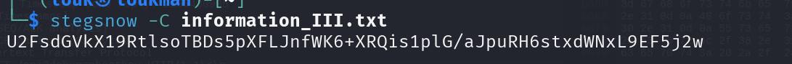
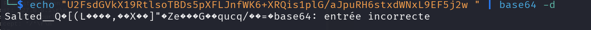
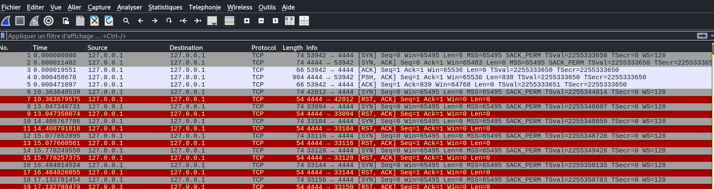
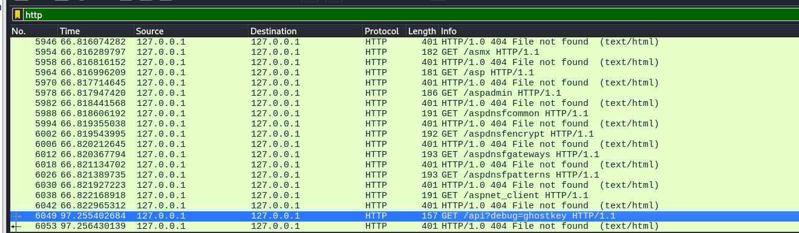
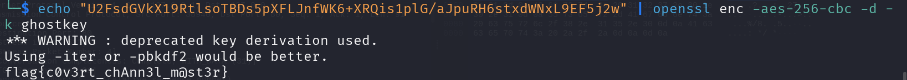

### Description

A suspected insider has been exfiltrating sensitive data through normal-looking communications. Network traffic was captured, but nothing immediately stands out. However, analysts believe the attacker may have left subtle traces behind. Your task is to analyze the traffic and uncover any hidden data. Every detail matters.

Le challenge nous donne deux fichier à analyser afin de trouver le flag, notamment un fichier texte et un fichier pcap 

#### Contenu du fichier texte:
```
Hey,	     	       	  	   	   	  	 	     	    
		 	  	   		    	  	      	   
Traffic logs look normal. Nothing suspicious detected.     	    	     
Let's proceed as planned.      		    	    	    	      	    
  		     	    	   	 	     	       		    
Regards,     	  	       	  	       	     	     	  	      
Admin  		     	       	      	   		   	   
	  	    	  	  	    	  	 	     	 
	   	    	     	  	     	 	  	  	   
    	      	     	 	   	  	       	     	    	   
   		  	     	    	   	     	    	       
	 	   		  	  	       		  	       
   	   		    	      	   	  	     	     	 
	       		      	     	       	  	      	     	      
    	     	     	 	   		    	    	     	      
   	 	  	   	    	    	  	  	       	  
       	 	     	  		     			 	  
    	  	  	     	       	      	   	 	       	       
      	    	  	  	   

```

#### Etape 1- Analyse de l'information 
L'apres l'analyse du contenu du fichier , on remarque beacoup d'espace , de tabulations .., ce qui nous indique qu'il s'agit de la technique SNOW utiliser en stegano pour cacher les informations dans les espaces blanches ... 

#### Note : SNOW

#### Etape 2- Extraire les infos cachés dans le fichier texte
Pour cela nous allons utiliser l'outil stegsnow de kali 

Commande :
```
stegsnow -C information_III.txt
```



Résultat : 
```
U2FsdGVkX19RtlsoTBDs5pXFLJnfWK6+XRQis1plG/aJpuRH6stxdWNxL9EF5j2w 
```

#### Etape 3- Identification du chiffrément

La chaîne extraite commence par `U2FsdGVkX1`. En encodage Base64, cela correspond au header **"Salted__"**, signature classique d'un contenu chiffré avec **OpenSSL**. Les données sont protégées par un mot de passe que nous devons trouver dans le trafic réseau.


Ainsi pour déchiffrer le message, nous avons besoin de la clé utilisée pour chiffrer le message. Ce qu'on peu trouver dans le fichier pcap 
#### Etape 4- Analyser le trafic 

Du coup nous allons lancer wireshark et ensuite ouvrir le fichier capture.pcapng


Le fichier contient beacoup de trafic , donc nous allons filtrer pour analyser le trafic http. 
Dans action taper **http** et appuyez sur Entrer. 

Descendez jusqu'en bas, vous verrez une requête http suspecte contenant la clé de l'utilisateur 

```
GET /api?debug=ghostkey HTTP/1.1
```



On a ainsi la clé de l'utilisateur : **ghostkey**

#### Etape 4- Déchiffrement 

**Commande :** 
```
echo "U2FsdGVkX19RtlsoTBDs5pXFLJnfWK6+XRQis1plG/aJpuRH6stxdWNxL9EF5j2w" | openssl enc -aes-256-cbc -d -a -k ghostkey
```



#### Flag : 
```
flag{c0v3rt_chAnn3l_m@st3r}
```
