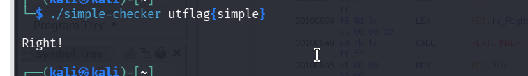

> **Informations sur le défi**
> - **Nom :** Simple Checker
> - **Catégorie :** Reverse Engineering
> - **Points :** 200
> - **Auteur :** danielp
> - **Description :** *The flag isn't encoded directly in the binary, but it shouldn't be that hard to get it out. From the reversing talk.*
> - **Fichier :** `simple-checker`

---

##  Analyse Initiale

### 1. Verification du type d'exécutable

Nous commençons par analyser le fichier binary pour déterminer son architecture et ses propriétés :

```bash
file simple-checker
````

**Résultat :**

```text
simple-checker: ELF 64-bit LSB pie executable, x86-64, version 1 (SYSV), dynamically linked, interpreter /lib64/ld-linux-x86-64.so.2, for GNU/Linux 3.2.0, BuildID[sha1]=d8f7f92c507f58405bd6b3c02dcd6b3ab38a7806, not stripped
```

> **Analyse du résultat `file`**
> 
> - **ELF 64-bit :** Exécutable standard pour systèmes Linux 64 bits.
>     
> - **not stripped :** L'exécutable contient encore ses symboles de débogage (noms de fonctions comme `main` et `check`), ce qui facilite grandement l'analyse statique.
>     

### 2. Recherche des chaînes visibles

Une vérification des chaînes de caractères lisibles permet d'identifier les messages de retour du programme :

```bash
strings simple-checker | less
```

On remarque la présence des chaînes `Wrong!` et `Right!`, confirmant un mécanisme de validation d'entrée utilisateur.

## Rétro-ingénierie (Ghidra)

Après ouverture du binaire sous Ghidra, nous décompilons la fonction principale `main` ainsi que la fonction de contrôle `check`.

#### Code de `main.c`

```c
void main(int param_1, undefined8 *param_2) {
  int iVar1;
  
  if (param_1 != 2) {
    __fprintf_chk(stderr, 1, "Usage: %s <flag>\n", *param_2);
    /* WARNING: Subroutine does not return */
    exit(1);
  }
  check(*(char *)(param_2[1] + 10) == 'p');
  check(*(char *)(param_2[1] + 0xc) == 'e');
  check(*(char *)(param_2[1] + 8) == 'i');
  check(*(char *)(param_2[1] + 9) == 'm');
  check(*(char *)(param_2[1] + 0xe) == '\0');
  iVar1 = memcmp("utflag{", (void *)param_2[1], 7);
  check(iVar1 == 0);
  check(*(char *)(param_2[1] + 7) == 's');
  check(*(char *)(param_2[1] + 0xd) == '}');
  check(*(char *)(param_2[1] + 0xb) == 'l');
  puts("Right!");
  /* WARNING: Subroutine does not return */
  exit(0);
}
```

#### Code de `check`

```c
void check(int param_1) {
  if (param_1 != 0) {
    return;
  }
  puts("Wrong!");
  /* WARNING: Subroutine does not return */
  exit(10);
}
```

## 📝 Explication de la logique

1. **Fonction `check` :** Reçoit une condition booléenne. Si la condition est vraie (`!= 0`), l'exécution continue. Si elle est fausse (`== 0`), le programme affiche `"Wrong!"` et s'arrête (`exit(10)`).
    
2. **Fonction `main` :**
    
    - Vérifie d'abord que le programme est exécuté avec exactement un argument (`param_1 == 2`).
        
    - Effectue une série de vérifications sur la chaîne passée en argument (`param_2[1]`).
        
    - L'expression `*(char *)(param_2[1] + X)` équivaut à l'accès par indice `flag[X]`.
        

## ⚙️ Exploitation & Reconstitution

Pour reconstituer la chaîne attendue, il suffit d'associer chaque contrainte à son indice respectif dans le tableau de caractères :

|**Indice (Déc)**|**Indice (Hex/Code)**|**Caractère attendu**|**Source de la validation**|
|---|---|---|---|
|**0 - 6**|`+ 0` à `+ 6`|`utflag{`|`memcmp("utflag{", flag, 7)`|
|**7**|`+ 7`|`s`|`check(flag[7] == 's')`|
|**8**|`+ 8`|`i`|`check(flag[8] == 'i')`|
|**9**|`+ 9`|`m`|`check(flag[9] == 'm')`|
|**10**|`+ 10`|`p`|`check(flag[10] == 'p')`|
|**11**|`+ 0xb`|`l`|`check(flag[0xb] == 'l')`|
|**12**|`+ 0xc`|`e`|`check(flag[0xc] == 'e')`|
|**13**|`+ 0xd`|`}`|`check(flag[0xd] == '}')`|
|**14**|`+ 0xe`|`\0`|`check(flag[0xe] == '\0')` _(Fin de chaîne)_|

### Validation dynamique

Nous testons notre chaîne auprès de l'exécutable pour valider le résultat :

```bash
./simple-checker utflag{simple}
```

**Résultat :**

```
Right!
```


## Flag Final

> **Flag Validé**
> 
> **`utflag{simple}`**
