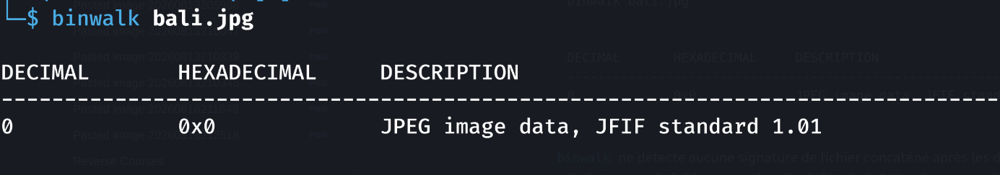
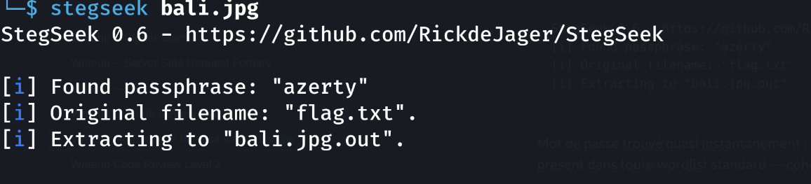

> **Catégorie : Forensics / Stéganographie**
> Flag caché dans une image JPEG via **steghide**, protégé par un mot de passe faible.

## Résumé

| Champ | Valeur |
|---|---|
| **Type** | Stéganographie (steghide) |
| **Fichier fourni** | `bali.jpg` |
| **Outil de résolution** | `stegseek` |
| **Mot de passe trouvé** | `azerty` (wordlist par défaut) |
| **Fichier caché** | `flag.txt` |

---

## Énoncé

> Ma tante est rentrée de Bali. Elle m'a apporté un souvenir, regardez plutôt ce magnifique paysage :
> *(image `bali.jpg` fournie)*

L'énoncé insiste sur "regardez plutôt ce magnifique paysage" — un indice classique en CTF pour orienter vers de la stéganographie dans l'image plutôt que vers l'image elle-même en tant que contenu.

---

## Méthodologie

### Étape 1 — Identification du type de fichier

```bash
file bali.jpg
```
```
bali.jpg: JPEG image data, JFIF standard 1.01, aspect ratio, density 1x1, segment length 16, baseline, precision 8, 960x640, components 3
```

Confirme un JPEG standard, rien d'anormal dans l'en-tête à première vue.

### Étape 2 — Recherche de fichiers/segments cachés (signatures embarquées)

```bash
binwalk bali.jpg
```
```
DECIMAL       HEXADECIMAL     DESCRIPTION
--------------------------------------------------------------------------------
0             0x0             JPEG image data, JFIF standard 1.01
```

`binwalk` ne détecte aucune signature de fichier concaténé après les données JPEG (pas de polyglotte, pas de fichier append en fin de binaire). Cela oriente vers de la **stéganographie applicative** (LSB, ou plus probablement `steghide`, très courant en CTF avec des JPEG) plutôt que du carving classique.



### Étape 3 — Attaque par dictionnaire avec `stegseek`

`steghide` protège ses données cachées par un mot de passe. `stegseek` est un outil qui teste rapidement une wordlist (par défaut `rockyou.txt`) contre un fichier stéganographié pour retrouver ce mot de passe par force brute :

```bash
stegseek bali.jpg
```
```
StegSeek 0.6 - https://github.com/RickdeJager/StegSeek
[i] Found passphrase: "azerty"
[i] Original filename: "flag.txt".
[i] Extracting to "bali.jpg.out".
```

Mot de passe trouvé quasi instantanément : `azerty`, un mot de passe extrêmement faible et présent dans toute wordlist standard — cohérent avec un challenge de difficulté easy/medium.



### Étape 4 — Lecture du flag extrait

```bash
cat bali.jpg.out
```
```
St3gH!id3_FTW
```

> **Flag obtenu**
> `St3gH!id3_FTW`

---

## Analyse technique

`steghide` fonctionne en modifiant les bits de poids faible (LSB — Least Significant Bit) des coefficients DCT dans les données JPEG, ce qui rend la donnée cachée invisible à l'œil nu et indétectable par une simple lecture d'en-tête (`file`) ou de signature (`binwalk`). La donnée est en plus chiffrée avec le mot de passe fourni à l'encodage.

`stegseek` est efficace ici car :
- Il est **bien plus rapide** que l'outil `steghide` seul en brute-force (utilise un pré-calcul/index sur la wordlist, contrairement à `steghide --extract` qui doit être relancé pour chaque mot de passe testé manuellement)
- Il s'appuie sur `rockyou.txt` par défaut, wordlist historique qui couvre l'immense majorité des mots de passe faibles/humains couramment utilisés dans les challenges volontairement pédagogiques

---

## Enseignements méthodologiques (pour la compet')

- [x] Toujours faire `file` + `binwalk` en premier réflexe sur tout fichier fourni en forensics, même une image "innocente"
- [x] Un énoncé qui insiste lourdement sur le contenu visuel de l'image ("regardez ce magnifique paysage") est souvent un indice volontaire vers la stéganographie
- [x] `stegseek` doit être le premier réflexe dès qu'on soupçonne du `steghide` — bien plus rapide qu'un brute-force manuel
- [x] Si `stegseek` échoue avec la wordlist par défaut, essayer d'autres wordlists (`crackstation`, `seclists`) ou générer une wordlist custom basée sur le contexte du challenge (thème, noms de personnages, dates mentionnées dans l'énoncé)
- [x] Ne pas negliger l'extraction manuelle via `steghide extract -sf bali.jpg -p <password>` si `stegseek` ne trouve pas de wordlist candidate mais qu'un mot de passe est déductible du contexte narratif du challenge

## Commandes clés à retenir

```bash
file <fichier>
binwalk <fichier>
stegseek <fichier>                          # brute-force wordlist par défaut
stegseek <fichier> <wordlist_custom.txt>    # wordlist personnalisée
steghide extract -sf <fichier> -p <password> # extraction manuelle si mdp connu
```

## Liens connexes
- CTF - Space Explorer - 22-23 Aout
- Forensics - Cheatsheet
