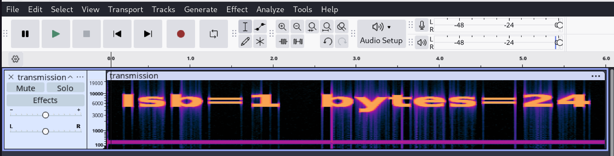
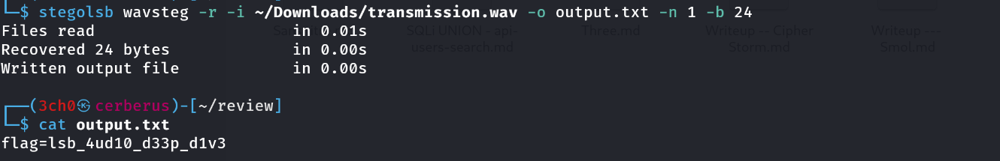

> **Catégorie : Forensics / Stéganographie audio (LSB)**
> Flag caché dans les bits de poids faible (LSB) d'un fichier audio WAV, détecté visuellement via spectrogramme sous Audacity, extrait avec `stego-lsb`.

## Résumé

| Champ | Valeur |
|---|---|
| **Type** | Stéganographie audio — LSB (Least Significant Bit) |
| **Fichier fourni** | `transmission.wav` |
| **Source** | [cyberini.com/ctfs](https://cyberini.com/ctfs/assets/transmission.wav) |
| **Outil d'analyse** | Audacity (spectrogramme) |
| **Outil d'extraction** | `stego-lsb` (package PyPI, commande `stegolsb`) |
| **Paramètres LSB** | `n=1` (1 bit par échantillon), `b=24` (24 octets cachés) |
| **Flag** | `flag=lsb_4ud10_d33p_d1v3` |

---

## Énoncé

> Un message 👽 a été reçu par un satellite. D'après nos experts en Star Trek, les aliens parlent une langue incompréhensible pour le commun des mortels. Mais bon, on sait que vous, vous pouvez la décoder.

L'indice "langue incompréhensible" et le format audio orientent naturellement vers de la stéganographie dans le signal sonore plutôt que vers un message audible classique.

---

## Méthodologie

### Étape 1 — Analyse visuelle sous Audacity

Ouverture de `transmission.wav` dans **Audacity**, puis affichage en mode **spectrogramme** (clic sur le nom de la piste → `Spectrogram`) plutôt qu'en forme d'onde classique.

> **Pourquoi le spectrogramme**
> Une stéganographie LSB classique (bit-flipping sur les échantillons) est **inaudible** et généralement invisible en forme d'onde standard. Le spectrogramme permet parfois de repérer des motifs de bruit haute fréquence anormaux introduits par la modification des bits de poids faible, ou du texte/image caché intentionnellement dans le spectre (technique différente mais souvent confondue). Ici, l'inspection a permis d'identifier les paramètres d'encodage LSB utilisés.



Paramètres LSB identifiés lors de l'analyse :
- `lsb = 1` → un seul bit de poids faible modifié par échantillon audio
- `bytes = 24` → taille de la donnée cachée à extraire

### Étape 2 — Installation de l'outil d'extraction

```bash
pip install stego-lsb
```

> **Rôle de l'outil `stego-lsb`**
> `stego-lsb` est un outil Python (CLI + librairie) dédié à la stéganographie par LSB, supportant deux types de porteurs :
> - **Audio WAV** (`wavsteg`) : cache/extrait des données en modifiant les bits de poids faible des échantillons audio PCM
> - **Images** (`steg` / mode image) : équivalent sur les canaux de couleur des pixels
>
> Le module s'appuie sur `numpy` pour la manipulation vectorisée des échantillons/pixels, et `Pillow` pour le support image. Il expose une commande `stegolsb` après installation, avec un sous-mode `wavsteg` spécifique à l'audio, utilisable soit pour **cacher** (`-h`/hide) soit pour **révéler** (`-r`/reveal) une donnée.

### Étape 3 — Extraction avec `stegolsb wavsteg`

```bash
stegolsb wavsteg -r -i ~/Downloads/transmission.wav -o output.txt -n 1 -b 24
```

| Option | Rôle |
|---|---|
| `wavsteg` | sous-commande dédiée aux fichiers WAV |
| `-r` | mode reveal (extraction, par opposition à `-h` pour hide) |
| `-i` | fichier audio source |
| `-o` | fichier de sortie où écrire la donnée extraite |
| `-n 1` | nombre de bits LSB utilisés par échantillon (`lsb=1` identifié à l'étape 1) |
| `-b 24` | nombre d'octets à extraire (`bytes=24` identifié à l'étape 1) |

```
Files read                     in 0.01s
Recovered 24 bytes             in 0.00s
Written output file            in 0.00s
```

### Étape 4 — Lecture du flag

```bash
cat output.txt
```
```
flag=lsb_4ud10_d33p_d1v3
```

> **Flag obtenu**
> `flag=lsb_4ud10_d33p_d1v3`



---

## Analyse technique

La stéganographie **LSB (Least Significant Bit)** exploite le fait que modifier le bit de poids le plus faible d'un échantillon audio (ou d'une composante couleur de pixel) produit une variation d'amplitude minime, généralement **imperceptible à l'oreille humaine** (ou à l'œil, pour les images). Chaque échantillon audio PCM peut ainsi porter 1 bit de donnée cachée sans altération audible perceptible.

Pour extraire correctement la donnée, deux paramètres sont indispensables et doivent correspondre exactement à ceux utilisés lors de l'encodage :
- **Le nombre de bits LSB utilisés par échantillon** (`n`) — ici 1, la configuration la plus discrète
- **La taille exacte de la donnée cachée** (`b`, en octets) — ici 24, sans quoi l'extraction récupère soit une donnée tronquée, soit des octets de bruit supplémentaires après la fin du message réel

Dans ce challenge, ces deux valeurs étaient directement fournies via l'inspection du fichier (annotation trouvée lors de l'analyse sous Audacity), évitant une phase de brute-force sur ces paramètres.

---

## Enseignements méthodologiques (pour la compet')

- [x] Pour tout challenge de stégano audio, toujours inspecter le fichier sous Audacity (ou équivalent) en mode **spectrogramme**, pas seulement en forme d'onde
- [x] `stego-lsb` sur PyPI s'installe avec un tiret (`stego-lsb`), mais s'invoque sans tiret en ligne de commande (`stegolsb`) — piège classique de nommage à connaître pour ne pas perdre de temps en compétition
- [x] Les paramètres `-n` (bits LSB) et `-b` (taille en octets) sont **critiques** : sans eux, il faut les bruteforcer (tester `n=1,2,3...` et observer quand la sortie devient un texte lisible)
- [x] Si les paramètres ne sont pas donnés/visibles, un script de brute-force simple sur `-n` (1 à 4) couplé à une détection de texte ASCII lisible dans la sortie permet de les retrouver rapidement

## Commandes clés à retenir

```bash
pip install stego-lsb                 # installation (nom PyPI avec tiret)
stegolsb wavsteg -r -i <fichier.wav> -o <sortie.txt> -n <bits_lsb> -b <taille_octets>   # extraction
stegolsb wavsteg -h -i <fichier.wav> -o <sortie.wav> -f <donnee_a_cacher> -n <bits_lsb> # encodage (si besoin de créer un challenge similaire)
```
