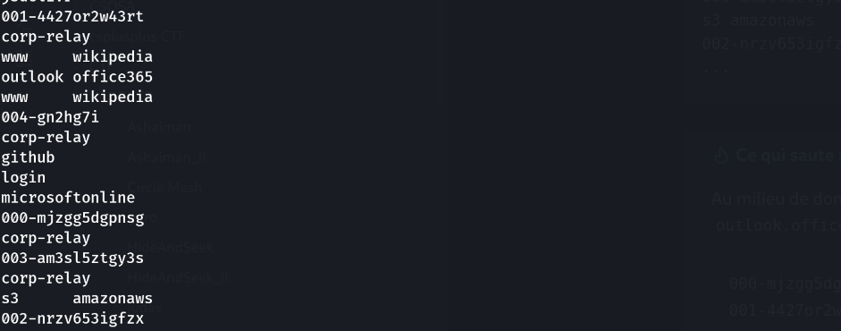
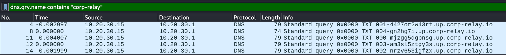

## Informations

- **Catégorie :** Forensics (Network)
- **Difficulté :** Medium
- **Points :** 100
- **Flag :** `brctf{dns_tunn3ls_wh1sp3r_s3cr3ts}`

> **Énoncé :** *The office was quiet until the network started behaving somehow. Too much talking. Too much movement. And nobody wanted to admit they knew anything about it.*
>
> Fichier fourni : `capture.pcap` (une capture réseau, 1.4 Ko)

---

## 1. Reconnaissance de la capture

```bash
file capture.pcap
# pcap capture file ... (Raw IPv4)
```

Pas de tshark sous la main ? Un simple `strings` donne déjà l'essentiel :

```bash
strings capture.pcap
```

```
fonts googleapis
github
jsdelivr
001-4427or2w43rt   corp-relay
www wikipedia
outlook office365
004-gn2hg7i        corp-relay
github
login microsoftonline
000-mjzgg5dgpnsg   corp-relay
003-am3sl5ztgy3s   corp-relay
s3 amazonaws
002-nrzv653igfzx   corp-relay
...
```

Au milieu de domaines parfaitement légitimes (`fonts.googleapis.com`, `api.github.com`, `outlook.office365.com`, `s3.amazonaws.com`…), une série d'intrus ressort :

```
000-mjzgg5dgpnsg.up.corp-relay.io
001-4427or2w43rt.up.corp-relay.io
002-nrzv653igfzx.up.corp-relay.io
003-am3sl5ztgy3s.up.corp-relay.io
004-gn2hg7i.up.corp-relay.io
```

- Un domaine inconnu (`corp-relay.io`) qui imite un nom « corporate » crédible.
- Des sous-domaines numérotés (`000`→`004`), donc un ordre de séquence.
- Des chaînes qui ressemblent à de l'encodage (lettres + chiffres, alphabet restreint).
- Le trafic légitime autour sert de camouflage.



---

## 2. Comprendre le DNS tunneling

Le DNS est presque toujours autorisé à sortir d'un réseau. Les attaquants en abusent : au lieu d'envoyer les données volées par HTTP (surveillé), ils les encodent dans des noms de domaine et envoient des requêtes DNS :

```
[données-encodées].sous-domaine.domaine-attaquant.com
```

Le serveur DNS de l'attaquant (qui fait autorité sur `corp-relay.io`) reçoit la requête et lit les données dans le sous-domaine. Comme un nom DNS a une taille limitée (~63 caractères par label), le secret est découpé en morceaux — d'où la numérotation `000`, `001`… pour pouvoir le réassembler dans l'ordre.

Pourquoi base32 et pas base64 ? Le DNS est insensible à la casse et n'accepte qu'un jeu de caractères restreint (lettres, chiffres, tirets). Le base64 utilise `+`, `/` et distingue majuscules/minuscules — inutilisable ici. Le base32 (A–Z + 2–7, insensible à la casse) est parfait pour le DNS : c'est la signature à reconnaître.

---

## 3. Extraire proprement les requêtes (scapy)

`strings` suffisait ici, mais la méthode propre consiste à parser le pcap avec **scapy** pour isoler les requêtes DNS (`DNSQR` = DNS Question Record) :

```python
from scapy.all import rdpcap, DNSQR
import re

pkts = rdpcap("capture.pcap")
names = [p[DNSQR].qname.decode().rstrip(".")
         for p in pkts if p.haslayer(DNSQR)]

# ne garder que les requetes d'exfil, numerotees
chunks = {}
for n in names:
    m = re.match(r'(\d{3})-([a-z0-9]+)\.up\.corp-relay', n)
    if m:
        chunks[int(m.group(1))] = m.group(2)
```

---

## 4. Réassembler et décoder

```python
import base64

# concatener dans l'ordre des numeros
data = "".join(chunks[k] for k in sorted(chunks))
# -> mjzgg5dgpnsg4427or2w43rtnrzv653igfzxam3sl5ztgy3sgn2hg7i

s  = data.upper()
s += "=" * ((8 - len(s) % 8) % 8)       # padding base32 (multiple de 8)
print(base64.b32decode(s, casefold=True))
```

Résultat :

```
b'brctf{dns_tunn3ls_wh1sp3r_s3cr3ts}'
```

**Flag :** `brctf{dns_tunn3ls_wh1sp3r_s3cr3ts}`

> Soit *« dns tunnels whisper secrets »* — le thème résumé en une phrase.

---

## 5. Dans Wireshark (alternative GUI)

1. Filtre d'affichage : `dns`
2. Repérer les requêtes de type A vers un domaine récurrent et inhabituel.
3. **Statistics → DNS**, ou **Statistics → Endpoints** pour voir les domaines les plus sollicités.
4. Filtre ciblé : `dns.qry.name contains "corp-relay"`
5. Clic droit sur un champ → **Apply as Column** (`dns.qry.name`) pour lire tous les sous-domaines d'un coup.



---

## Récapitulatif de la chaîne d'exploitation

1. **`strings`** sur le pcap → requêtes DNS numérotées vers un domaine inconnu, noyées dans du trafic légitime.
2. **scapy (`DNSQR`)** → extraction propre des requêtes numérotées.
3. **Réassemblage** des chunks dans l'ordre, puis **décodage base32** → flag.

> **Concept clé :** du trafic DNS vers un domaine inconnu, avec des sous-domaines longs et numérotés, est la signature d'une exfiltration par DNS tunneling. Le DNS reste souvent autorisé en sortie là où le HTTP est filtré, ce qui en fait un canal de choix pour exfiltrer discrètement des données en les encodant dans des noms de domaine.

---

***— 3ch0***
