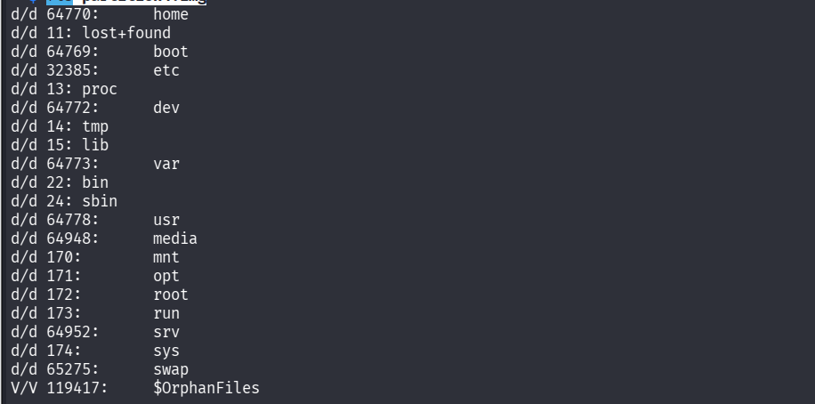
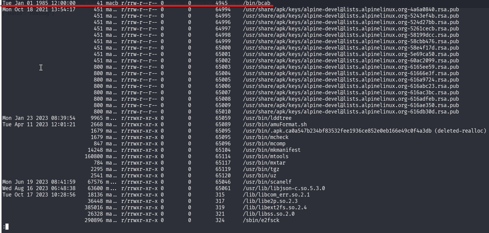
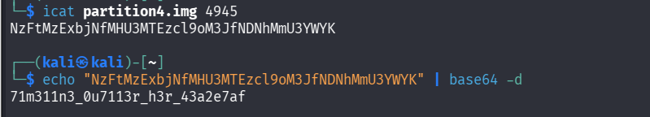

## Métadonnées

- **Catégorie :** Forensics Linux File-System
    
- **Outils :** SleuthKit (`fls`, `icat`, `mactime`) base64
    
- **Flag :** `picoCTF{71m311n3_0u7113r_h3r_43a2e7af}`
    

## 💬 Description du challenge

L'objectif est d'analyser une image de partition Linux (`partition4.img`) afin de détecter d'éventuelles anomalies ou artefacts dissimulés par un attaquant.

## 🔍 Étape 1 : Analyse initiale et exploration du système de fichiers

On commence par identifier le type de fichier et la structure de la partition avec la commande `file` et `binwalk`.

```bash
file partition4.img
binwalk partition4.img
```

L'image contient un système de fichiers **ext4 rev 1.0** standard. On utilise ensuite l'outil `fls` de la suite _Sleuth Kit_ pour l'explorer à la racine sans avoir à monter l'image sur notre machine Kali.

```bash
fls partition4.img
```



> 📌 **Note d'investigation :** L'exploration récursive des répertoires sensibles `/home/ctf-player` et `/root/` ne remonte aucun fichier suspect. L'historique `.ash_history` de l'administrateur a été nettoyé et ne contient que la commande `poweroff`. Il faut creuser ailleurs.

##  Étape 2 : Création d'une Timeline MAC (Analyse Temporelle)

Face à l'absence de fichiers visibles dans les répertoires classiques, on s'appuie sur l'indice du challenge pointant vers une attaque de type **Timestomping** (falsification des horodatages des fichiers).

Pour détecter cette anomalie, on génère une ligne du temps chronologique complète (Timeline) de toutes les activités de la partition (dates de Modification, Accès, Changement d'inode, et Création - MACB).

1. **Génération du fichier de corps (Body file) :**
    

```
fls -r -m / partition4.img > body.txt
```

2. **Conversion en frise chronologique lisible :**

```
mactime -b body.txt > timeline.txt
```

## 🕵️ Étape 3 : Identification de l'anomalie temporelle

En inspectant le haut du fichier `timeline.txt` (les dates les plus anciennes), une anomalie flagrante apparaît immédiatement :

```text
Tue Jan 01 1985 12:00:00       41 macb r/rrw-r--r-- 0        0        4945     /bin/bcab
```



> 💡 **Analyse Forensic :** Le fichier `/bin/bcab` possède un horodatage fixé au **1er janvier 1985**. Alpine Linux n'existant pas à cette époque, cela confirme une manipulation frauduleuse par _Timestomping_ pour dissimuler ce fichier au milieu des fichiers systèmes légitimes. Le fichier est lié à l'**inode 4945**.

## 🔓 Étape 4 : Extraction et Décodage de la charge utile

On utilise l'outil `icat` pour extraire directement le contenu textuel de l'inode **4945** sans interagir avec l'arborescence logique.

```bash
icat partition4.img 4945
```

### Résultat :

```text
NzFtMzExbjNfMHU3MTEzcl9oM3JfNDNhMmU3YWYK
```

La chaîne obtenue présente les caractéristiques d'un encodage **Base64**. On procède au décodage via le terminal :

```bash
echo "NzFtMzExbjNfMHU3MTEzcl9oM3JfNDNhMmU3YWYK" | base64 -d
```

### Résultat du décodage (LeetSpeak) :

```text
71m311n3_0u7113r_h3r_43a2e7af
```



## 🏁 Étape 5 : Capture du Flag

En encapsulant la chaîne décodée (qui se traduit par _Timeline Outlier Here_ en leetspeak) dans le format requis par le CTF, on obtient le drapeau final.

**Flag :** `picoCTF{71m311n3_0u7113r_h3r_43a2e7af}`

## 🧠 Mémo Technique : Le Timestomping & Les Timelines

- **Le concept :** Le _Timestomping_ consiste à modifier manuellement les attributs temporels d'un fichier (souvent via la commande `touch -d` ou des outils d'antiforensics plus avancés) pour modifier les métadonnées de l'inode.
    
- **La parade :** L'analyse de fichiers un par un est inefficace contre cette technique. La seule défense absolue de l'analyste est la génération d'une **Timeline globale** (`mactime`). En forçant un tri strictement chronologique, le fichier falsifié est propulsé tout en haut ou tout en bas de la chronologie, le rendant instantanément visible car totalement isolé au milieu de nulle part (un _outlier_).
