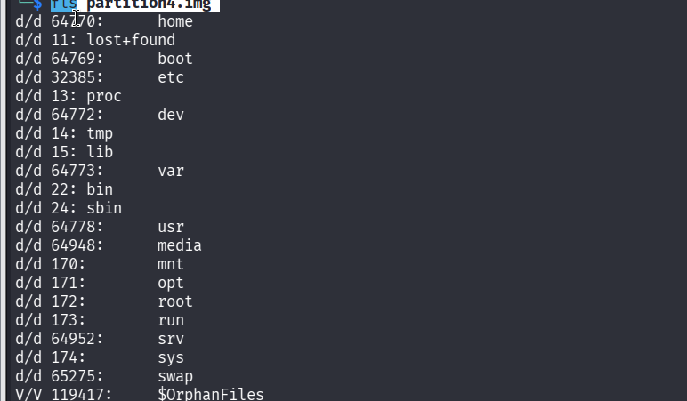
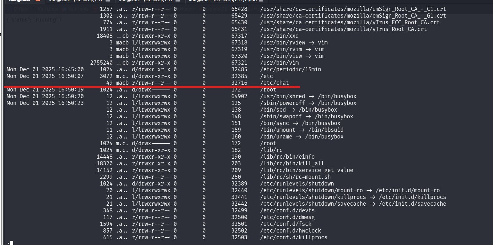
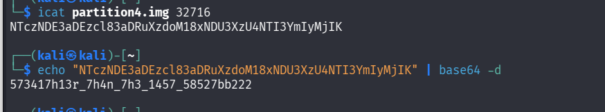

## Métadonnées

- **Catégorie :** Forensics Linux File-System
    
- **Auteur :** LT 'syreal' Jones
    
- **Outils :** SleuthKit (`fls`, `mactime`, `icat`) base64
    
- **Flag :** `picoCTF{573417h13r_7h4n_7h3_1457_58527bb222}`
    

## 💬 Description du challenge

L'objectif est de trouver un flag dissimulé dans une image de disque (`partition4.img`). L'indice nous demande de générer une timeline MAC, de surveiller les timestamps récents et de prêter une attention particulière aux événements proches d'une action "anti-forensic" (destruction de traces).

## 🔍 Étape 1 : Analyse initiale de la partition

On commence par vérifier la nature du fichier téléchargé avec la commande `file` :

```bash
file partition4.img
```

### Résultat :

```text
partition4.img: Linux rev 1.0 ext4 filesystem data, UUID=7a00e9da-98f8-4f0f-b257-95edf422d902 (extents) (64bit) (large files) (huge files)
```

Il s'agit d'un système de fichiers Linux **ext4**. On liste ensuite le contenu initial avec `fls` :

```bash
fls partition4.img
```



> 📌 **Constat :** L'inspection rapide des répertoires standards `/home` et `/root` ne donne rien d'exploitable directement. L'attaquant a été plus discret que lors du précédent challenge.

## 🕒 Étape 2 : Extraction récursive et Génération de la Timeline MAC

Pour détecter l'activité de l'attaquant, on applique la méthode de la ligne du temps (Timeline) afin de reconstituer l'historique complet des événements de la partition.

1. **Extraction récursive des métadonnées temporelles brutes (Body file) :**
    

```
fls -r -m / partition4.img > output.txt
```

2. **Reconstitution de la frise chronologique triée :**
    

```
mactime -b output.txt > timeline1.txt
```

## 🕵️ Étape 3 : Analyse des événements récents & Action Anti-Forensic

Conformément à l'indice qui demande de regarder les timestamps récents et les actions anti-forensics, on inspecte la fin de la timeline :

```bash
tail -n 100 timeline1.txt | less
```



### Analyse du bloc suspect (`Mon Dec 01 2025`) :

À **16:50:20**, on repère une activité critique : l'accès à l'outil **`shred`** (`/usr/bin/shred`), une commande utilisée pour détruire définitivement des fichiers et effacer les preuves (action anti-forensic).

Juste avant cette tentative d'effacement, à **16:50:07**, un fichier suspect a été modifié/créé dans les configurations système :

- **Fichier :** `/etc/chat`
    
- **Inode associé :** **`32716`**
    

## 🔓 Étape 4 : Extraction de l'Inode et Décodage

Puisque le fichier a été positionné à cet instant précis, il s'agit de notre cible principale. On utilise `icat` pour lire le contenu brut de l'inode **32716** :

```bash
icat partition4.img 32716
```

### Résultat :

```text
NTczNDE3aDEzcl83aDRuXzdoM18xNDU3XzU4NTI3YmIyMjIK
```

La chaîne se termine par des caractères typiques d'un encodage **Base64**. On la décode directement en ligne de commande :

```bash
echo "NTczNDE3aDEzcl83aDRuXzdoM18xNDU3XzU4NTI3YmIyMjIK" | base64 -d
```

### Résultat du décodage :

```text
573417h13r_7h4n_7h3_1457_58527bb222
```



## 🏁 Étape 5 : Formatage du Flag

On encapsule la chaîne décodée dans le format demandé par la plateforme du CTF.

**Flag :** `picoCTF{573417h13r_7h4n_7h3_1457_58527bb222}`

## 📝 Notes Techniques : Rappel des Commandes Clés

### 1. `fls`

Sert à l'exploration de bas niveau d'un système de fichiers. L'option `-r` permet de tout lister de manière récursive. Couplé à l'option `-m /`, il génère un format "Body file" contenant les métadonnées de temps absolues (timestamps) de chaque fichier du disque.

### 2. `mactime`

Prend le fichier "Body file" brut généré par `fls` et s'occupe de la traduction humaine. Il convertit les secondes Unix en vraies dates et effectue un tri chronologique strict de tous les fichiers de l'image (Modified, Accessed, Changed, Birth).

### 3. `icat`

Permet de lire le contenu de n'importe quel fichier sur une image disque en interrogeant directement son numéro d'**inode** plutôt que son chemin logique. Cela permet de contourner les masquages de répertoires, les suppressions de pointeurs logiques ou les restrictions de permissions.
